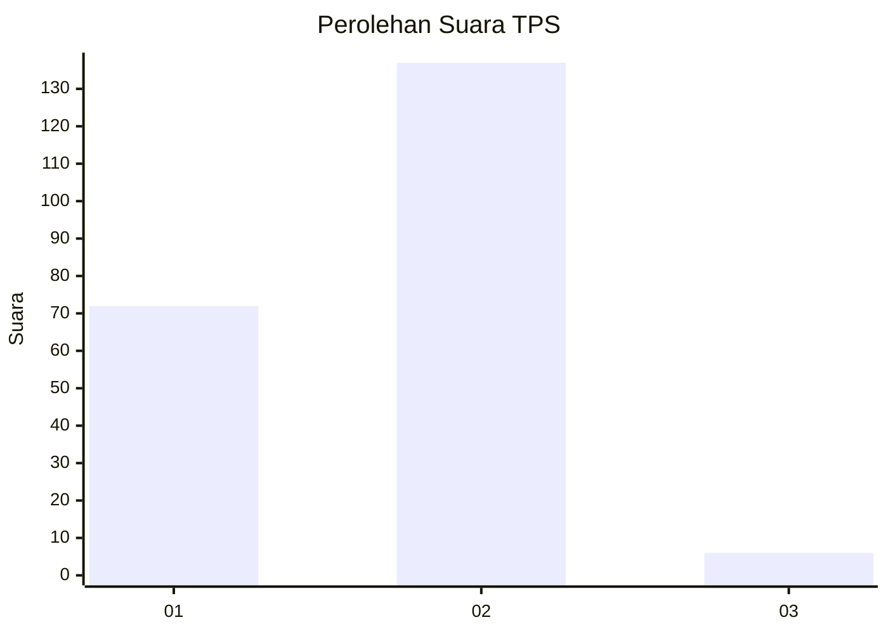
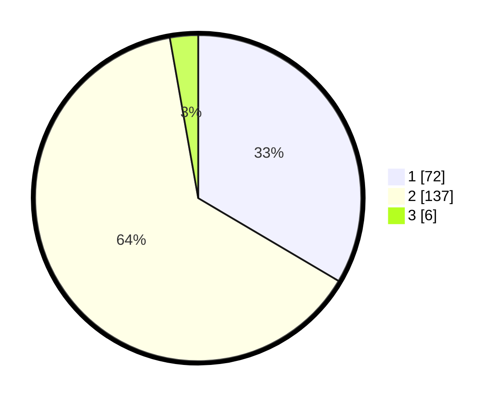

# Hasil

## Grafik

## Tabel

| No. | Nama Paslon    | Suara | Suara (raw) | Persentase |
|:--- |:-------------- | -----:| -----------:| ----------:|
| 1   | ANIES MUHAIMIN | 72    | [72][p-1]   | 33,49      |
| 2   | PRABOWO GIBRAN | 137   | [137][p-2]  | 63,72      |
| 3   | GANJAR MAHFUD  | 6     | [6][p-3]    | 2,79       |

[p-1]: https://github.com/gigit-pemilu/pemilu-2024-74-sulawesi-tenggara/blob/main/pilpres/hitung-suara/sub/74-sulawesi-tenggara/sub/03-muna/sub/30-kontu-kowuna/sub/2004-bahutara/sub/002-tps/sub/paslon-1.txt
[p-2]: https://github.com/gigit-pemilu/pemilu-2024-74-sulawesi-tenggara/blob/main/pilpres/hitung-suara/sub/74-sulawesi-tenggara/sub/03-muna/sub/30-kontu-kowuna/sub/2004-bahutara/sub/002-tps/sub/paslon-2.txt
[p-3]: https://github.com/gigit-pemilu/pemilu-2024-74-sulawesi-tenggara/blob/main/pilpres/hitung-suara/sub/74-sulawesi-tenggara/sub/03-muna/sub/30-kontu-kowuna/sub/2004-bahutara/sub/002-tps/sub/paslon-3.txt

## Foto C Plano

https://sirekap-obj-formc.kpu.go.id/52c5/pemilu/ppwp/74/03/30/20/04/7403302004002-20240215-143117--268fb3ce-6a03-4c45-bf41-7f0e1a0e273e.jpg

https://sirekap-obj-formc.kpu.go.id/52c5/pemilu/ppwp/74/03/30/20/04/7403302004002-20240215-150024--70250d25-13a6-4acb-9479-94d7d65c0d49.jpg

https://sirekap-obj-formc.kpu.go.id/52c5/pemilu/ppwp/74/03/30/20/04/7403302004002-20240215-145656--01e6f8c0-1d70-4aa7-9410-66893878bb17.jpg

## Metadata

| Key        | Value               |
| ---------- | ------------------- |
| Time Stamp | 2024-02-16 16:25:10 |

