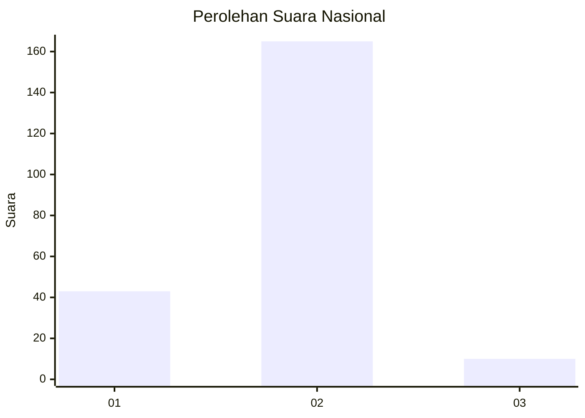
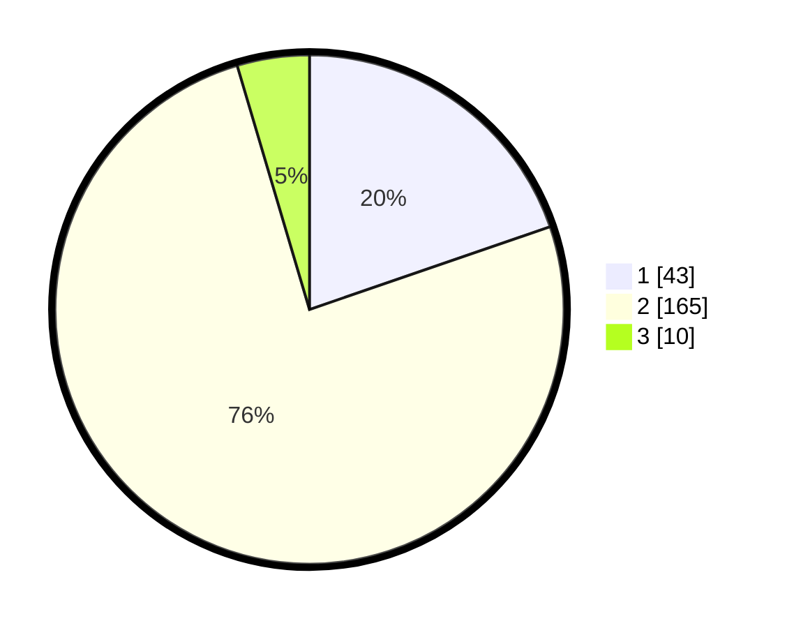

# Hasil

## Grafik

## Tabel

| No. | Nama Paslon    | Suara | Suara (raw) | Persentase |
|:--- |:-------------- | -----:| -----------:| ----------:|
| 1   | ANIES MUHAIMIN | 43    | [43][p-1]   | 19,72      |
| 2   | PRABOWO GIBRAN | 165   | [165][p-2]  | 75,69      |
| 3   | GANJAR MAHFUD  | 10    | [10][p-3]   | 4,59       |

[p-1]: https://github.com/gigit-pemilu/pemilu-2024/blob/main/pilpres/hitung-suara/sub/74-sulawesi-tenggara/sub/03-muna/sub/31-marobo/sub/2001-marobo/sub/001-tps/sub/paslon-1.txt
[p-2]: https://github.com/gigit-pemilu/pemilu-2024/blob/main/pilpres/hitung-suara/sub/74-sulawesi-tenggara/sub/03-muna/sub/31-marobo/sub/2001-marobo/sub/001-tps/sub/paslon-2.txt
[p-3]: https://github.com/gigit-pemilu/pemilu-2024/blob/main/pilpres/hitung-suara/sub/74-sulawesi-tenggara/sub/03-muna/sub/31-marobo/sub/2001-marobo/sub/001-tps/sub/paslon-3.txt

## Foto C Plano

https://sirekap-obj-formc.kpu.go.id/3bb2/pemilu/ppwp/74/03/31/20/01/7403312001001-20240215-142840--735bbe8b-5f88-48c8-87e5-f9463671d4fc.jpg

https://sirekap-obj-formc.kpu.go.id/3bb2/pemilu/ppwp/74/03/31/20/01/7403312001001-20240215-093233--96b41672-9dc4-4bd3-b81f-1caa8283f9ce.jpg

https://sirekap-obj-formc.kpu.go.id/3bb2/pemilu/ppwp/74/03/31/20/01/7403312001001-20240215-093811--59274eed-be0c-4c53-8f07-bd8001bdd3e9.jpg

## Metadata

| Key        | Value               |
| ---------- | ------------------- |
| Time Stamp | 2024-02-15 15:00:29 |

