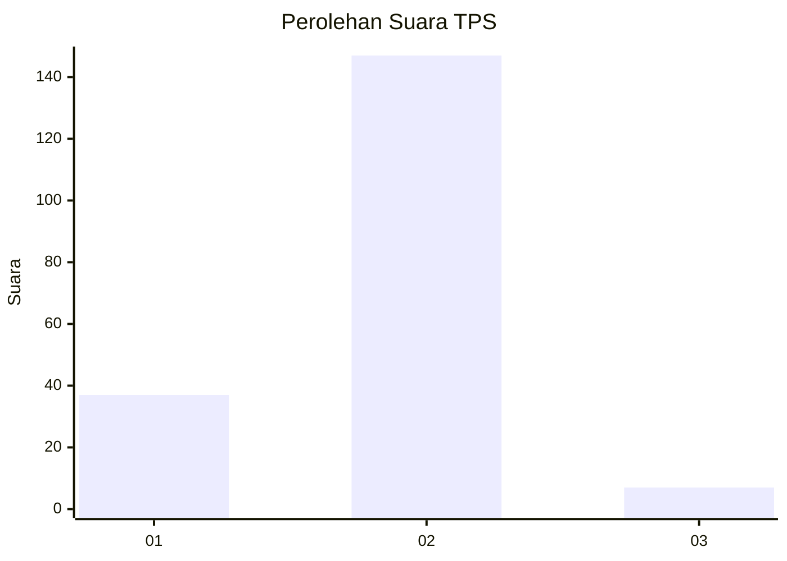
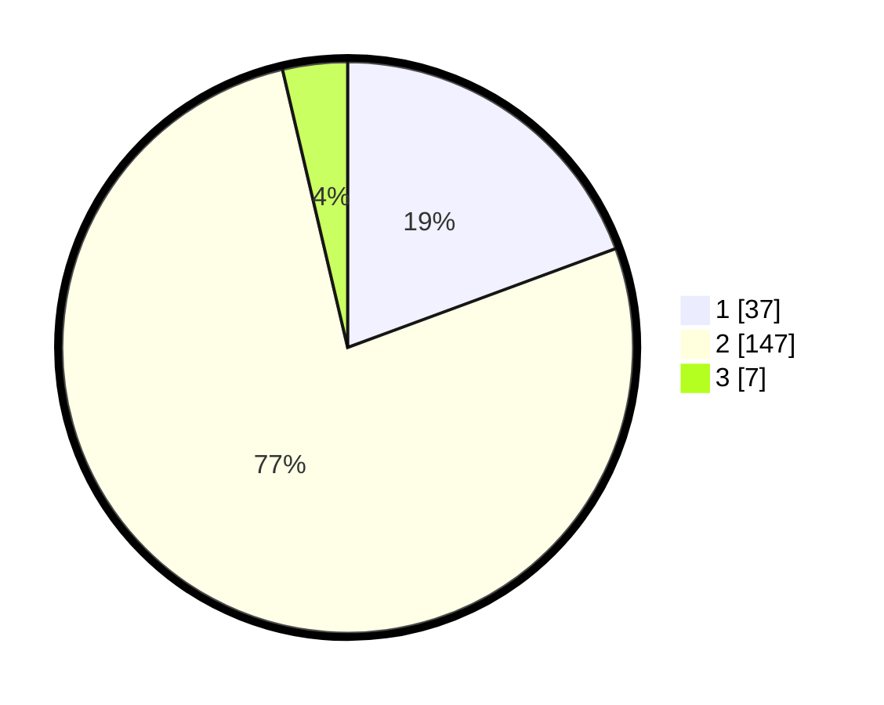

# Hasil

## Grafik

## Tabel

| No. | Nama Paslon    | Suara | Suara (raw) | Persentase |
|:--- |:-------------- | -----:| -----------:| ----------:|
| 1   | ANIES MUHAIMIN | 37    | [37][p-1]   | 19,37      |
| 2   | PRABOWO GIBRAN | 147   | [147][p-2]  | 76,96      |
| 3   | GANJAR MAHFUD  | 7     | [7][p-3]    | 3,66       |

[p-1]: https://github.com/gigit-pemilu/pemilu-2024-74-sulawesi-tenggara/blob/main/pilpres/hitung-suara/sub/74-sulawesi-tenggara/sub/03-muna/sub/32-tongkuno-selatan/sub/1001-lawama/sub/001-tps/sub/paslon-1.txt
[p-2]: https://github.com/gigit-pemilu/pemilu-2024-74-sulawesi-tenggara/blob/main/pilpres/hitung-suara/sub/74-sulawesi-tenggara/sub/03-muna/sub/32-tongkuno-selatan/sub/1001-lawama/sub/001-tps/sub/paslon-2.txt
[p-3]: https://github.com/gigit-pemilu/pemilu-2024-74-sulawesi-tenggara/blob/main/pilpres/hitung-suara/sub/74-sulawesi-tenggara/sub/03-muna/sub/32-tongkuno-selatan/sub/1001-lawama/sub/001-tps/sub/paslon-3.txt

## Foto C Plano

https://sirekap-obj-formc.kpu.go.id/8f64/pemilu/ppwp/74/03/32/10/01/7403321001001-20240214-204321--ffc3be75-0c52-413e-82bb-e9d09105c75a.jpg

https://sirekap-obj-formc.kpu.go.id/8f64/pemilu/ppwp/74/03/32/10/01/7403321001001-20240214-210501--a631e2cf-5b24-47c7-a522-42587d11f2f0.jpg

https://sirekap-obj-formc.kpu.go.id/8f64/pemilu/ppwp/74/03/32/10/01/7403321001001-20240214-204757--35bb89f3-f8f6-4588-bb48-69108c8da06c.jpg

## Metadata

| Key        | Value               |
| ---------- | ------------------- |
| Time Stamp | 2024-02-15 15:00:29 |

