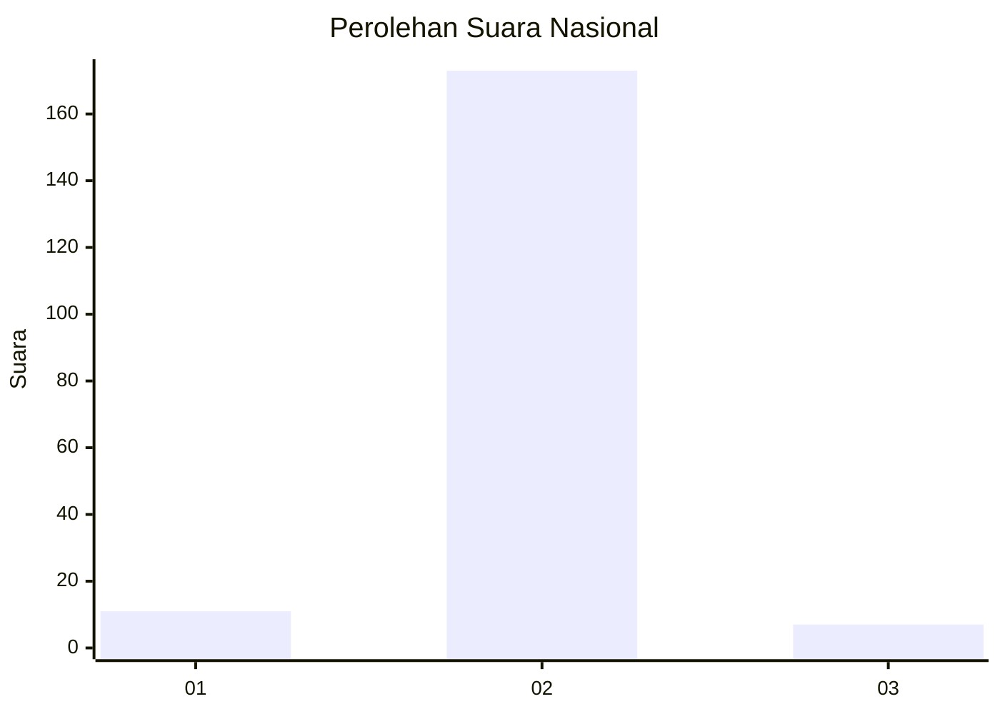
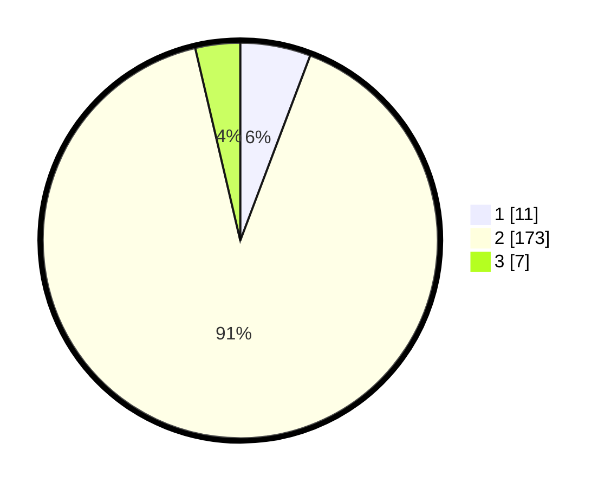

# Hasil

## Grafik

## Tabel

| No. | Nama Paslon    | Suara | Suara (raw) | Persentase |
|:--- |:-------------- | -----:| -----------:| ----------:|
| 1   | ANIES MUHAIMIN | 11    | [11][p-1]   | 5,76       |
| 2   | PRABOWO GIBRAN | 173   | [173][p-2]  | 90,58      |
| 3   | GANJAR MAHFUD  | 7     | [7][p-3]    | 3,66       |

[p-1]: https://github.com/gigit-pemilu/pemilu-2024/blob/main/pilpres/hitung-suara/sub/74-sulawesi-tenggara/sub/05-konawe-selatan/sub/02-angata/sub/2041-boloso/sub/002-tps/sub/paslon-1.txt
[p-2]: https://github.com/gigit-pemilu/pemilu-2024/blob/main/pilpres/hitung-suara/sub/74-sulawesi-tenggara/sub/05-konawe-selatan/sub/02-angata/sub/2041-boloso/sub/002-tps/sub/paslon-2.txt
[p-3]: https://github.com/gigit-pemilu/pemilu-2024/blob/main/pilpres/hitung-suara/sub/74-sulawesi-tenggara/sub/05-konawe-selatan/sub/02-angata/sub/2041-boloso/sub/002-tps/sub/paslon-3.txt

## Foto C Plano

https://sirekap-obj-formc.kpu.go.id/d1c6/pemilu/ppwp/74/05/02/20/41/7405022041002-20240215-082012--4fb0b461-86e6-43eb-b442-b26ecd59bd02.jpg

https://sirekap-obj-formc.kpu.go.id/d1c6/pemilu/ppwp/74/05/02/20/41/7405022041002-20240215-082158--276455e8-79e3-4821-9efb-4c4d1d5c3599.jpg

https://sirekap-obj-formc.kpu.go.id/d1c6/pemilu/ppwp/74/05/02/20/41/7405022041002-20240215-082311--acc6d0b4-6402-40a8-b2b1-e7e4f17bfb5b.jpg

## Metadata

| Key        | Value               |
| ---------- | ------------------- |
| Time Stamp | 2024-02-25 11:00:00 |

