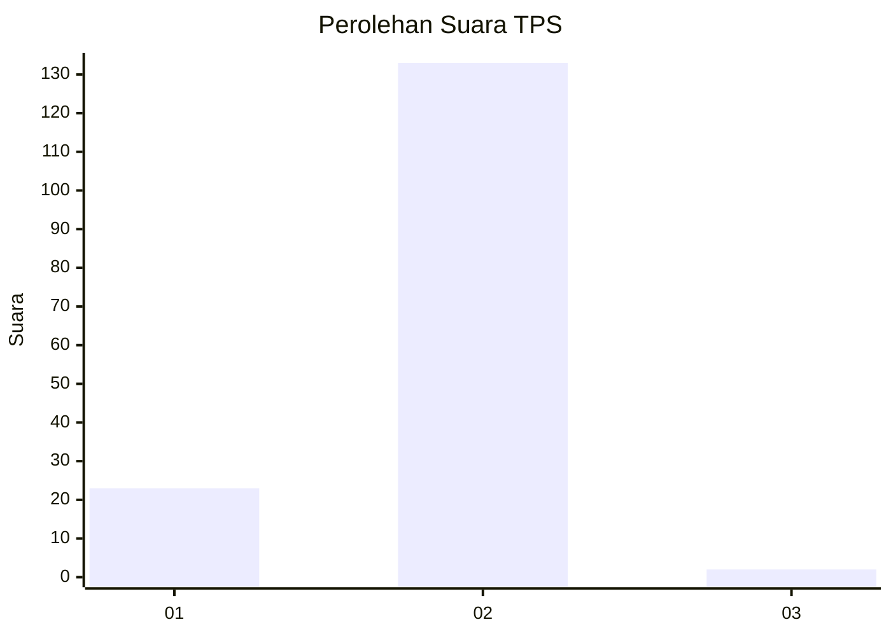
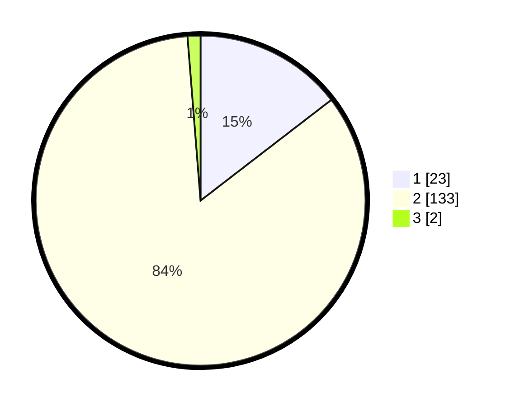

# Hasil

## Grafik

## Tabel

| No. | Nama Paslon    | Suara | Suara (raw) | Persentase |
|:--- |:-------------- | -----:| -----------:| ----------:|
| 1   | ANIES MUHAIMIN | 23    | [23][p-1]   | 14,56      |
| 2   | PRABOWO GIBRAN | 133   | [133][p-2]  | 84,18      |
| 3   | GANJAR MAHFUD  | 2     | [2][p-3]    | 1,27       |

[p-1]: https://github.com/gigit-pemilu/pemilu-2024-74-sulawesi-tenggara/blob/main/pilpres/hitung-suara/sub/74-sulawesi-tenggara/sub/05-konawe-selatan/sub/04-palangga/sub/1001-palangga/sub/004-tps/sub/paslon-1.txt
[p-2]: https://github.com/gigit-pemilu/pemilu-2024-74-sulawesi-tenggara/blob/main/pilpres/hitung-suara/sub/74-sulawesi-tenggara/sub/05-konawe-selatan/sub/04-palangga/sub/1001-palangga/sub/004-tps/sub/paslon-2.txt
[p-3]: https://github.com/gigit-pemilu/pemilu-2024-74-sulawesi-tenggara/blob/main/pilpres/hitung-suara/sub/74-sulawesi-tenggara/sub/05-konawe-selatan/sub/04-palangga/sub/1001-palangga/sub/004-tps/sub/paslon-3.txt

## Foto C Plano

https://sirekap-obj-formc.kpu.go.id/7f2c/pemilu/ppwp/74/05/04/10/01/7405041001004-20240216-072526--30354644-ef83-4360-82b8-4b7b88291561.jpg

https://sirekap-obj-formc.kpu.go.id/7f2c/pemilu/ppwp/74/05/04/10/01/7405041001004-20240215-075237--853357b4-3725-4f70-a16c-9c8fe77ab7fd.jpg

https://sirekap-obj-formc.kpu.go.id/7f2c/pemilu/ppwp/74/05/04/10/01/7405041001004-20240215-075340--c19dfef9-b0c7-4b91-a75c-c2dec8f267bf.jpg

## Metadata

| Key        | Value               |
| ---------- | ------------------- |
| Time Stamp | 2024-02-16 08:00:28 |

