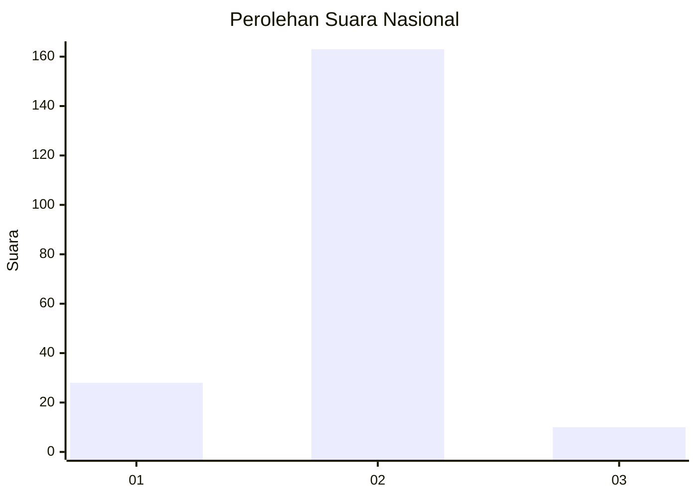
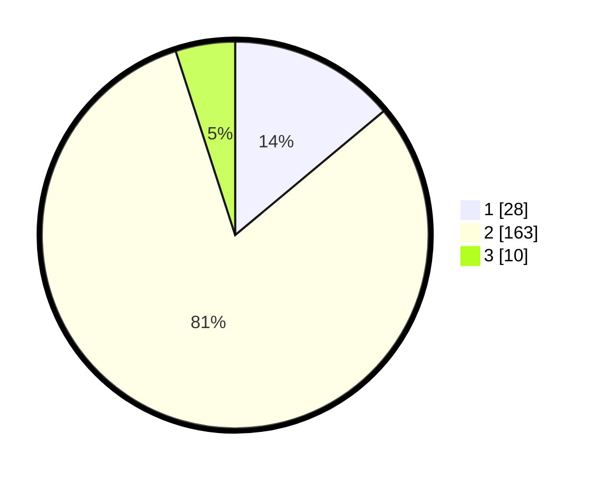

# Hasil

## Grafik

## Tabel

| No. | Nama Paslon    | Suara | Suara (raw) | Persentase |
|:--- |:-------------- | -----:| -----------:| ----------:|
| 1   | ANIES MUHAIMIN | 28    | [28][p-1]   | 13,93      |
| 2   | PRABOWO GIBRAN | 163   | [163][p-2]  | 81,09      |
| 3   | GANJAR MAHFUD  | 10    | [10][p-3]   | 4,98       |

[p-1]: https://github.com/gigit-pemilu/pemilu-2024/blob/main/pilpres/hitung-suara/sub/74-sulawesi-tenggara/sub/05-konawe-selatan/sub/07-konda/sub/2002-puosu-jaya/sub/001-tps/sub/paslon-1.txt
[p-2]: https://github.com/gigit-pemilu/pemilu-2024/blob/main/pilpres/hitung-suara/sub/74-sulawesi-tenggara/sub/05-konawe-selatan/sub/07-konda/sub/2002-puosu-jaya/sub/001-tps/sub/paslon-2.txt
[p-3]: https://github.com/gigit-pemilu/pemilu-2024/blob/main/pilpres/hitung-suara/sub/74-sulawesi-tenggara/sub/05-konawe-selatan/sub/07-konda/sub/2002-puosu-jaya/sub/001-tps/sub/paslon-3.txt

## Foto C Plano

https://sirekap-obj-formc.kpu.go.id/8576/pemilu/ppwp/74/05/07/20/02/7405072002001-20240215-122926--54ae2a87-1ff6-43fe-b2c8-74f716c74ef4.jpg

https://sirekap-obj-formc.kpu.go.id/8576/pemilu/ppwp/74/05/07/20/02/7405072002001-20240215-123101--331e2f4a-31f0-4c92-890e-cf4f438cddea.jpg

https://sirekap-obj-formc.kpu.go.id/8576/pemilu/ppwp/74/05/07/20/02/7405072002001-20240215-123153--8548cb66-43ac-4e0c-9761-cdf57ad72b86.jpg

## Metadata

| Key        | Value               |
| ---------- | ------------------- |
| Time Stamp | 2024-02-25 02:00:00 |

