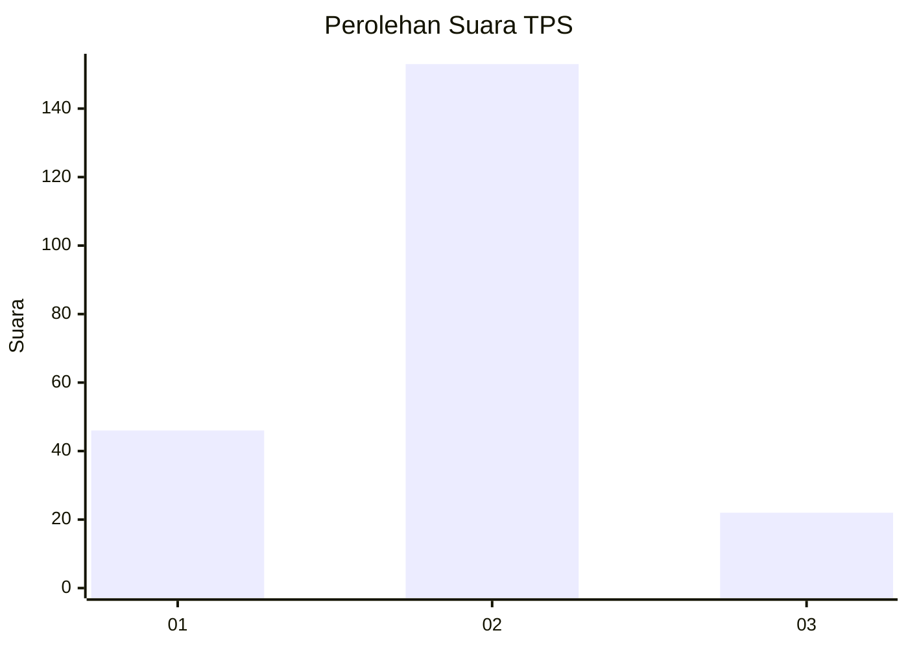

# Hasil

## Grafik

## Tabel

| No. | Nama Paslon    | Suara | Suara (raw) | Persentase |
|:--- |:-------------- | -----:| -----------:| ----------:|
| 1   | ANIES MUHAIMIN | 46    | [46][p-1]   | 20,81      |
| 2   | PRABOWO GIBRAN | 153   | [153][p-2]  | 69,23      |
| 3   | GANJAR MAHFUD  | 22    | [22][p-3]   | 9,95       |

[p-1]: https://github.com/gigit-pemilu/pemilu-2024-74-sulawesi-tenggara/blob/main/pilpres/hitung-suara/sub/74-sulawesi-tenggara/sub/05-konawe-selatan/sub/08-ranomeeto/sub/1001-ranomeeto/sub/001-tps/sub/paslon-1.txt
[p-2]: https://github.com/gigit-pemilu/pemilu-2024-74-sulawesi-tenggara/blob/main/pilpres/hitung-suara/sub/74-sulawesi-tenggara/sub/05-konawe-selatan/sub/08-ranomeeto/sub/1001-ranomeeto/sub/001-tps/sub/paslon-2.txt
[p-3]: https://github.com/gigit-pemilu/pemilu-2024-74-sulawesi-tenggara/blob/main/pilpres/hitung-suara/sub/74-sulawesi-tenggara/sub/05-konawe-selatan/sub/08-ranomeeto/sub/1001-ranomeeto/sub/001-tps/sub/paslon-3.txt

## Foto C Plano

https://sirekap-obj-formc.kpu.go.id/09c7/pemilu/ppwp/74/05/08/10/01/7405081001001-20240215-053725--4c3a9538-38f1-4338-ae3f-4b1dd0a837a6.jpg

https://sirekap-obj-formc.kpu.go.id/09c7/pemilu/ppwp/74/05/08/10/01/7405081001001-20240215-053928--d8f35e7e-780f-41f0-9a4b-ad0b9e45ba1b.jpg

https://sirekap-obj-formc.kpu.go.id/09c7/pemilu/ppwp/74/05/08/10/01/7405081001001-20240215-054005--c4e6b9ac-39a4-4434-ad31-a9c35a073147.jpg

## Metadata

| Key        | Value               |
| ---------- | ------------------- |
| Time Stamp | 2024-02-25 11:00:00 |

