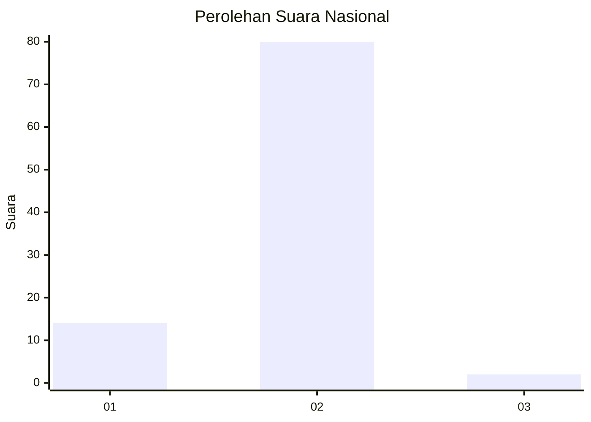
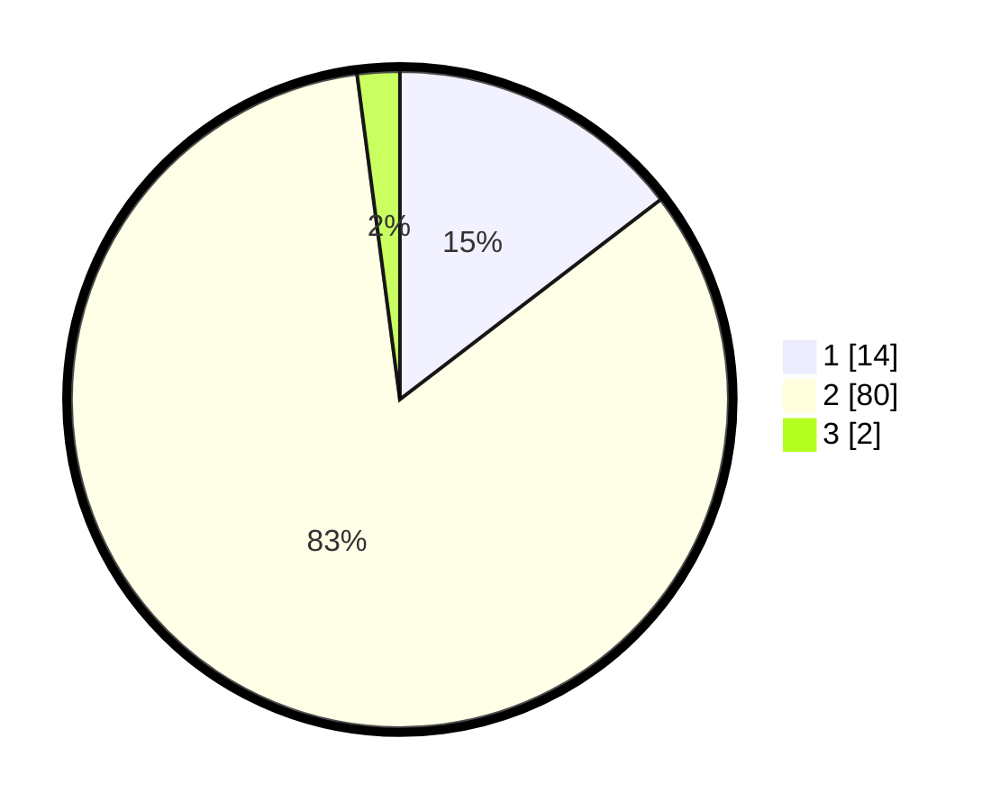

# Hasil

## Grafik

## Tabel

| No. | Nama Paslon    | Suara | Suara (raw) | Persentase |
|:--- |:-------------- | -----:| -----------:| ----------:|
| 1   | ANIES MUHAIMIN | 14    | [14][p-1]   | 14,58      |
| 2   | PRABOWO GIBRAN | 80    | [80][p-2]   | 83,33      |
| 3   | GANJAR MAHFUD  | 2     | [2][p-3]    | 2,08       |

[p-1]: https://github.com/gigit-pemilu/pemilu-2024/blob/main/pilpres/hitung-suara/sub/74-sulawesi-tenggara/sub/05-konawe-selatan/sub/09-kolono/sub/2009-mondoe-jaya/sub/002-tps/sub/paslon-1.txt
[p-2]: https://github.com/gigit-pemilu/pemilu-2024/blob/main/pilpres/hitung-suara/sub/74-sulawesi-tenggara/sub/05-konawe-selatan/sub/09-kolono/sub/2009-mondoe-jaya/sub/002-tps/sub/paslon-2.txt
[p-3]: https://github.com/gigit-pemilu/pemilu-2024/blob/main/pilpres/hitung-suara/sub/74-sulawesi-tenggara/sub/05-konawe-selatan/sub/09-kolono/sub/2009-mondoe-jaya/sub/002-tps/sub/paslon-3.txt

## Foto C Plano

https://sirekap-obj-formc.kpu.go.id/ed58/pemilu/ppwp/74/05/09/20/09/7405092009002-20240214-223205--383ad254-6337-4f5a-af1e-9fed7f890db4.jpg

https://sirekap-obj-formc.kpu.go.id/ed58/pemilu/ppwp/74/05/09/20/09/7405092009002-20240215-041719--c12fc839-6b40-454f-a676-5d03b8465290.jpg

https://sirekap-obj-formc.kpu.go.id/ed58/pemilu/ppwp/74/05/09/20/09/7405092009002-20240214-223643--638a027a-ef04-4e83-a168-d8533564d90c.jpg

## Metadata

| Key        | Value               |
| ---------- | ------------------- |
| Time Stamp | 2024-02-24 22:31:28 |

