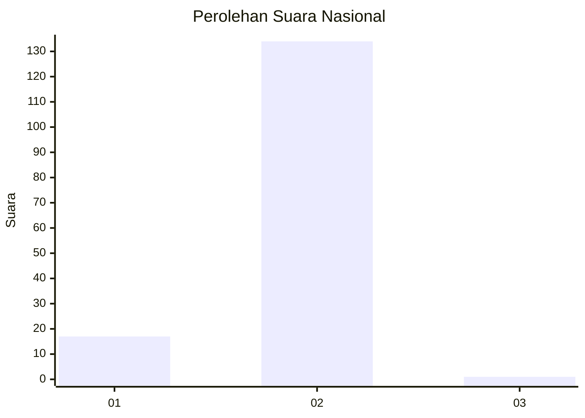
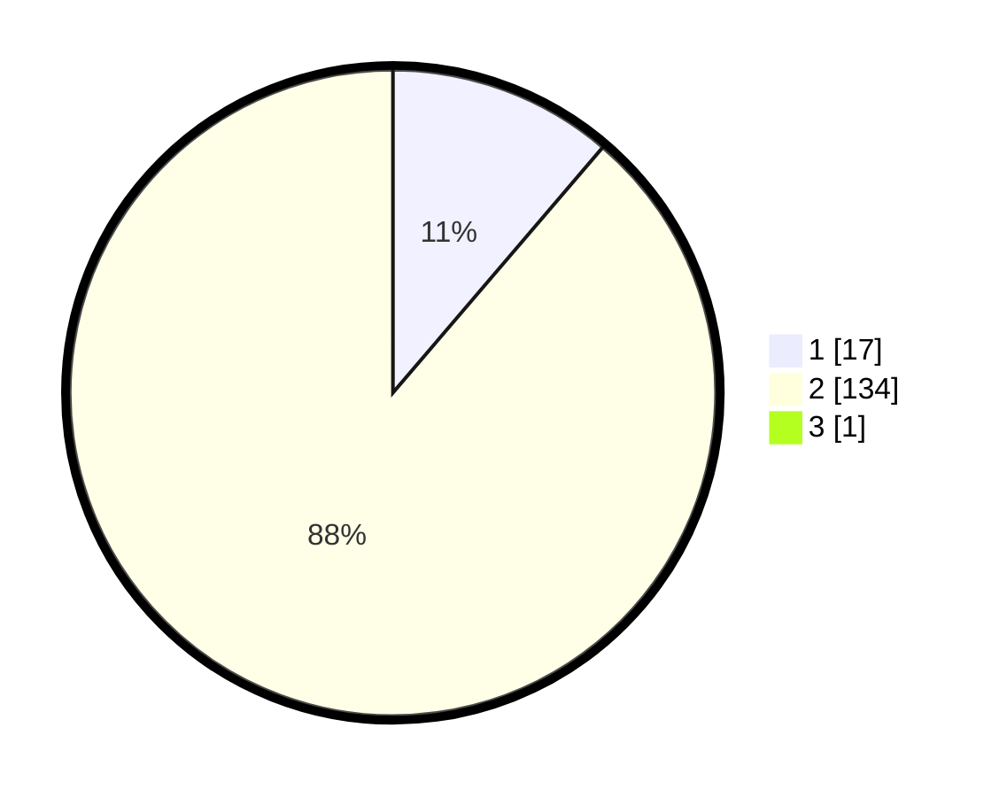

# Hasil

## Grafik

## Tabel

| No. | Nama Paslon    | Suara | Suara (raw) | Persentase |
|:--- |:-------------- | -----:| -----------:| ----------:|
| 1   | ANIES MUHAIMIN | 17    | [17][p-1]   | 11,18      |
| 2   | PRABOWO GIBRAN | 134   | [134][p-2]  | 88,16      |
| 3   | GANJAR MAHFUD  | 1     | [1][p-3]    | 0,66       |

[p-1]: https://github.com/gigit-pemilu/pemilu-2024/blob/main/pilpres/hitung-suara/sub/74-sulawesi-tenggara/sub/05-konawe-selatan/sub/11-laonti/sub/2003-woru-woru/sub/001-tps/sub/paslon-1.txt
[p-2]: https://github.com/gigit-pemilu/pemilu-2024/blob/main/pilpres/hitung-suara/sub/74-sulawesi-tenggara/sub/05-konawe-selatan/sub/11-laonti/sub/2003-woru-woru/sub/001-tps/sub/paslon-2.txt
[p-3]: https://github.com/gigit-pemilu/pemilu-2024/blob/main/pilpres/hitung-suara/sub/74-sulawesi-tenggara/sub/05-konawe-selatan/sub/11-laonti/sub/2003-woru-woru/sub/001-tps/sub/paslon-3.txt

## Foto C Plano

https://sirekap-obj-formc.kpu.go.id/d540/pemilu/ppwp/74/05/11/20/03/7405112003001-20240215-111916--9754b2ea-c537-4a52-b8b4-c90fb941e4a7.jpg

https://sirekap-obj-formc.kpu.go.id/d540/pemilu/ppwp/74/05/11/20/03/7405112003001-20240215-094155--4b8df6d0-c84d-442b-9fe0-ba2aee564d10.jpg

https://sirekap-obj-formc.kpu.go.id/d540/pemilu/ppwp/74/05/11/20/03/7405112003001-20240215-094444--c8454e74-c7b8-4a2e-9408-c7606b1bead8.jpg

## Metadata

| Key        | Value               |
| ---------- | ------------------- |
| Time Stamp | 2024-02-25 17:00:00 |

