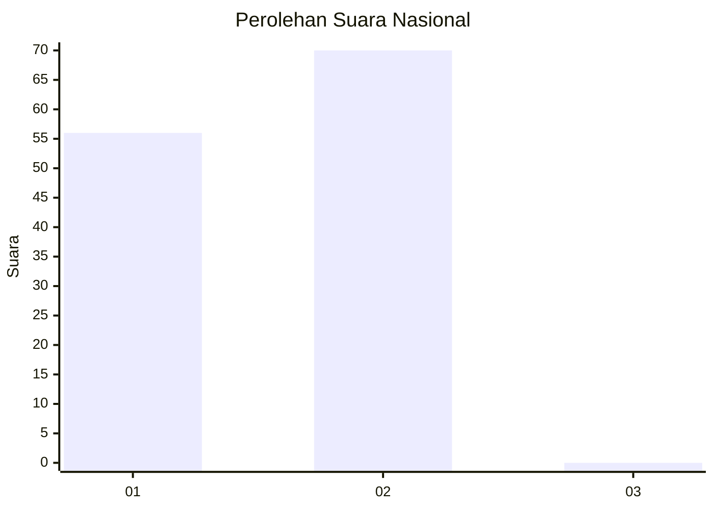
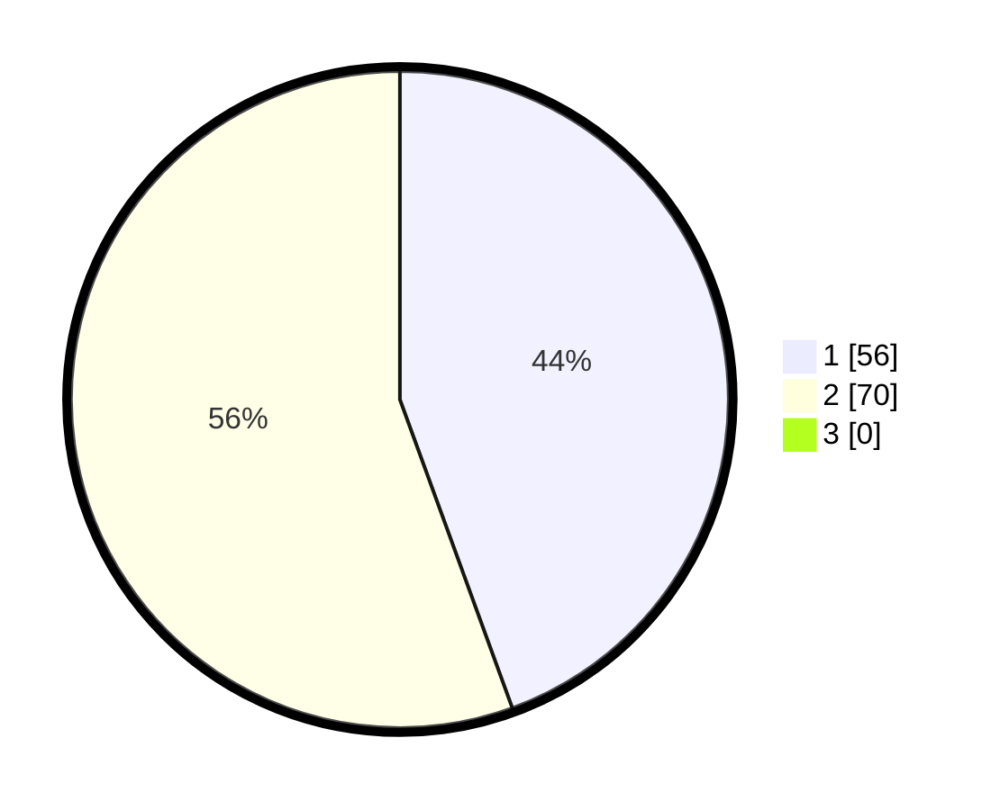

# Hasil

## Grafik

## Tabel

| No. | Nama Paslon    | Suara | Suara (raw) | Persentase |
|:--- |:-------------- | -----:| -----------:| ----------:|
| 1   | ANIES MUHAIMIN | 56    | [56][p-1]   | 44,44      |
| 2   | PRABOWO GIBRAN | 70    | [70][p-2]   | 55,56      |
| 3   | GANJAR MAHFUD  | 0     | [0][p-3]    | 0,00       |

[p-1]: https://github.com/gigit-pemilu/pemilu-2024/blob/main/pilpres/hitung-suara/sub/74-sulawesi-tenggara/sub/05-konawe-selatan/sub/11-laonti/sub/2009-tue-tue/sub/002-tps/sub/paslon-1.txt
[p-2]: https://github.com/gigit-pemilu/pemilu-2024/blob/main/pilpres/hitung-suara/sub/74-sulawesi-tenggara/sub/05-konawe-selatan/sub/11-laonti/sub/2009-tue-tue/sub/002-tps/sub/paslon-2.txt
[p-3]: https://github.com/gigit-pemilu/pemilu-2024/blob/main/pilpres/hitung-suara/sub/74-sulawesi-tenggara/sub/05-konawe-selatan/sub/11-laonti/sub/2009-tue-tue/sub/002-tps/sub/paslon-3.txt

## Foto C Plano

https://sirekap-obj-formc.kpu.go.id/f9de/pemilu/ppwp/74/05/11/20/09/7405112009002-20240215-160709--dd7f7162-fccc-4c1c-a898-567e1b574b24.jpg

https://sirekap-obj-formc.kpu.go.id/f9de/pemilu/ppwp/74/05/11/20/09/7405112009002-20240215-160924--60a08adf-ac75-4c45-b59d-50be46c53f2b.jpg

https://sirekap-obj-formc.kpu.go.id/f9de/pemilu/ppwp/74/05/11/20/09/7405112009002-20240215-161133--76591dbf-937c-4d06-869a-3db39b15d26d.jpg

## Metadata

| Key        | Value               |
| ---------- | ------------------- |
| Time Stamp | 2024-02-27 13:00:00 |

