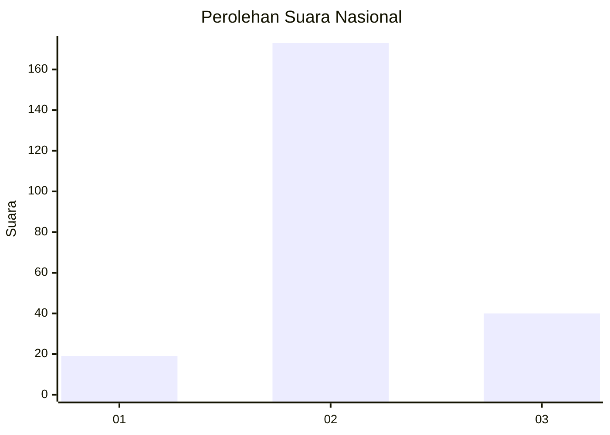

# Hasil

## Grafik

## Tabel

| No. | Nama Paslon    | Suara | Suara (raw) | Persentase |
|:--- |:-------------- | -----:| -----------:| ----------:|
| 1   | ANIES MUHAIMIN | 19    | [19][p-1]   | 8,19       |
| 2   | PRABOWO GIBRAN | 173   | [173][p-2]  | 74,57      |
| 3   | GANJAR MAHFUD  | 40    | [40][p-3]   | 17,24      |

[p-1]: https://github.com/gigit-pemilu/pemilu-2024/blob/main/pilpres/hitung-suara/sub/74-sulawesi-tenggara/sub/05-konawe-selatan/sub/15-mowila/sub/2005-mulyasari/sub/002-tps/sub/paslon-1.txt
[p-2]: https://github.com/gigit-pemilu/pemilu-2024/blob/main/pilpres/hitung-suara/sub/74-sulawesi-tenggara/sub/05-konawe-selatan/sub/15-mowila/sub/2005-mulyasari/sub/002-tps/sub/paslon-2.txt
[p-3]: https://github.com/gigit-pemilu/pemilu-2024/blob/main/pilpres/hitung-suara/sub/74-sulawesi-tenggara/sub/05-konawe-selatan/sub/15-mowila/sub/2005-mulyasari/sub/002-tps/sub/paslon-3.txt

## Foto C Plano

https://sirekap-obj-formc.kpu.go.id/3092/pemilu/ppwp/74/05/15/20/05/7405152005002-20240215-035811--7f42a396-d77f-4f9f-9a48-a12f32a53af3.jpg

https://sirekap-obj-formc.kpu.go.id/3092/pemilu/ppwp/74/05/15/20/05/7405152005002-20240215-035811--0fa233c0-2633-4baf-a80c-dc3c32a8975c.jpg

https://sirekap-obj-formc.kpu.go.id/3092/pemilu/ppwp/74/05/15/20/05/7405152005002-20240215-035937--170f1443-c17d-4d0a-be01-72143609a51d.jpg

## Metadata

| Key        | Value               |
| ---------- | ------------------- |
| Time Stamp | 2024-02-25 21:00:00 |

