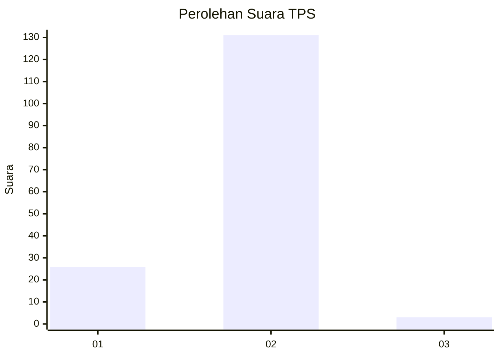
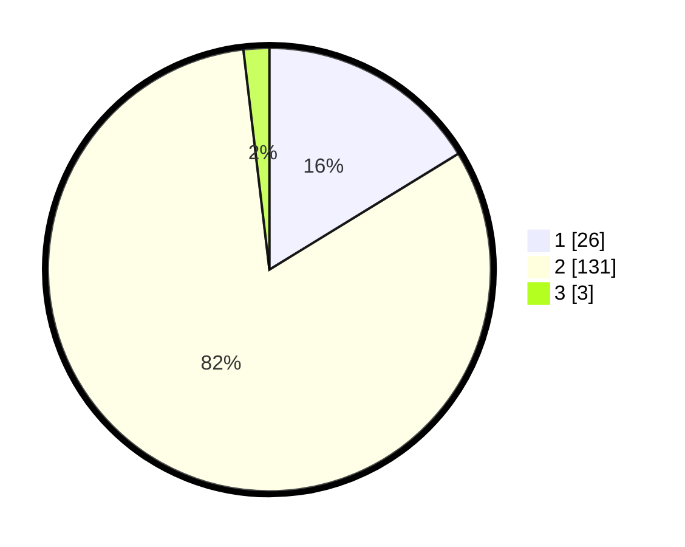

# Hasil

## Grafik

## Tabel

| No. | Nama Paslon    | Suara | Suara (raw) | Persentase |
|:--- |:-------------- | -----:| -----------:| ----------:|
| 1   | ANIES MUHAIMIN | 26    | [26][p-1]   | 16,25      |
| 2   | PRABOWO GIBRAN | 131   | [131][p-2]  | 81,88      |
| 3   | GANJAR MAHFUD  | 3     | [3][p-3]    | 1,88       |

[p-1]: https://github.com/gigit-pemilu/pemilu-2024-74-sulawesi-tenggara/blob/main/pilpres/hitung-suara/sub/74-sulawesi-tenggara/sub/05-konawe-selatan/sub/16-moramo-utara/sub/1002-lalowaru/sub/001-tps/sub/paslon-1.txt
[p-2]: https://github.com/gigit-pemilu/pemilu-2024-74-sulawesi-tenggara/blob/main/pilpres/hitung-suara/sub/74-sulawesi-tenggara/sub/05-konawe-selatan/sub/16-moramo-utara/sub/1002-lalowaru/sub/001-tps/sub/paslon-2.txt
[p-3]: https://github.com/gigit-pemilu/pemilu-2024-74-sulawesi-tenggara/blob/main/pilpres/hitung-suara/sub/74-sulawesi-tenggara/sub/05-konawe-selatan/sub/16-moramo-utara/sub/1002-lalowaru/sub/001-tps/sub/paslon-3.txt

## Foto C Plano

https://sirekap-obj-formc.kpu.go.id/e459/pemilu/ppwp/74/05/16/10/02/7405161002001-20240215-054004--e14d3fd7-1794-4d51-a21b-13f874e1bba4.jpg

https://sirekap-obj-formc.kpu.go.id/e459/pemilu/ppwp/74/05/16/10/02/7405161002001-20240216-172441--8b9d953c-2c1e-4f33-b656-503e1188ff36.jpg

https://sirekap-obj-formc.kpu.go.id/e459/pemilu/ppwp/74/05/16/10/02/7405161002001-20240215-050607--f0649e97-a7af-475b-a812-2152fedebece.jpg

## Metadata

| Key        | Value               |
| ---------- | ------------------- |
| Time Stamp | 2024-02-24 22:31:28 |

