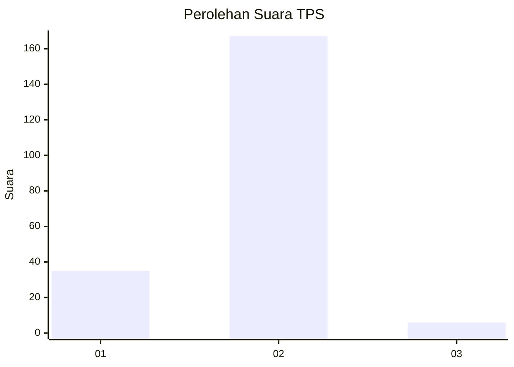
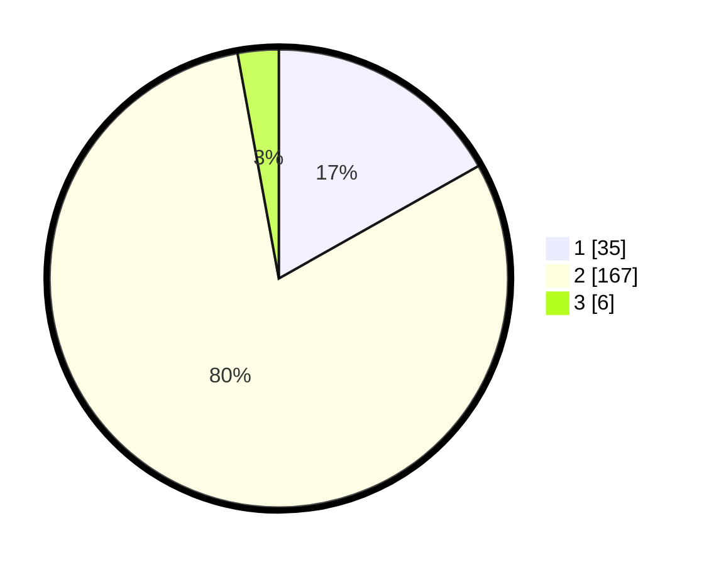

# Hasil

## Grafik

## Tabel

| No. | Nama Paslon    | Suara | Suara (raw) | Persentase |
|:--- |:-------------- | -----:| -----------:| ----------:|
| 1   | ANIES MUHAIMIN | 35    | [35][p-1]   | 16,83      |
| 2   | PRABOWO GIBRAN | 167   | [167][p-2]  | 80,29      |
| 3   | GANJAR MAHFUD  | 6     | [6][p-3]    | 2,88       |

[p-1]: https://github.com/gigit-pemilu/pemilu-2024-74-sulawesi-tenggara/blob/main/pilpres/hitung-suara/sub/74-sulawesi-tenggara/sub/05-konawe-selatan/sub/16-moramo-utara/sub/1002-lalowaru/sub/002-tps/sub/paslon-1.txt
[p-2]: https://github.com/gigit-pemilu/pemilu-2024-74-sulawesi-tenggara/blob/main/pilpres/hitung-suara/sub/74-sulawesi-tenggara/sub/05-konawe-selatan/sub/16-moramo-utara/sub/1002-lalowaru/sub/002-tps/sub/paslon-2.txt
[p-3]: https://github.com/gigit-pemilu/pemilu-2024-74-sulawesi-tenggara/blob/main/pilpres/hitung-suara/sub/74-sulawesi-tenggara/sub/05-konawe-selatan/sub/16-moramo-utara/sub/1002-lalowaru/sub/002-tps/sub/paslon-3.txt

## Foto C Plano

https://sirekap-obj-formc.kpu.go.id/bd82/pemilu/ppwp/74/05/16/10/02/7405161002002-20240215-061848--917090ba-fb7b-44ca-9198-ecfe06f386db.jpg

https://sirekap-obj-formc.kpu.go.id/bd82/pemilu/ppwp/74/05/16/10/02/7405161002002-20240214-205142--04402080-7928-4f24-9539-b6c30f3e6bef.jpg

https://sirekap-obj-formc.kpu.go.id/bd82/pemilu/ppwp/74/05/16/10/02/7405161002002-20240215-063030--80f2c879-cedc-425c-b1e2-53515fd96130.jpg

## Metadata

| Key        | Value               |
| ---------- | ------------------- |
| Time Stamp | 2024-02-25 15:00:00 |

