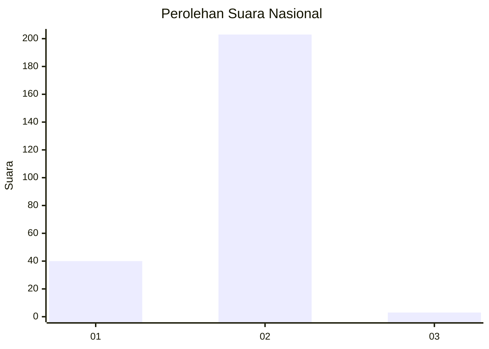
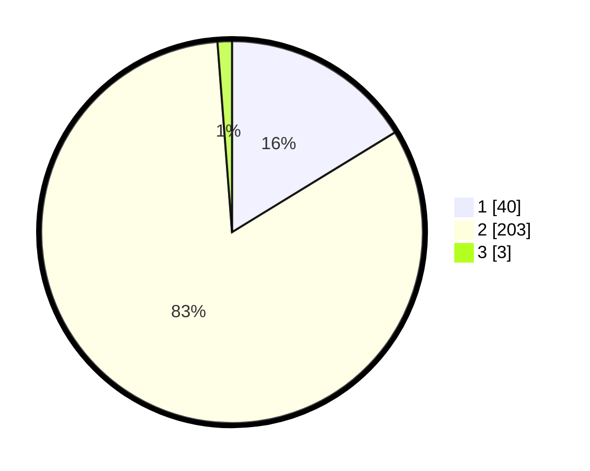

# Hasil

## Grafik

## Tabel

| No. | Nama Paslon    | Suara | Suara (raw) | Persentase |
|:--- |:-------------- | -----:| -----------:| ----------:|
| 1   | ANIES MUHAIMIN | 40    | [40][p-1]   | 16,26      |
| 2   | PRABOWO GIBRAN | 203   | [203][p-2]  | 82,52      |
| 3   | GANJAR MAHFUD  | 3     | [3][p-3]    | 1,22       |

[p-1]: https://github.com/gigit-pemilu/pemilu-2024/blob/main/pilpres/hitung-suara/sub/74-sulawesi-tenggara/sub/05-konawe-selatan/sub/16-moramo-utara/sub/2001-puasana/sub/001-tps/sub/paslon-1.txt
[p-2]: https://github.com/gigit-pemilu/pemilu-2024/blob/main/pilpres/hitung-suara/sub/74-sulawesi-tenggara/sub/05-konawe-selatan/sub/16-moramo-utara/sub/2001-puasana/sub/001-tps/sub/paslon-2.txt
[p-3]: https://github.com/gigit-pemilu/pemilu-2024/blob/main/pilpres/hitung-suara/sub/74-sulawesi-tenggara/sub/05-konawe-selatan/sub/16-moramo-utara/sub/2001-puasana/sub/001-tps/sub/paslon-3.txt

## Foto C Plano

https://sirekap-obj-formc.kpu.go.id/fc17/pemilu/ppwp/74/05/16/20/01/7405162001001-20240215-011836--427df856-6dd9-4087-86e8-0b3743a4ad34.jpg

https://sirekap-obj-formc.kpu.go.id/fc17/pemilu/ppwp/74/05/16/20/01/7405162001001-20240215-021108--264101c3-59f4-40b3-b09b-62ecf73c6d64.jpg

https://sirekap-obj-formc.kpu.go.id/fc17/pemilu/ppwp/74/05/16/20/01/7405162001001-20240215-021523--93c0b891-7d5f-45f8-835e-ddc17b2b83b4.jpg

## Metadata

| Key        | Value               |
| ---------- | ------------------- |
| Time Stamp | 2024-02-24 23:00:00 |

