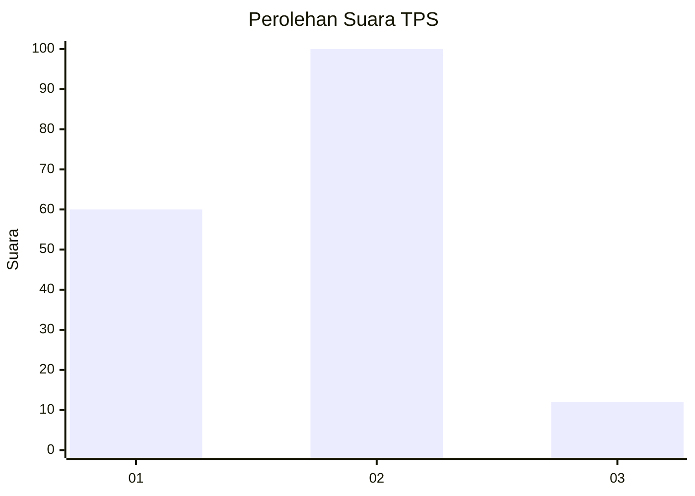
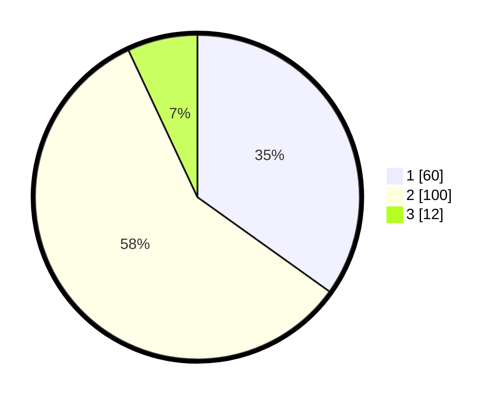

# Hasil

## Grafik

## Tabel

| No. | Nama Paslon    | Suara | Suara (raw) | Persentase |
|:--- |:-------------- | -----:| -----------:| ----------:|
| 1   | ANIES MUHAIMIN | 60    | [60][p-1]   | 34,88      |
| 2   | PRABOWO GIBRAN | 100   | [100][p-2]  | 58,14      |
| 3   | GANJAR MAHFUD  | 12    | [12][p-3]   | 6,98       |

[p-1]: https://github.com/gigit-pemilu/pemilu-2024-74-sulawesi-tenggara/blob/main/pilpres/hitung-suara/sub/74-sulawesi-tenggara/sub/05-konawe-selatan/sub/16-moramo-utara/sub/2003-tanjung-tiram/sub/001-tps/sub/paslon-1.txt
[p-2]: https://github.com/gigit-pemilu/pemilu-2024-74-sulawesi-tenggara/blob/main/pilpres/hitung-suara/sub/74-sulawesi-tenggara/sub/05-konawe-selatan/sub/16-moramo-utara/sub/2003-tanjung-tiram/sub/001-tps/sub/paslon-2.txt
[p-3]: https://github.com/gigit-pemilu/pemilu-2024-74-sulawesi-tenggara/blob/main/pilpres/hitung-suara/sub/74-sulawesi-tenggara/sub/05-konawe-selatan/sub/16-moramo-utara/sub/2003-tanjung-tiram/sub/001-tps/sub/paslon-3.txt

## Foto C Plano

https://sirekap-obj-formc.kpu.go.id/8269/pemilu/ppwp/74/05/16/20/03/7405162003001-20240215-073407--18ed3eda-9156-49fd-8e3f-50fcdfe4c21b.jpg

https://sirekap-obj-formc.kpu.go.id/8269/pemilu/ppwp/74/05/16/20/03/7405162003001-20240215-073816--c827e88d-73bf-45c2-8829-4a96b435a3c8.jpg

https://sirekap-obj-formc.kpu.go.id/8269/pemilu/ppwp/74/05/16/20/03/7405162003001-20240215-074202--9b9f488d-01a1-4e7d-974b-7132408fffc6.jpg

## Metadata

| Key        | Value               |
| ---------- | ------------------- |
| Time Stamp | 2024-02-25 00:00:00 |

