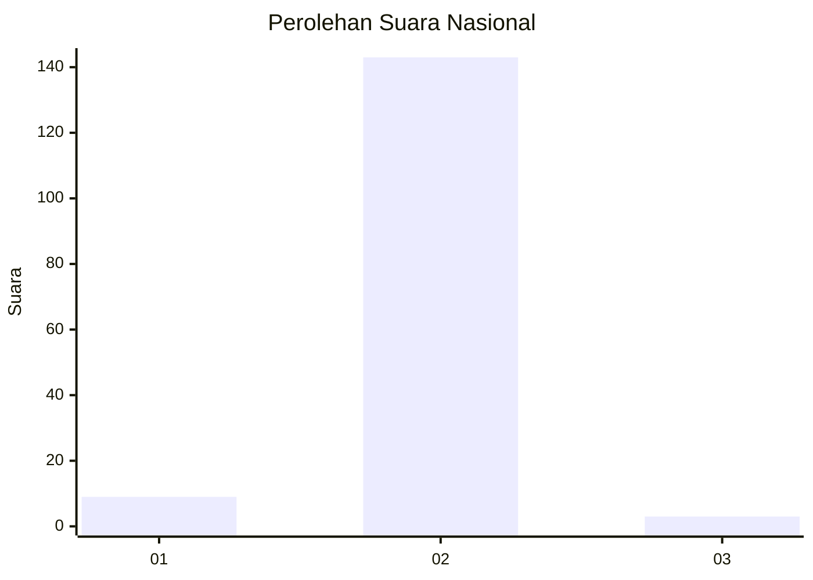
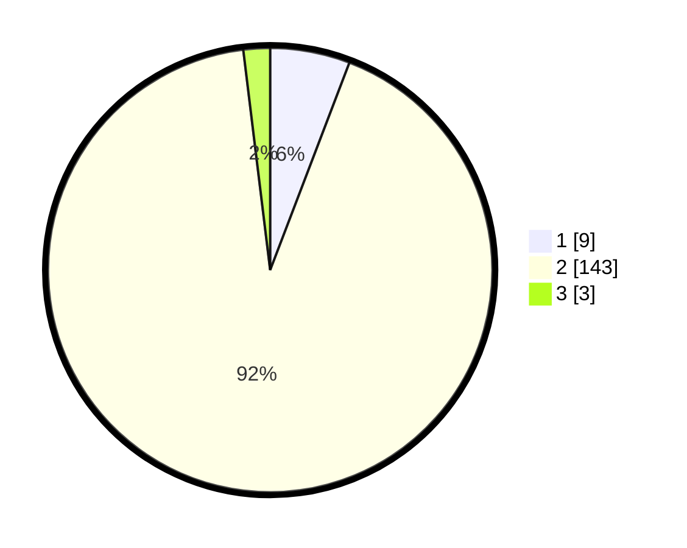

# Hasil

## Grafik

## Tabel

| No. | Nama Paslon    | Suara | Suara (raw) | Persentase |
|:--- |:-------------- | -----:| -----------:| ----------:|
| 1   | ANIES MUHAIMIN | 9     | [9][p-1]    | 5,81       |
| 2   | PRABOWO GIBRAN | 143   | [143][p-2]  | 92,26      |
| 3   | GANJAR MAHFUD  | 3     | [3][p-3]    | 1,94       |

[p-1]: https://github.com/gigit-pemilu/pemilu-2024/blob/main/pilpres/hitung-suara/sub/74-sulawesi-tenggara/sub/05-konawe-selatan/sub/16-moramo-utara/sub/2005-sanggula/sub/003-tps/sub/paslon-1.txt
[p-2]: https://github.com/gigit-pemilu/pemilu-2024/blob/main/pilpres/hitung-suara/sub/74-sulawesi-tenggara/sub/05-konawe-selatan/sub/16-moramo-utara/sub/2005-sanggula/sub/003-tps/sub/paslon-2.txt
[p-3]: https://github.com/gigit-pemilu/pemilu-2024/blob/main/pilpres/hitung-suara/sub/74-sulawesi-tenggara/sub/05-konawe-selatan/sub/16-moramo-utara/sub/2005-sanggula/sub/003-tps/sub/paslon-3.txt

## Foto C Plano

https://sirekap-obj-formc.kpu.go.id/6ec9/pemilu/ppwp/74/05/16/20/05/7405162005003-20240214-191146--0915b93e-4172-4513-a4f3-6f2aee7e090a.jpg

https://sirekap-obj-formc.kpu.go.id/6ec9/pemilu/ppwp/74/05/16/20/05/7405162005003-20240214-191205--0601dab4-34ed-425c-8e9c-e5b45041b97a.jpg

https://sirekap-obj-formc.kpu.go.id/6ec9/pemilu/ppwp/74/05/16/20/05/7405162005003-20240214-191230--f581e6aa-a209-440b-8094-1634f86d4216.jpg

## Metadata

| Key        | Value               |
| ---------- | ------------------- |
| Time Stamp | 2024-02-24 22:31:28 |

