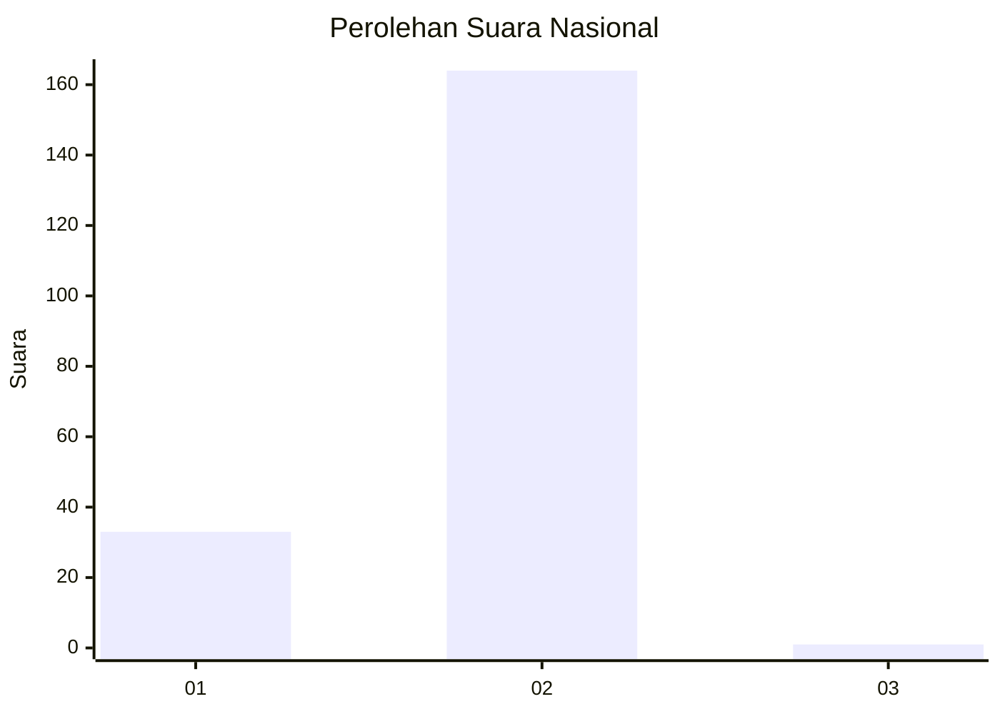
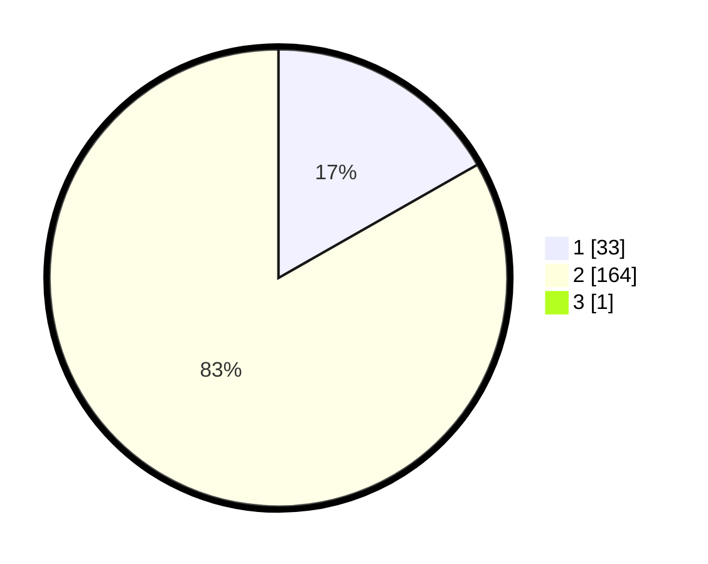

# Hasil

## Grafik

## Tabel

| No. | Nama Paslon    | Suara | Suara (raw) | Persentase |
|:--- |:-------------- | -----:| -----------:| ----------:|
| 1   | ANIES MUHAIMIN | 33    | [33][p-1]   | 16,67      |
| 2   | PRABOWO GIBRAN | 164   | [164][p-2]  | 82,83      |
| 3   | GANJAR MAHFUD  | 1     | [1][p-3]    | 0,51       |

[p-1]: https://github.com/gigit-pemilu/pemilu-2024/blob/main/pilpres/hitung-suara/sub/74-sulawesi-tenggara/sub/05-konawe-selatan/sub/21-basala/sub/2001-iwoimendoro/sub/003-tps/sub/paslon-1.txt
[p-2]: https://github.com/gigit-pemilu/pemilu-2024/blob/main/pilpres/hitung-suara/sub/74-sulawesi-tenggara/sub/05-konawe-selatan/sub/21-basala/sub/2001-iwoimendoro/sub/003-tps/sub/paslon-2.txt
[p-3]: https://github.com/gigit-pemilu/pemilu-2024/blob/main/pilpres/hitung-suara/sub/74-sulawesi-tenggara/sub/05-konawe-selatan/sub/21-basala/sub/2001-iwoimendoro/sub/003-tps/sub/paslon-3.txt

## Foto C Plano

https://sirekap-obj-formc.kpu.go.id/0af9/pemilu/ppwp/74/05/21/20/01/7405212001003-20240215-051200--39d19c50-82a2-4c0b-a946-caab31b0b2c9.jpg

https://sirekap-obj-formc.kpu.go.id/0af9/pemilu/ppwp/74/05/21/20/01/7405212001003-20240215-051300--8265f5dd-464d-40b1-99e5-f05bf86dcda0.jpg

https://sirekap-obj-formc.kpu.go.id/0af9/pemilu/ppwp/74/05/21/20/01/7405212001003-20240215-051348--342c80b0-6529-4c93-a495-6feb0cb16874.jpg

## Metadata

| Key        | Value               |
| ---------- | ------------------- |
| Time Stamp | 2024-02-25 12:00:00 |

