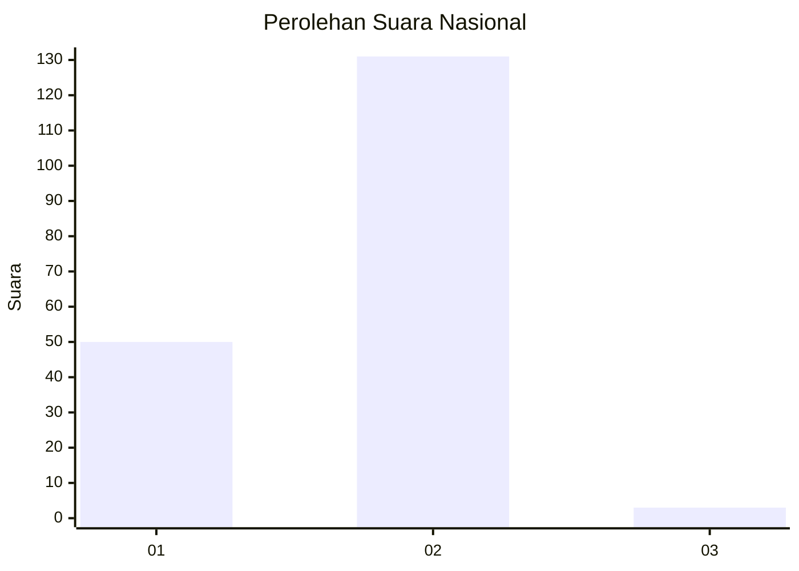
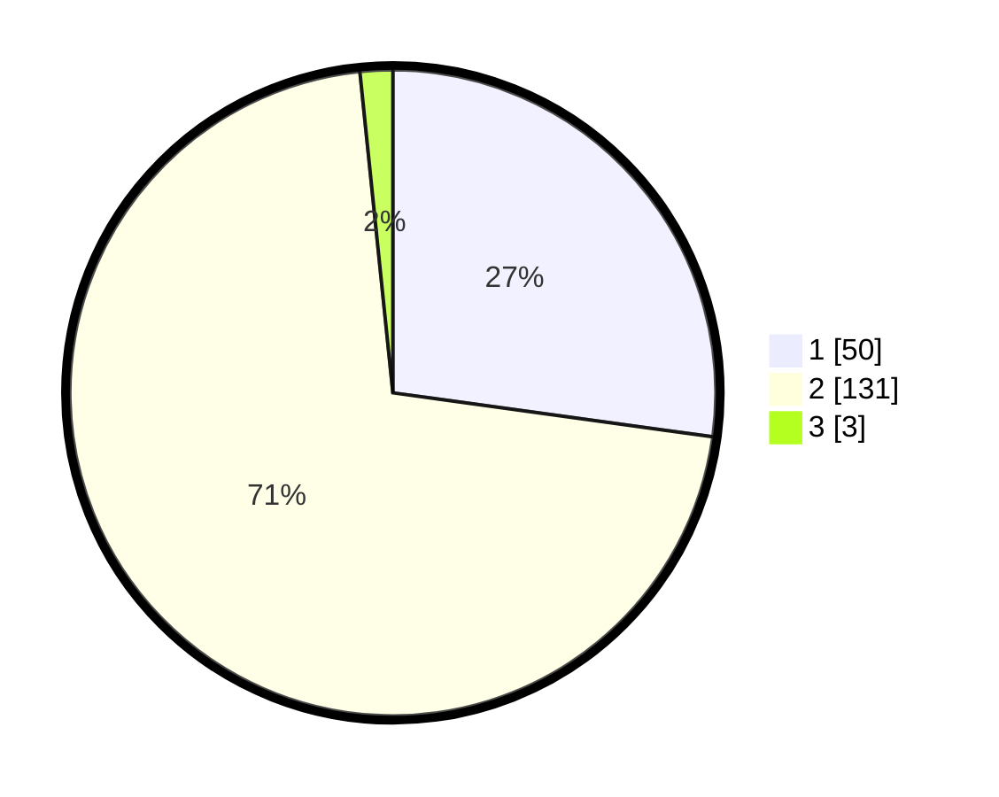

# Hasil

## Grafik

## Tabel

| No. | Nama Paslon    | Suara | Suara (raw) | Persentase |
|:--- |:-------------- | -----:| -----------:| ----------:|
| 1   | ANIES MUHAIMIN | 50    | [50][p-1]   | 27,17      |
| 2   | PRABOWO GIBRAN | 131   | [131][p-2]  | 71,20      |
| 3   | GANJAR MAHFUD  | 3     | [3][p-3]    | 1,63       |

[p-1]: https://github.com/gigit-pemilu/pemilu-2024/blob/main/pilpres/hitung-suara/sub/74-sulawesi-tenggara/sub/05-konawe-selatan/sub/21-basala/sub/2004-lipumasagena/sub/005-tps/sub/paslon-1.txt
[p-2]: https://github.com/gigit-pemilu/pemilu-2024/blob/main/pilpres/hitung-suara/sub/74-sulawesi-tenggara/sub/05-konawe-selatan/sub/21-basala/sub/2004-lipumasagena/sub/005-tps/sub/paslon-2.txt
[p-3]: https://github.com/gigit-pemilu/pemilu-2024/blob/main/pilpres/hitung-suara/sub/74-sulawesi-tenggara/sub/05-konawe-selatan/sub/21-basala/sub/2004-lipumasagena/sub/005-tps/sub/paslon-3.txt

## Foto C Plano

https://sirekap-obj-formc.kpu.go.id/d0f9/pemilu/ppwp/74/05/21/20/04/7405212004005-20240215-043942--5f6b4503-cc1b-4bd7-9ffe-f1e3f89091b7.jpg

https://sirekap-obj-formc.kpu.go.id/d0f9/pemilu/ppwp/74/05/21/20/04/7405212004005-20240215-044202--c063d6b2-945b-4222-a50b-ac836755f29a.jpg

https://sirekap-obj-formc.kpu.go.id/d0f9/pemilu/ppwp/74/05/21/20/04/7405212004005-20240215-044355--8c2b3f88-9b5a-480d-a999-7ff115a3087c.jpg

## Metadata

| Key        | Value               |
| ---------- | ------------------- |
| Time Stamp | 2024-02-16 08:00:28 |

