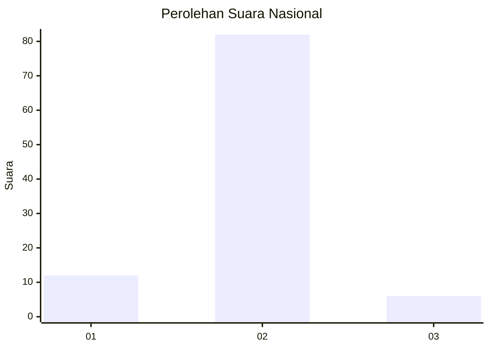
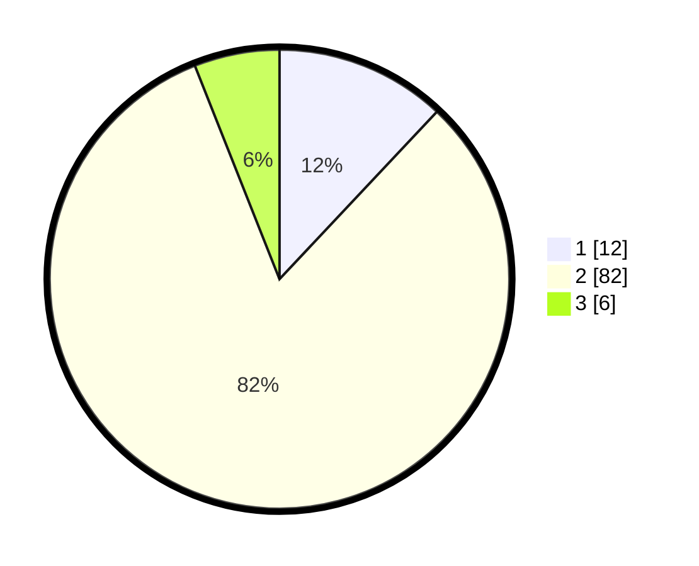

# Hasil

## Grafik

## Tabel

| No. | Nama Paslon    | Suara | Suara (raw) | Persentase |
|:--- |:-------------- | -----:| -----------:| ----------:|
| 1   | ANIES MUHAIMIN | 12    | [12][p-1]   | 12,00      |
| 2   | PRABOWO GIBRAN | 82    | [82][p-2]   | 82,00      |
| 3   | GANJAR MAHFUD  | 6     | [6][p-3]    | 6,00       |

[p-1]: https://github.com/gigit-pemilu/pemilu-2024/blob/main/pilpres/hitung-suara/sub/74-sulawesi-tenggara/sub/05-konawe-selatan/sub/21-basala/sub/2006-polo-pololi/sub/002-tps/sub/paslon-1.txt
[p-2]: https://github.com/gigit-pemilu/pemilu-2024/blob/main/pilpres/hitung-suara/sub/74-sulawesi-tenggara/sub/05-konawe-selatan/sub/21-basala/sub/2006-polo-pololi/sub/002-tps/sub/paslon-2.txt
[p-3]: https://github.com/gigit-pemilu/pemilu-2024/blob/main/pilpres/hitung-suara/sub/74-sulawesi-tenggara/sub/05-konawe-selatan/sub/21-basala/sub/2006-polo-pololi/sub/002-tps/sub/paslon-3.txt

## Foto C Plano

https://sirekap-obj-formc.kpu.go.id/ede0/pemilu/ppwp/74/05/21/20/06/7405212006002-20240215-044453--f14c4113-488b-4e2d-a27c-0152f10e4162.jpg

https://sirekap-obj-formc.kpu.go.id/ede0/pemilu/ppwp/74/05/21/20/06/7405212006002-20240215-045027--bb497471-98e1-4ae3-adeb-2ce9d093fe88.jpg

https://sirekap-obj-formc.kpu.go.id/ede0/pemilu/ppwp/74/05/21/20/06/7405212006002-20240215-045256--da41ab5c-b9d6-4dc8-9c49-b85b55a811d0.jpg

## Metadata

| Key        | Value               |
| ---------- | ------------------- |
| Time Stamp | 2024-02-25 17:00:00 |

