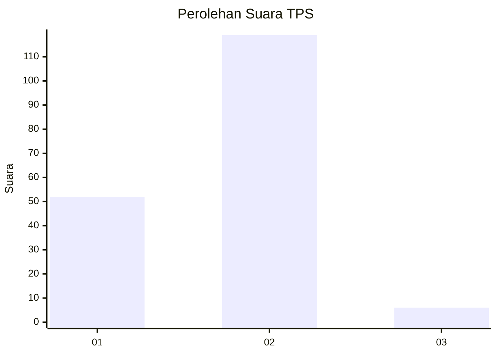
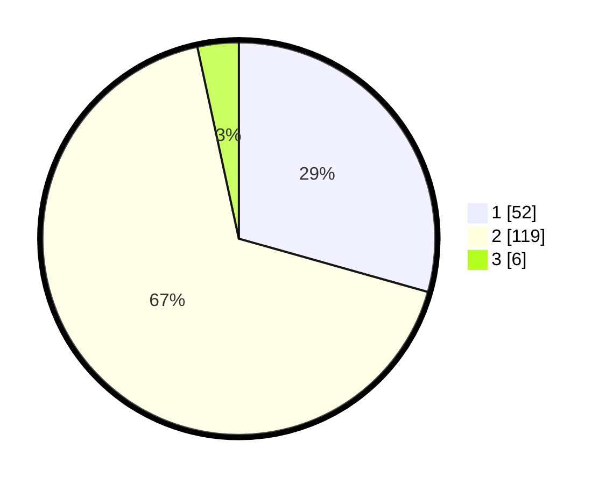

# Hasil

## Grafik

## Tabel

| No. | Nama Paslon    | Suara | Suara (raw) | Persentase |
|:--- |:-------------- | -----:| -----------:| ----------:|
| 1   | ANIES MUHAIMIN | 52    | [52][p-1]   | 29,38      |
| 2   | PRABOWO GIBRAN | 119   | [119][p-2]  | 67,23      |
| 3   | GANJAR MAHFUD  | 6     | [6][p-3]    | 3,39       |

[p-1]: https://github.com/gigit-pemilu/pemilu-2024-74-sulawesi-tenggara/blob/main/pilpres/hitung-suara/sub/74-sulawesi-tenggara/sub/05-konawe-selatan/sub/23-kolono-timur/sub/2003-tumbu-tumbu-jaya/sub/002-tps/sub/paslon-1.txt
[p-2]: https://github.com/gigit-pemilu/pemilu-2024-74-sulawesi-tenggara/blob/main/pilpres/hitung-suara/sub/74-sulawesi-tenggara/sub/05-konawe-selatan/sub/23-kolono-timur/sub/2003-tumbu-tumbu-jaya/sub/002-tps/sub/paslon-2.txt
[p-3]: https://github.com/gigit-pemilu/pemilu-2024-74-sulawesi-tenggara/blob/main/pilpres/hitung-suara/sub/74-sulawesi-tenggara/sub/05-konawe-selatan/sub/23-kolono-timur/sub/2003-tumbu-tumbu-jaya/sub/002-tps/sub/paslon-3.txt

## Foto C Plano

https://sirekap-obj-formc.kpu.go.id/fc4e/pemilu/ppwp/74/05/23/20/03/7405232003002-20240215-012451--914613d6-5084-4b9a-b3f2-47839b4b7805.jpg

https://sirekap-obj-formc.kpu.go.id/fc4e/pemilu/ppwp/74/05/23/20/03/7405232003002-20240215-012607--cf3fb76b-cef2-45b8-8325-73d2d68b9b4d.jpg

https://sirekap-obj-formc.kpu.go.id/fc4e/pemilu/ppwp/74/05/23/20/03/7405232003002-20240215-012711--ab5cc4ff-cc66-4482-88e3-865b104c0af8.jpg

## Metadata

| Key        | Value               |
| ---------- | ------------------- |
| Time Stamp | 2024-02-25 17:00:00 |

