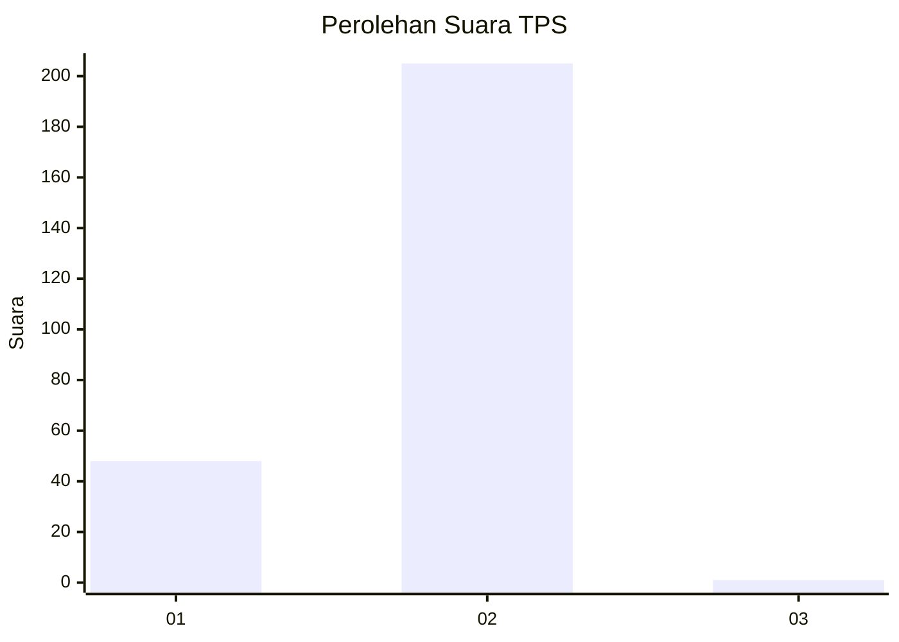
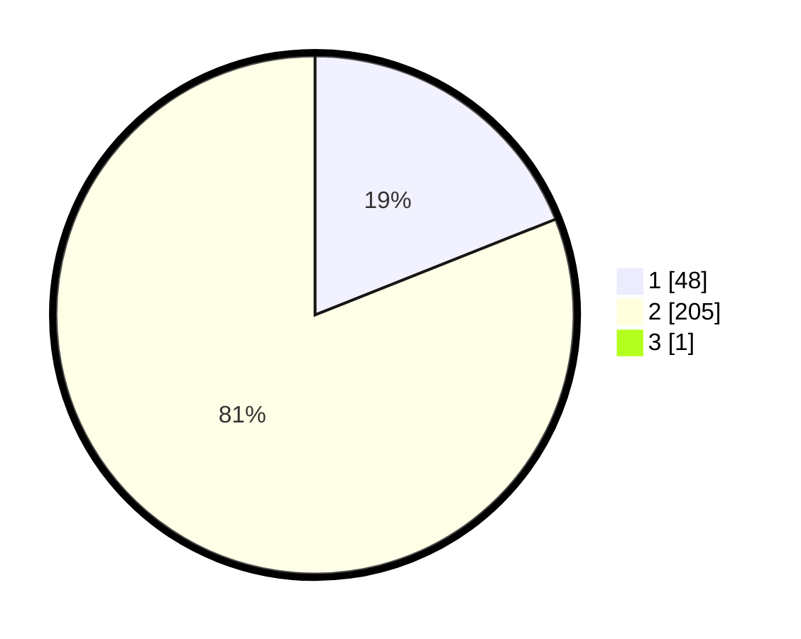

# Hasil

## Grafik

## Tabel

| No. | Nama Paslon    | Suara | Suara (raw) | Persentase |
|:--- |:-------------- | -----:| -----------:| ----------:|
| 1   | ANIES MUHAIMIN | 48    | [48][p-1]   | 18,90      |
| 2   | PRABOWO GIBRAN | 205   | [205][p-2]  | 80,71      |
| 3   | GANJAR MAHFUD  | 1     | [1][p-3]    | 0,39       |

[p-1]: https://github.com/gigit-pemilu/pemilu-2024-74-sulawesi-tenggara/blob/main/pilpres/hitung-suara/sub/74-sulawesi-tenggara/sub/05-konawe-selatan/sub/24-sabulakoa/sub/2003-tetenggabo/sub/001-tps/sub/paslon-1.txt
[p-2]: https://github.com/gigit-pemilu/pemilu-2024-74-sulawesi-tenggara/blob/main/pilpres/hitung-suara/sub/74-sulawesi-tenggara/sub/05-konawe-selatan/sub/24-sabulakoa/sub/2003-tetenggabo/sub/001-tps/sub/paslon-2.txt
[p-3]: https://github.com/gigit-pemilu/pemilu-2024-74-sulawesi-tenggara/blob/main/pilpres/hitung-suara/sub/74-sulawesi-tenggara/sub/05-konawe-selatan/sub/24-sabulakoa/sub/2003-tetenggabo/sub/001-tps/sub/paslon-3.txt

## Foto C Plano

https://sirekap-obj-formc.kpu.go.id/76b4/pemilu/ppwp/74/05/24/20/03/7405242003001-20240215-044525--879a5326-e39f-4056-99fa-943f44fde510.jpg

https://sirekap-obj-formc.kpu.go.id/76b4/pemilu/ppwp/74/05/24/20/03/7405242003001-20240215-044923--36e1a8d7-efe9-442c-a7cd-d893dec4b406.jpg

https://sirekap-obj-formc.kpu.go.id/76b4/pemilu/ppwp/74/05/24/20/03/7405242003001-20240215-045753--4ba7e6e4-5796-4825-b2fa-3c62fc65bff8.jpg

## Metadata

| Key        | Value               |
| ---------- | ------------------- |
| Time Stamp | 2024-02-25 16:00:00 |

