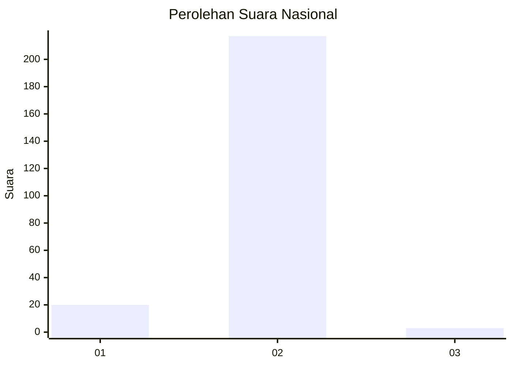
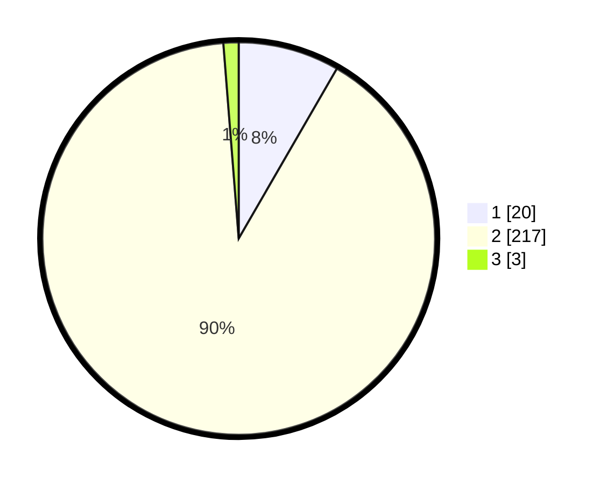

# Hasil

## Grafik

## Tabel

| No. | Nama Paslon    | Suara | Suara (raw) | Persentase |
|:--- |:-------------- | -----:| -----------:| ----------:|
| 1   | ANIES MUHAIMIN | 20    | [20][p-1]   | 8,33       |
| 2   | PRABOWO GIBRAN | 217   | [217][p-2]  | 90,42      |
| 3   | GANJAR MAHFUD  | 3     | [3][p-3]    | 1,25       |

[p-1]: https://github.com/gigit-pemilu/pemilu-2024/blob/main/pilpres/hitung-suara/sub/74-sulawesi-tenggara/sub/05-konawe-selatan/sub/25-andoolo-barat/sub/2003-bekenggasu/sub/002-tps/sub/paslon-1.txt
[p-2]: https://github.com/gigit-pemilu/pemilu-2024/blob/main/pilpres/hitung-suara/sub/74-sulawesi-tenggara/sub/05-konawe-selatan/sub/25-andoolo-barat/sub/2003-bekenggasu/sub/002-tps/sub/paslon-2.txt
[p-3]: https://github.com/gigit-pemilu/pemilu-2024/blob/main/pilpres/hitung-suara/sub/74-sulawesi-tenggara/sub/05-konawe-selatan/sub/25-andoolo-barat/sub/2003-bekenggasu/sub/002-tps/sub/paslon-3.txt

## Foto C Plano

https://sirekap-obj-formc.kpu.go.id/f3ba/pemilu/ppwp/74/05/25/20/03/7405252003002-20240215-102331--035cd36f-3c60-45e6-8363-6b278b661fdc.jpg

https://sirekap-obj-formc.kpu.go.id/f3ba/pemilu/ppwp/74/05/25/20/03/7405252003002-20240215-102529--bf8feea9-2db7-45b1-b707-b69ed73e0c5b.jpg

https://sirekap-obj-formc.kpu.go.id/f3ba/pemilu/ppwp/74/05/25/20/03/7405252003002-20240215-102647--769c3ab2-277d-4604-8cec-da804b9ff535.jpg

## Metadata

| Key        | Value               |
| ---------- | ------------------- |
| Time Stamp | 2024-02-24 22:31:28 |

