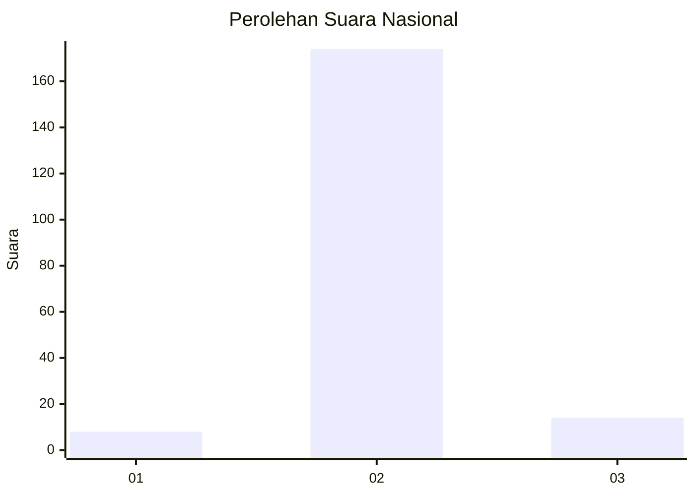
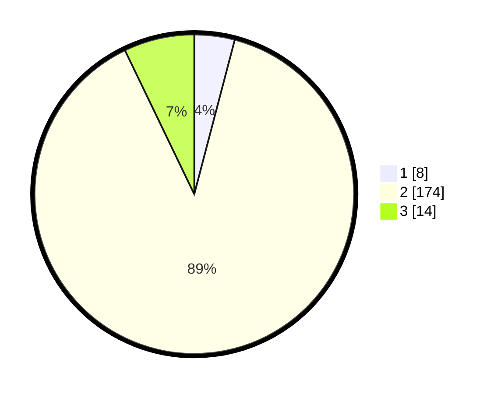

# Hasil

## Grafik

## Tabel

| No. | Nama Paslon    | Suara | Suara (raw) | Persentase |
|:--- |:-------------- | -----:| -----------:| ----------:|
| 1   | ANIES MUHAIMIN | 8     | [8][p-1]    | 4,08       |
| 2   | PRABOWO GIBRAN | 174   | [174][p-2]  | 88,78      |
| 3   | GANJAR MAHFUD  | 14    | [14][p-3]   | 7,14       |

[p-1]: https://github.com/gigit-pemilu/pemilu-2024/blob/main/pilpres/hitung-suara/sub/74-sulawesi-tenggara/sub/06-bombana/sub/03-rarowatu/sub/1010-taubonto/sub/001-tps/sub/paslon-1.txt
[p-2]: https://github.com/gigit-pemilu/pemilu-2024/blob/main/pilpres/hitung-suara/sub/74-sulawesi-tenggara/sub/06-bombana/sub/03-rarowatu/sub/1010-taubonto/sub/001-tps/sub/paslon-2.txt
[p-3]: https://github.com/gigit-pemilu/pemilu-2024/blob/main/pilpres/hitung-suara/sub/74-sulawesi-tenggara/sub/06-bombana/sub/03-rarowatu/sub/1010-taubonto/sub/001-tps/sub/paslon-3.txt

## Foto C Plano

https://sirekap-obj-formc.kpu.go.id/cb96/pemilu/ppwp/74/06/03/10/10/7406031010001-20240215-021352--f3103eda-60ca-48bd-b752-79aeb8062324.jpg

https://sirekap-obj-formc.kpu.go.id/cb96/pemilu/ppwp/74/06/03/10/10/7406031010001-20240216-125115--a562db0d-7c66-48a4-aad5-cbf974c63872.jpg

https://sirekap-obj-formc.kpu.go.id/cb96/pemilu/ppwp/74/06/03/10/10/7406031010001-20240215-023724--17cfe275-fa66-4e5e-9a89-ec6c74be8253.jpg

## Metadata

| Key        | Value               |
| ---------- | ------------------- |
| Time Stamp | 2024-02-19 06:16:00 |

