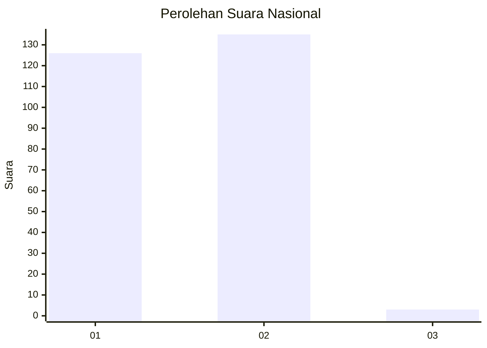
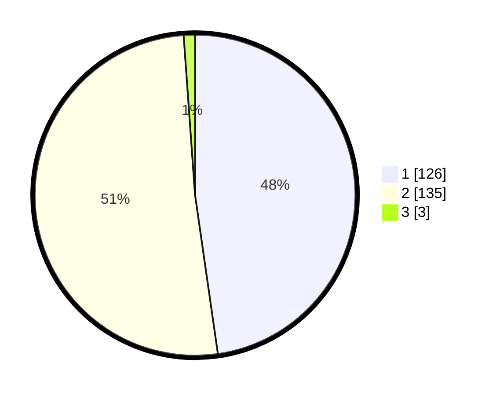

# Hasil

## Grafik

## Tabel

| No. | Nama Paslon    | Suara | Suara (raw) | Persentase |
|:--- |:-------------- | -----:| -----------:| ----------:|
| 1   | ANIES MUHAIMIN | 126   | [126][p-1]  | 47,73      |
| 2   | PRABOWO GIBRAN | 135   | [135][p-2]  | 51,14      |
| 3   | GANJAR MAHFUD  | 3     | [3][p-3]    | 1,14       |

[p-1]: https://github.com/gigit-pemilu/pemilu-2024/blob/main/pilpres/hitung-suara/sub/74-sulawesi-tenggara/sub/06-bombana/sub/03-rarowatu/sub/2009-rarowatu/sub/001-tps/sub/paslon-1.txt
[p-2]: https://github.com/gigit-pemilu/pemilu-2024/blob/main/pilpres/hitung-suara/sub/74-sulawesi-tenggara/sub/06-bombana/sub/03-rarowatu/sub/2009-rarowatu/sub/001-tps/sub/paslon-2.txt
[p-3]: https://github.com/gigit-pemilu/pemilu-2024/blob/main/pilpres/hitung-suara/sub/74-sulawesi-tenggara/sub/06-bombana/sub/03-rarowatu/sub/2009-rarowatu/sub/001-tps/sub/paslon-3.txt

## Foto C Plano

https://sirekap-obj-formc.kpu.go.id/02c7/pemilu/ppwp/74/06/03/20/09/7406032009001-20240215-071120--f63b0c76-0e9a-471f-a458-b321b81852ff.jpg

https://sirekap-obj-formc.kpu.go.id/02c7/pemilu/ppwp/74/06/03/20/09/7406032009001-20240215-000415--86dcdd06-40fa-4df0-8fd2-3937fbdcb58c.jpg

https://sirekap-obj-formc.kpu.go.id/02c7/pemilu/ppwp/74/06/03/20/09/7406032009001-20240215-071408--339c85d6-32be-4205-b269-47a0cde499d3.jpg

## Metadata

| Key        | Value               |
| ---------- | ------------------- |
| Time Stamp | 2024-02-24 22:31:28 |

