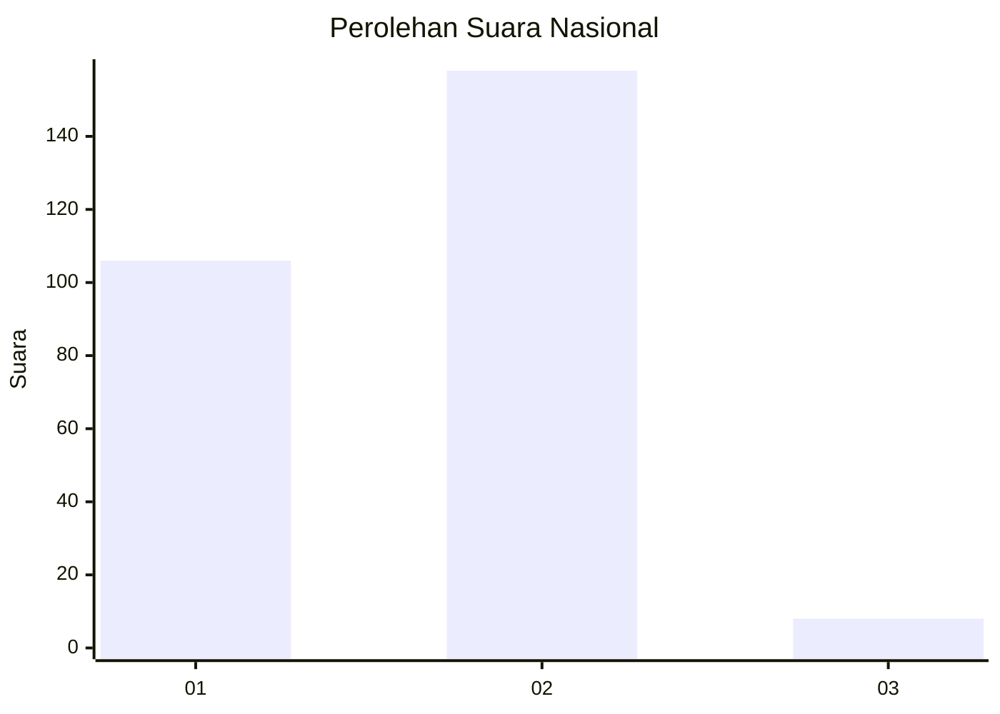
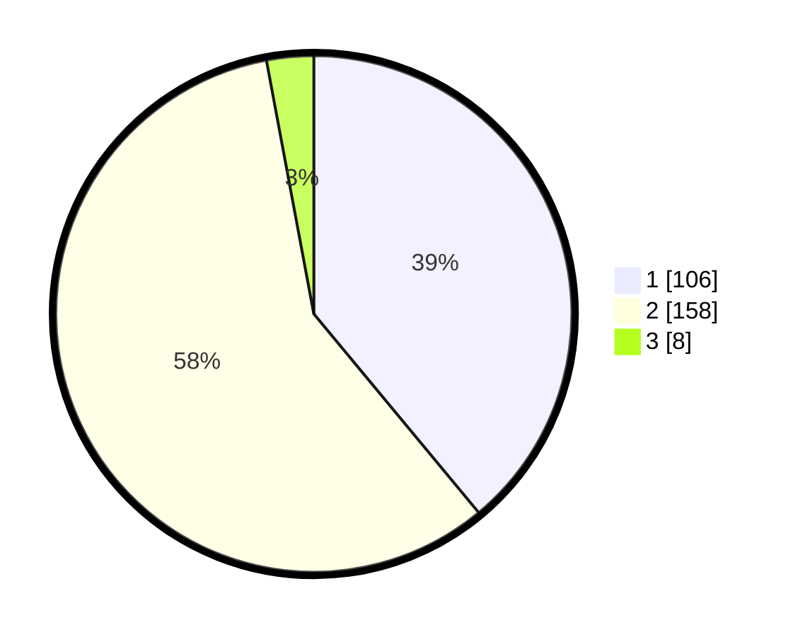

# Hasil

## Grafik

## Tabel

| No. | Nama Paslon    | Suara | Suara (raw) | Persentase |
|:--- |:-------------- | -----:| -----------:| ----------:|
| 1   | ANIES MUHAIMIN | 106   | [106][p-1]  | 38,97      |
| 2   | PRABOWO GIBRAN | 158   | [158][p-2]  | 58,09      |
| 3   | GANJAR MAHFUD  | 8     | [8][p-3]    | 2,94       |

[p-1]: https://github.com/gigit-pemilu/pemilu-2024/blob/main/pilpres/hitung-suara/sub/74-sulawesi-tenggara/sub/06-bombana/sub/04-rumbia/sub/1002-lameroro/sub/003-tps/sub/paslon-1.txt
[p-2]: https://github.com/gigit-pemilu/pemilu-2024/blob/main/pilpres/hitung-suara/sub/74-sulawesi-tenggara/sub/06-bombana/sub/04-rumbia/sub/1002-lameroro/sub/003-tps/sub/paslon-2.txt
[p-3]: https://github.com/gigit-pemilu/pemilu-2024/blob/main/pilpres/hitung-suara/sub/74-sulawesi-tenggara/sub/06-bombana/sub/04-rumbia/sub/1002-lameroro/sub/003-tps/sub/paslon-3.txt

## Foto C Plano

https://sirekap-obj-formc.kpu.go.id/a23f/pemilu/ppwp/74/06/04/10/02/7406041002003-20240216-190928--68cf8e31-2bfa-48ee-b79a-a97dcc4f93d4.jpg

https://sirekap-obj-formc.kpu.go.id/a23f/pemilu/ppwp/74/06/04/10/02/7406041002003-20240216-190929--714c0893-c41f-4afa-8c36-9e8e2bdd5c76.jpg

https://sirekap-obj-formc.kpu.go.id/a23f/pemilu/ppwp/74/06/04/10/02/7406041002003-20240216-190929--29005bef-01e6-4172-9770-3468bd40ec5a.jpg

## Metadata

| Key        | Value               |
| ---------- | ------------------- |
| Time Stamp | 2024-02-19 06:16:00 |

## DATA PEMILIH TETAP

Jumlah pemilih dalam DPT: **294**.
 * L: **133**.
 * P: **161**.

## DATA PENGGUNA HAK PILIH

Jumlah pengguna hak pilih dalam DPT: **268**.
 * L: **119**.
 * P: **149**.

Jumlah pengguna hak pilih dalam DPTb: **2**.
 * L: **1**.
 * P: **1**.

Jumlah pengguna hak pilih dalam DPK: **2**.
 * L: **2**.
 * P: **0**.

Jumlah pengguna hak pilih: **272**.
 * L: **122**.
 * P: **150**.

## JUMLAH SUARA SAH DAN TIDAK SAH

JUMLAH SELURUH SUARA SAH: **272**.

JUMLAH SUARA TIDAK SAH: **0**.

JUMLAH SELURUH SUARA SAH DAN SUARA TIDAK SAH: **272**.

