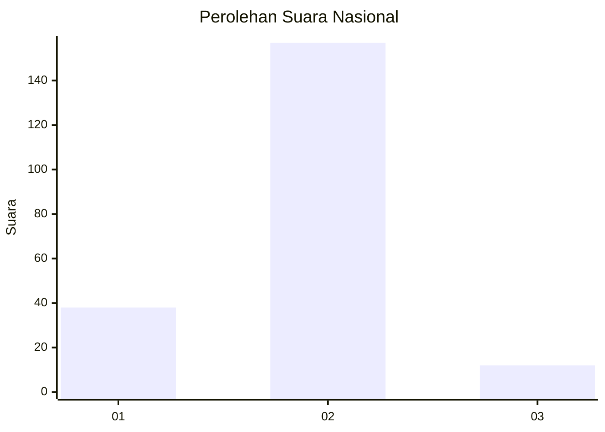
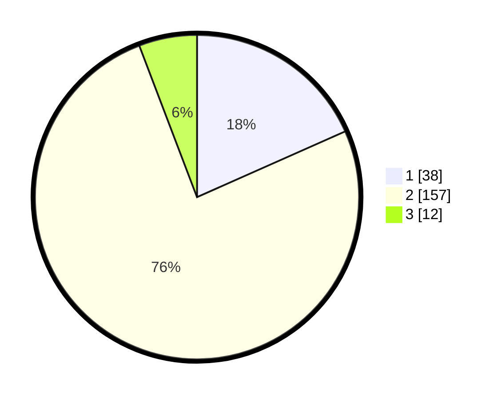

# Hasil

## Grafik

## Tabel

| No. | Nama Paslon    | Suara | Suara (raw) | Persentase |
|:--- |:-------------- | -----:| -----------:| ----------:|
| 1   | ANIES MUHAIMIN | 38    | [38][p-1]   | 18,36      |
| 2   | PRABOWO GIBRAN | 157   | [157][p-2]  | 75,85      |
| 3   | GANJAR MAHFUD  | 12    | [12][p-3]   | 5,80       |

[p-1]: https://github.com/gigit-pemilu/pemilu-2024/blob/main/pilpres/hitung-suara/sub/74-sulawesi-tenggara/sub/06-bombana/sub/06-kabaena-timur/sub/1009-dongkala/sub/001-tps/sub/paslon-1.txt
[p-2]: https://github.com/gigit-pemilu/pemilu-2024/blob/main/pilpres/hitung-suara/sub/74-sulawesi-tenggara/sub/06-bombana/sub/06-kabaena-timur/sub/1009-dongkala/sub/001-tps/sub/paslon-2.txt
[p-3]: https://github.com/gigit-pemilu/pemilu-2024/blob/main/pilpres/hitung-suara/sub/74-sulawesi-tenggara/sub/06-bombana/sub/06-kabaena-timur/sub/1009-dongkala/sub/001-tps/sub/paslon-3.txt

## Foto C Plano

https://sirekap-obj-formc.kpu.go.id/65b6/pemilu/ppwp/74/06/06/10/09/7406061009001-20240215-113152--d3464d96-8855-4e24-9a38-c822debc9760.jpg

https://sirekap-obj-formc.kpu.go.id/65b6/pemilu/ppwp/74/06/06/10/09/7406061009001-20240215-113309--61bdd1fa-4131-4c88-9cd6-b45469a7a53c.jpg

https://sirekap-obj-formc.kpu.go.id/65b6/pemilu/ppwp/74/06/06/10/09/7406061009001-20240215-074711--9e664a22-a7c0-46d3-8360-913568aa19d9.jpg

## Metadata

| Key        | Value               |
| ---------- | ------------------- |
| Time Stamp | 2024-02-25 15:00:00 |

