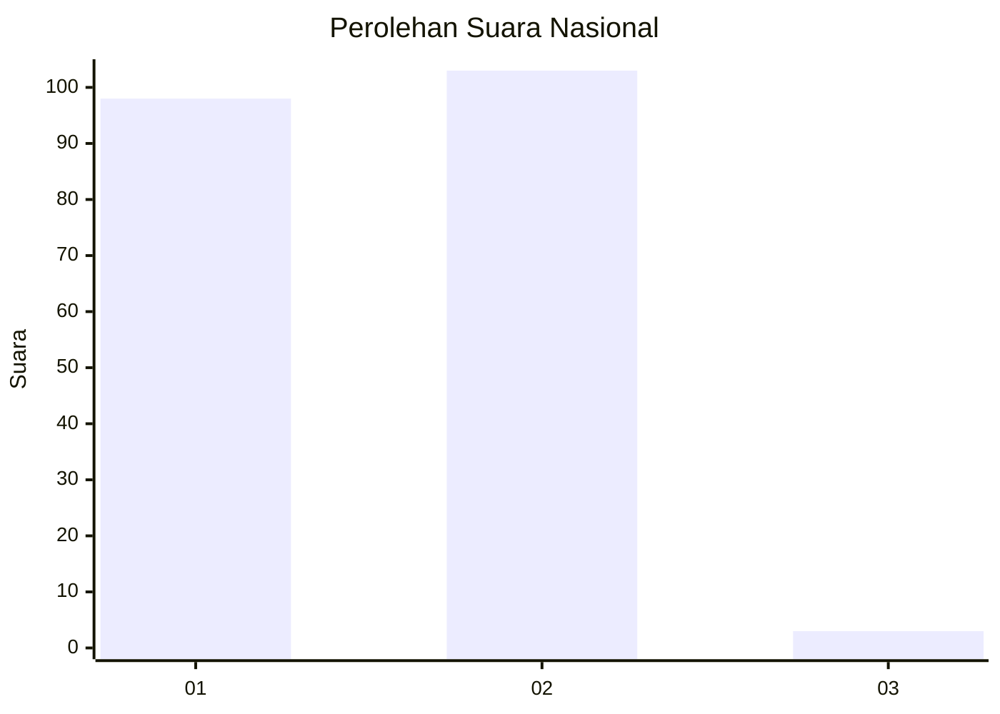
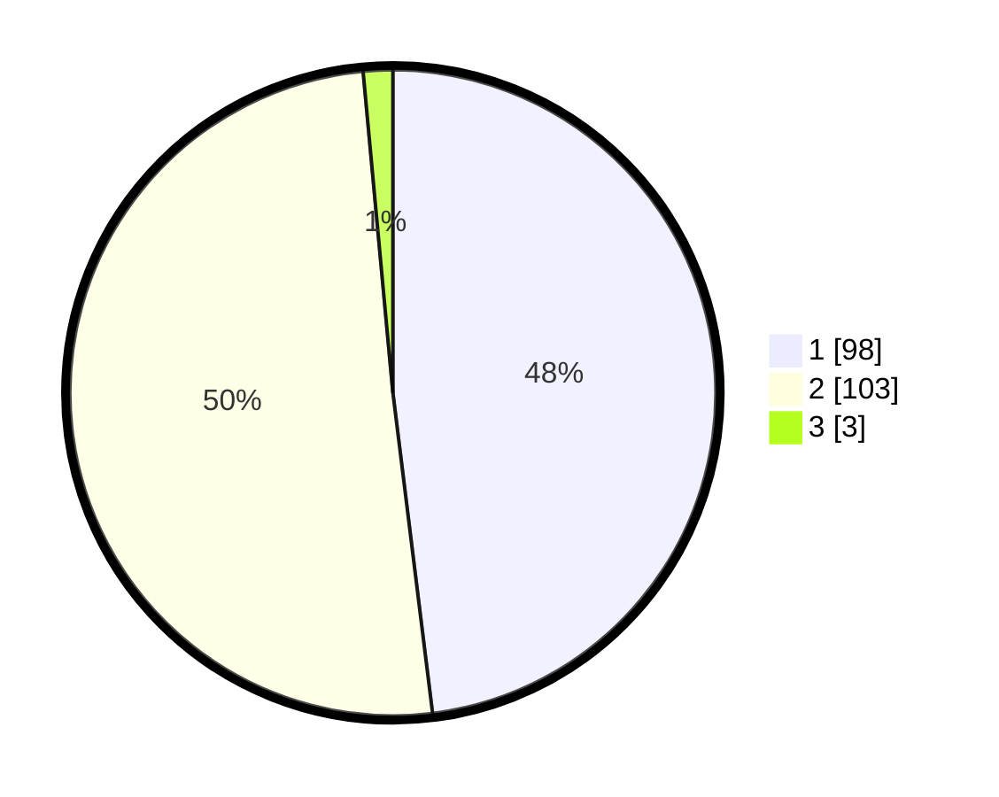

# Hasil

## Grafik

## Tabel

| No. | Nama Paslon    | Suara | Suara (raw) | Persentase |
|:--- |:-------------- | -----:| -----------:| ----------:|
| 1   | ANIES MUHAIMIN | 98    | [98][p-1]   | 48,04      |
| 2   | PRABOWO GIBRAN | 103   | [103][p-2]  | 50,49      |
| 3   | GANJAR MAHFUD  | 3     | [3][p-3]    | 1,47       |

[p-1]: https://github.com/gigit-pemilu/pemilu-2024/blob/main/pilpres/hitung-suara/sub/74-sulawesi-tenggara/sub/06-bombana/sub/07-poleang-barat/sub/2003-timbala/sub/002-tps/sub/paslon-1.txt
[p-2]: https://github.com/gigit-pemilu/pemilu-2024/blob/main/pilpres/hitung-suara/sub/74-sulawesi-tenggara/sub/06-bombana/sub/07-poleang-barat/sub/2003-timbala/sub/002-tps/sub/paslon-2.txt
[p-3]: https://github.com/gigit-pemilu/pemilu-2024/blob/main/pilpres/hitung-suara/sub/74-sulawesi-tenggara/sub/06-bombana/sub/07-poleang-barat/sub/2003-timbala/sub/002-tps/sub/paslon-3.txt

## Foto C Plano

https://sirekap-obj-formc.kpu.go.id/9665/pemilu/ppwp/74/06/07/20/03/7406072003002-20240215-054705--2106bb48-f16c-4772-841e-57cab3989b09.jpg

https://sirekap-obj-formc.kpu.go.id/9665/pemilu/ppwp/74/06/07/20/03/7406072003002-20240215-054843--faa988cd-5882-46e1-be72-4736e4159126.jpg

https://sirekap-obj-formc.kpu.go.id/9665/pemilu/ppwp/74/06/07/20/03/7406072003002-20240215-055334--28bda76c-802b-4962-b46a-aa0dc3b5cc5f.jpg

## Metadata

| Key        | Value               |
| ---------- | ------------------- |
| Time Stamp | 2024-02-24 22:31:28 |

