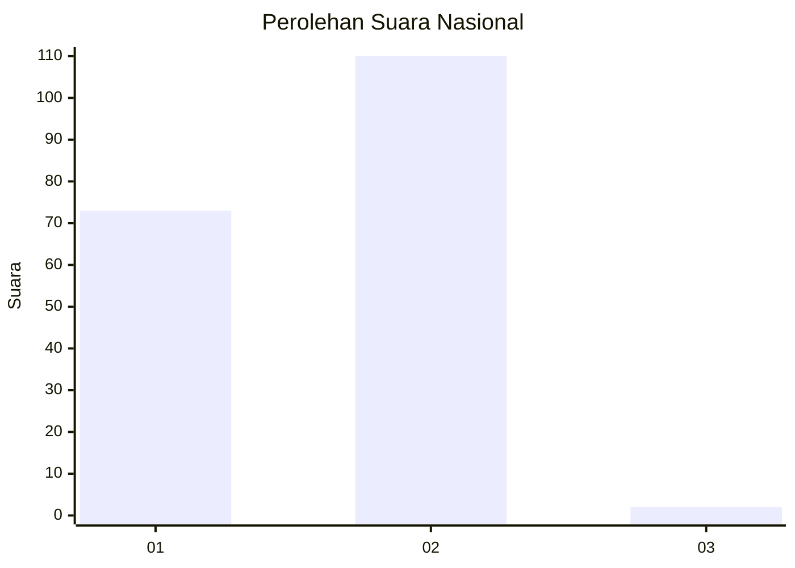
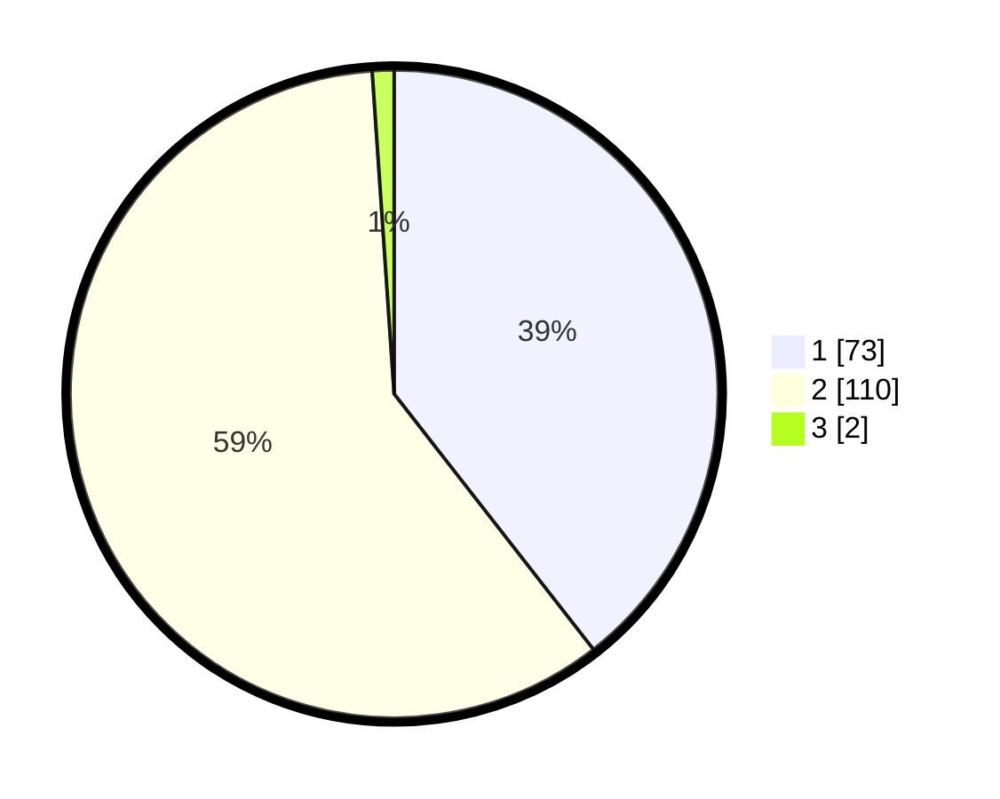

# Hasil

## Grafik

## Tabel

| No. | Nama Paslon    | Suara | Suara (raw) | Persentase |
|:--- |:-------------- | -----:| -----------:| ----------:|
| 1   | ANIES MUHAIMIN | 73    | [73][p-1]   | 39,46      |
| 2   | PRABOWO GIBRAN | 110   | [110][p-2]  | 59,46      |
| 3   | GANJAR MAHFUD  | 2     | [2][p-3]    | 1,08       |

[p-1]: https://github.com/gigit-pemilu/pemilu-2024/blob/main/pilpres/hitung-suara/sub/74-sulawesi-tenggara/sub/06-bombana/sub/07-poleang-barat/sub/2003-timbala/sub/004-tps/sub/paslon-1.txt
[p-2]: https://github.com/gigit-pemilu/pemilu-2024/blob/main/pilpres/hitung-suara/sub/74-sulawesi-tenggara/sub/06-bombana/sub/07-poleang-barat/sub/2003-timbala/sub/004-tps/sub/paslon-2.txt
[p-3]: https://github.com/gigit-pemilu/pemilu-2024/blob/main/pilpres/hitung-suara/sub/74-sulawesi-tenggara/sub/06-bombana/sub/07-poleang-barat/sub/2003-timbala/sub/004-tps/sub/paslon-3.txt

## Foto C Plano

https://sirekap-obj-formc.kpu.go.id/457e/pemilu/ppwp/74/06/07/20/03/7406072003004-20240215-005049--4d792943-cca0-4992-9940-1e23f9a07eb9.jpg

https://sirekap-obj-formc.kpu.go.id/457e/pemilu/ppwp/74/06/07/20/03/7406072003004-20240215-005943--c592e96b-7994-4cb2-b0d1-f1566b154457.jpg

https://sirekap-obj-formc.kpu.go.id/457e/pemilu/ppwp/74/06/07/20/03/7406072003004-20240215-010243--9d410b1d-935b-411e-aee1-67a744d49b60.jpg

## Metadata

| Key        | Value               |
| ---------- | ------------------- |
| Time Stamp | 2024-02-25 15:00:00 |

