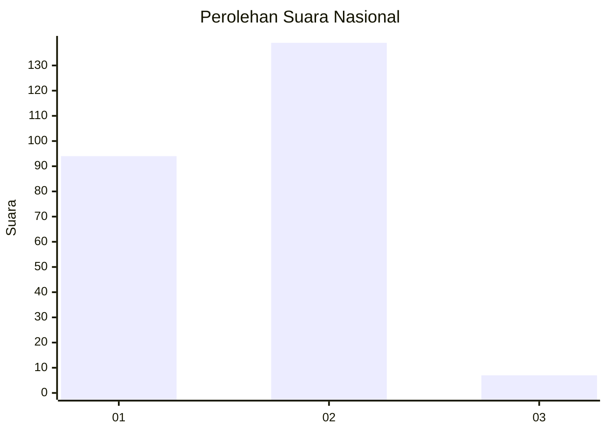
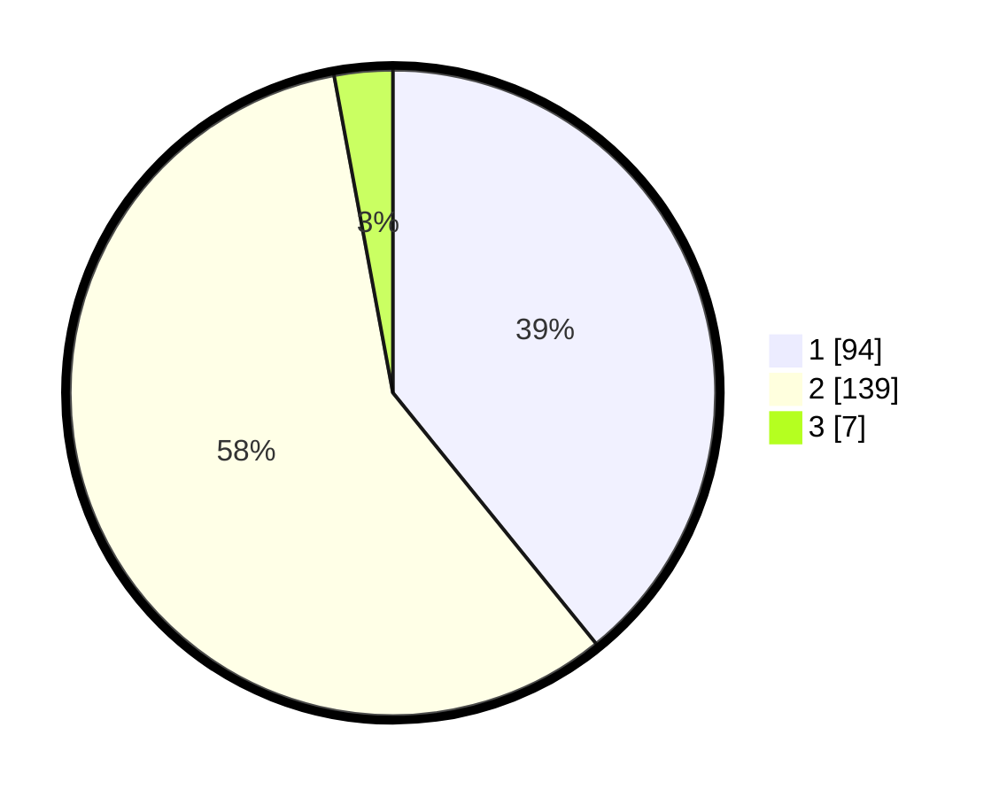

# Hasil

## Grafik

## Tabel

| No. | Nama Paslon    | Suara | Suara (raw) | Persentase |
|:--- |:-------------- | -----:| -----------:| ----------:|
| 1   | ANIES MUHAIMIN | 94    | [94][p-1]   | 39,17      |
| 2   | PRABOWO GIBRAN | 139   | [139][p-2]  | 57,92      |
| 3   | GANJAR MAHFUD  | 7     | [7][p-3]    | 2,92       |

[p-1]: https://github.com/gigit-pemilu/pemilu-2024/blob/main/pilpres/hitung-suara/sub/74-sulawesi-tenggara/sub/06-bombana/sub/07-poleang-barat/sub/2004-ranokomea/sub/001-tps/sub/paslon-1.txt
[p-2]: https://github.com/gigit-pemilu/pemilu-2024/blob/main/pilpres/hitung-suara/sub/74-sulawesi-tenggara/sub/06-bombana/sub/07-poleang-barat/sub/2004-ranokomea/sub/001-tps/sub/paslon-2.txt
[p-3]: https://github.com/gigit-pemilu/pemilu-2024/blob/main/pilpres/hitung-suara/sub/74-sulawesi-tenggara/sub/06-bombana/sub/07-poleang-barat/sub/2004-ranokomea/sub/001-tps/sub/paslon-3.txt

## Foto C Plano

https://sirekap-obj-formc.kpu.go.id/e3e4/pemilu/ppwp/74/06/07/20/04/7406072004001-20240215-033914--685cd693-004c-4bbe-b478-15bdae6bbd4f.jpg

https://sirekap-obj-formc.kpu.go.id/e3e4/pemilu/ppwp/74/06/07/20/04/7406072004001-20240215-034016--3beb4002-18c2-4d82-954c-74566643ca35.jpg

https://sirekap-obj-formc.kpu.go.id/e3e4/pemilu/ppwp/74/06/07/20/04/7406072004001-20240215-033942--de5fe3a8-d249-42c8-a04e-9e899ff31525.jpg

## Metadata

| Key        | Value               |
| ---------- | ------------------- |
| Time Stamp | 2024-02-25 21:00:00 |

