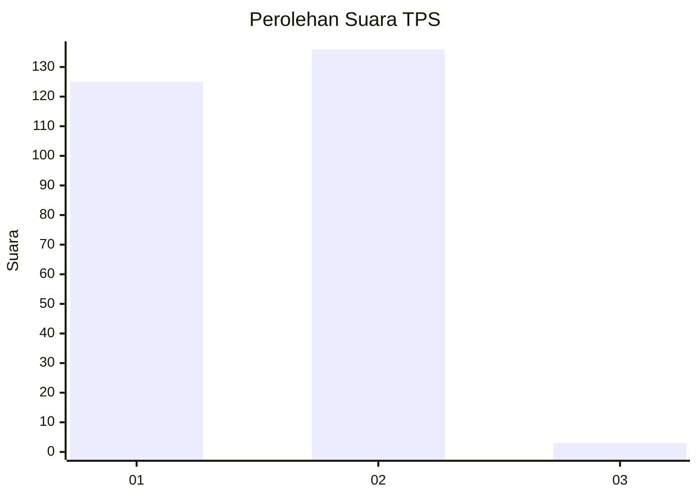
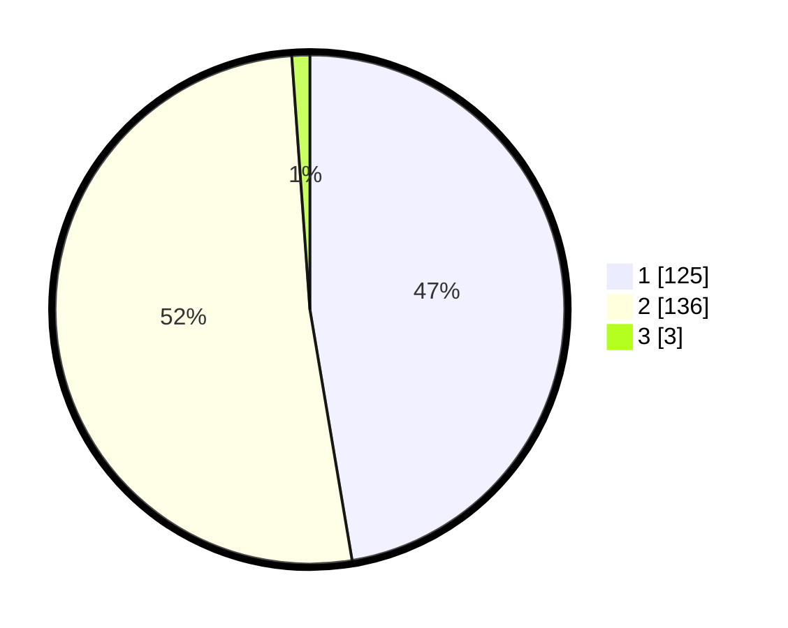

# Hasil

## Grafik

## Tabel

| No. | Nama Paslon    | Suara | Suara (raw) | Persentase |
|:--- |:-------------- | -----:| -----------:| ----------:|
| 1   | ANIES MUHAIMIN | 125   | [125][p-1]  | 47,35      |
| 2   | PRABOWO GIBRAN | 136   | [136][p-2]  | 51,52      |
| 3   | GANJAR MAHFUD  | 3     | [3][p-3]    | 1,14       |

[p-1]: https://github.com/gigit-pemilu/pemilu-2024-74-sulawesi-tenggara/blob/main/pilpres/hitung-suara/sub/74-sulawesi-tenggara/sub/06-bombana/sub/07-poleang-barat/sub/2007-pabiring/sub/001-tps/sub/paslon-1.txt
[p-2]: https://github.com/gigit-pemilu/pemilu-2024-74-sulawesi-tenggara/blob/main/pilpres/hitung-suara/sub/74-sulawesi-tenggara/sub/06-bombana/sub/07-poleang-barat/sub/2007-pabiring/sub/001-tps/sub/paslon-2.txt
[p-3]: https://github.com/gigit-pemilu/pemilu-2024-74-sulawesi-tenggara/blob/main/pilpres/hitung-suara/sub/74-sulawesi-tenggara/sub/06-bombana/sub/07-poleang-barat/sub/2007-pabiring/sub/001-tps/sub/paslon-3.txt

## Foto C Plano

https://sirekap-obj-formc.kpu.go.id/b0ef/pemilu/ppwp/74/06/07/20/07/7406072007001-20240215-090654--01dca909-c01a-4702-841c-89453e984915.jpg

https://sirekap-obj-formc.kpu.go.id/b0ef/pemilu/ppwp/74/06/07/20/07/7406072007001-20240215-091204--347ee72f-3569-484e-b875-26739d11abf5.jpg

https://sirekap-obj-formc.kpu.go.id/b0ef/pemilu/ppwp/74/06/07/20/07/7406072007001-20240215-091736--7a106448-1c15-493d-9e1d-38d06b0144e9.jpg

## Metadata

| Key        | Value               |
| ---------- | ------------------- |
| Time Stamp | 2024-02-25 21:00:00 |

