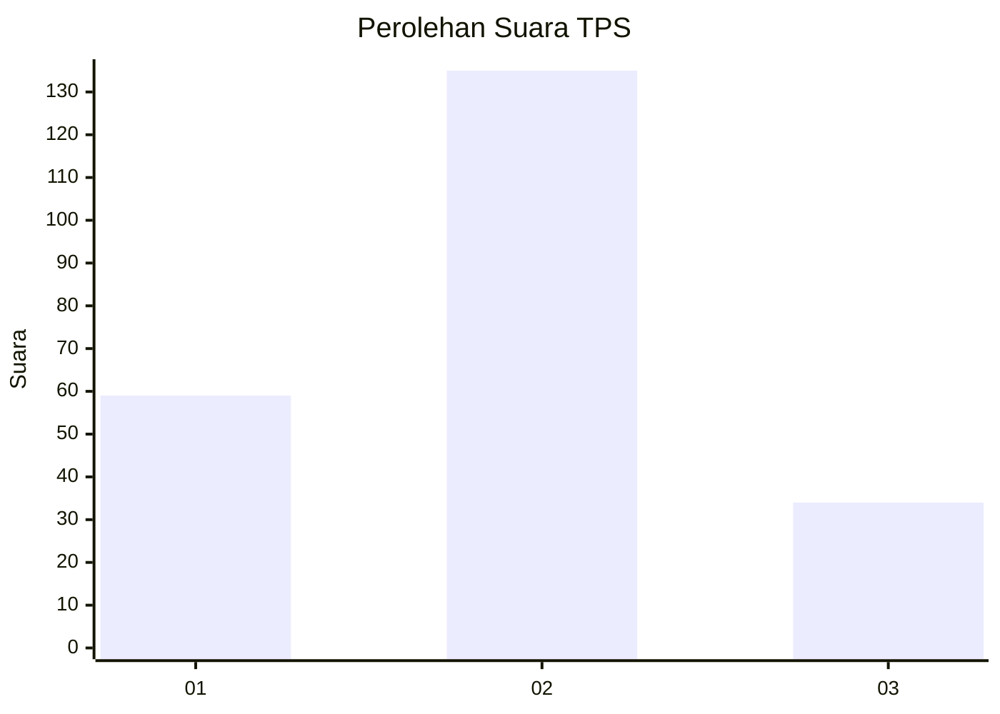
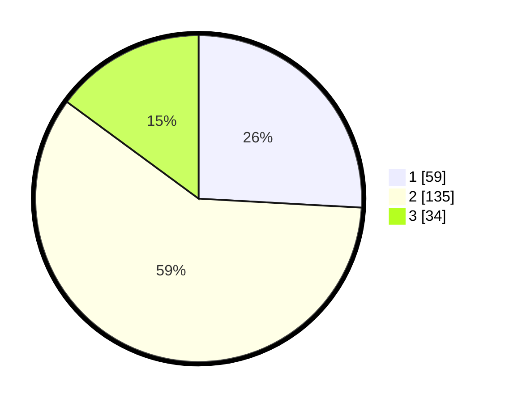

# Hasil

## Grafik

## Tabel

| No. | Nama Paslon    | Suara | Suara (raw) | Persentase |
|:--- |:-------------- | -----:| -----------:| ----------:|
| 1   | ANIES MUHAIMIN | 59    | [59][p-1]   | 25,88      |
| 2   | PRABOWO GIBRAN | 135   | [135][p-2]  | 59,21      |
| 3   | GANJAR MAHFUD  | 34    | [34][p-3]   | 14,91      |

[p-1]: https://github.com/gigit-pemilu/pemilu-2024-74-sulawesi-tenggara/blob/main/pilpres/hitung-suara/sub/74-sulawesi-tenggara/sub/06-bombana/sub/09-rarowatu-utara/sub/1008-aneka-marga/sub/001-tps/sub/paslon-1.txt
[p-2]: https://github.com/gigit-pemilu/pemilu-2024-74-sulawesi-tenggara/blob/main/pilpres/hitung-suara/sub/74-sulawesi-tenggara/sub/06-bombana/sub/09-rarowatu-utara/sub/1008-aneka-marga/sub/001-tps/sub/paslon-2.txt
[p-3]: https://github.com/gigit-pemilu/pemilu-2024-74-sulawesi-tenggara/blob/main/pilpres/hitung-suara/sub/74-sulawesi-tenggara/sub/06-bombana/sub/09-rarowatu-utara/sub/1008-aneka-marga/sub/001-tps/sub/paslon-3.txt

## Foto C Plano

https://sirekap-obj-formc.kpu.go.id/9b19/pemilu/ppwp/74/06/09/10/08/7406091008001-20240215-060050--44532fc3-63b0-472f-86ab-4284badae8e6.jpg

https://sirekap-obj-formc.kpu.go.id/9b19/pemilu/ppwp/74/06/09/10/08/7406091008001-20240215-060258--10628a89-b0b5-4567-be96-87409e9f3549.jpg

https://sirekap-obj-formc.kpu.go.id/9b19/pemilu/ppwp/74/06/09/10/08/7406091008001-20240215-060447--fec8ca69-0638-4bc5-8eda-72060ab204be.jpg

## Metadata

| Key        | Value               |
| ---------- | ------------------- |
| Time Stamp | 2024-02-25 15:00:00 |

