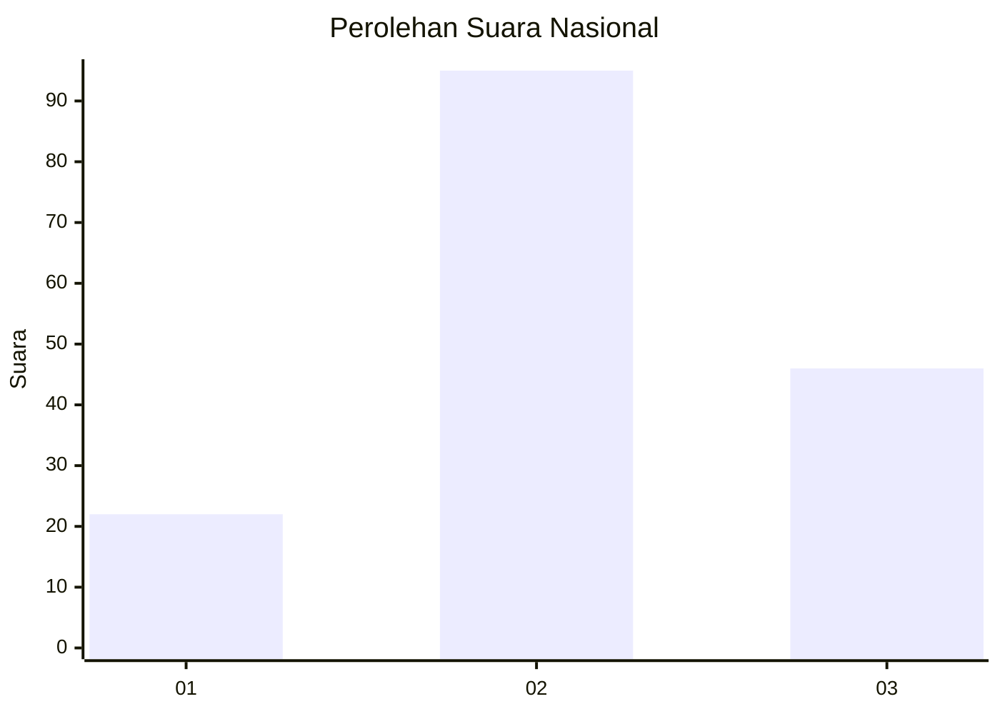
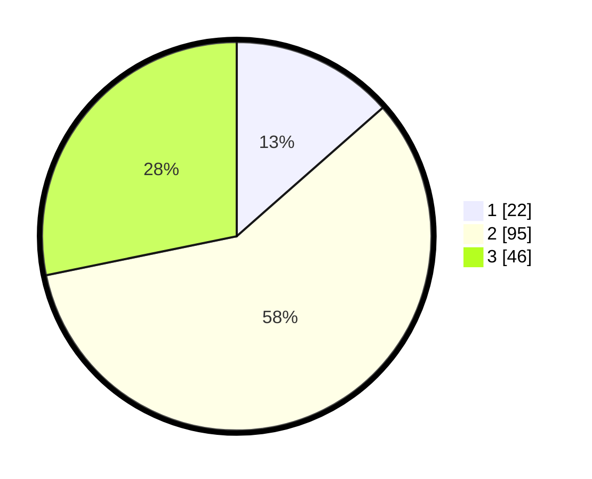

# Hasil

## Grafik

## Tabel

| No. | Nama Paslon    | Suara | Suara (raw) | Persentase |
|:--- |:-------------- | -----:| -----------:| ----------:|
| 1   | ANIES MUHAIMIN | 22    | [22][p-1]   | 13,50      |
| 2   | PRABOWO GIBRAN | 95    | [95][p-2]   | 58,28      |
| 3   | GANJAR MAHFUD  | 46    | [46][p-3]   | 28,22      |

[p-1]: https://github.com/gigit-pemilu/pemilu-2024/blob/main/pilpres/hitung-suara/sub/74-sulawesi-tenggara/sub/06-bombana/sub/09-rarowatu-utara/sub/1008-aneka-marga/sub/003-tps/sub/paslon-1.txt
[p-2]: https://github.com/gigit-pemilu/pemilu-2024/blob/main/pilpres/hitung-suara/sub/74-sulawesi-tenggara/sub/06-bombana/sub/09-rarowatu-utara/sub/1008-aneka-marga/sub/003-tps/sub/paslon-2.txt
[p-3]: https://github.com/gigit-pemilu/pemilu-2024/blob/main/pilpres/hitung-suara/sub/74-sulawesi-tenggara/sub/06-bombana/sub/09-rarowatu-utara/sub/1008-aneka-marga/sub/003-tps/sub/paslon-3.txt

## Foto C Plano

https://sirekap-obj-formc.kpu.go.id/541e/pemilu/ppwp/74/06/09/10/08/7406091008003-20240215-052447--91fe5087-552f-4ae1-88ab-f1eb55754134.jpg

https://sirekap-obj-formc.kpu.go.id/541e/pemilu/ppwp/74/06/09/10/08/7406091008003-20240215-045333--88c705db-5232-4739-9606-41a6c853effd.jpg

https://sirekap-obj-formc.kpu.go.id/541e/pemilu/ppwp/74/06/09/10/08/7406091008003-20240215-044754--59ad7d5f-1ca7-4fba-a0f0-4b8b5af6f8c0.jpg

## Metadata

| Key        | Value               |
| ---------- | ------------------- |
| Time Stamp | 2024-02-25 14:00:00 |

