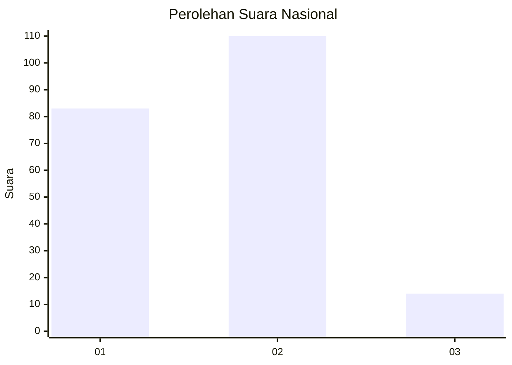

# Hasil

## Grafik

## Tabel

| No. | Nama Paslon    | Suara | Suara (raw) | Persentase |
|:--- |:-------------- | -----:| -----------:| ----------:|
| 1   | ANIES MUHAIMIN | 83    | [83][p-1]   | 40,10      |
| 2   | PRABOWO GIBRAN | 110   | [110][p-2]  | 53,14      |
| 3   | GANJAR MAHFUD  | 14    | [14][p-3]   | 6,76       |

[p-1]: https://github.com/gigit-pemilu/pemilu-2024/blob/main/pilpres/hitung-suara/sub/74-sulawesi-tenggara/sub/06-bombana/sub/10-poleang-utara/sub/2001-tanpabulu/sub/003-tps/sub/paslon-1.txt
[p-2]: https://github.com/gigit-pemilu/pemilu-2024/blob/main/pilpres/hitung-suara/sub/74-sulawesi-tenggara/sub/06-bombana/sub/10-poleang-utara/sub/2001-tanpabulu/sub/003-tps/sub/paslon-2.txt
[p-3]: https://github.com/gigit-pemilu/pemilu-2024/blob/main/pilpres/hitung-suara/sub/74-sulawesi-tenggara/sub/06-bombana/sub/10-poleang-utara/sub/2001-tanpabulu/sub/003-tps/sub/paslon-3.txt

## Foto C Plano

https://sirekap-obj-formc.kpu.go.id/2792/pemilu/ppwp/74/06/10/20/01/7406102001003-20240215-141722--54dd7062-cb60-4047-a638-11dd30366650.jpg

https://sirekap-obj-formc.kpu.go.id/2792/pemilu/ppwp/74/06/10/20/01/7406102001003-20240215-155356--8f808dc4-f362-4077-963e-8f36bb212da3.jpg

https://sirekap-obj-formc.kpu.go.id/2792/pemilu/ppwp/74/06/10/20/01/7406102001003-20240215-164156--bad7c621-6c8e-4f4b-aa4c-22841a0bfc23.jpg

## Metadata

| Key        | Value               |
| ---------- | ------------------- |
| Time Stamp | 2024-02-16 08:00:28 |

