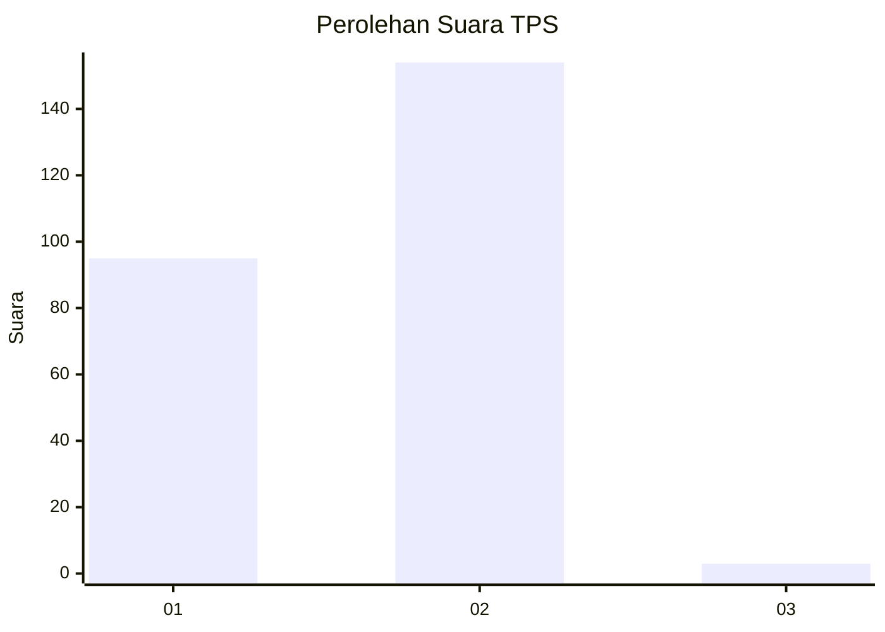
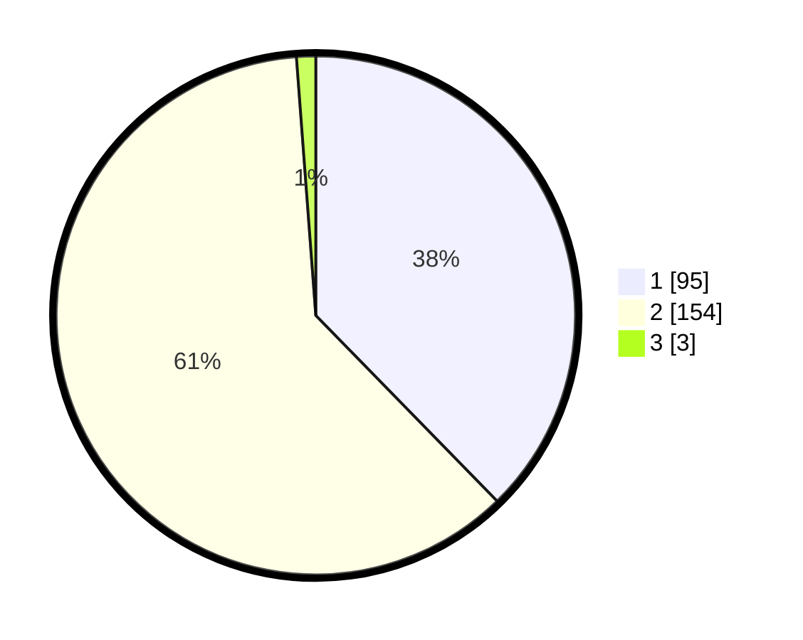

# Hasil

## Grafik

## Tabel

| No. | Nama Paslon    | Suara | Suara (raw) | Persentase |
|:--- |:-------------- | -----:| -----------:| ----------:|
| 1   | ANIES MUHAIMIN | 95    | [95][p-1]   | 37,70      |
| 2   | PRABOWO GIBRAN | 154   | [154][p-2]  | 61,11      |
| 3   | GANJAR MAHFUD  | 3     | [3][p-3]    | 1,19       |

[p-1]: https://github.com/gigit-pemilu/pemilu-2024-74-sulawesi-tenggara/blob/main/pilpres/hitung-suara/sub/74-sulawesi-tenggara/sub/06-bombana/sub/11-poleang-selatan/sub/2001-batu-putih/sub/002-tps/sub/paslon-1.txt
[p-2]: https://github.com/gigit-pemilu/pemilu-2024-74-sulawesi-tenggara/blob/main/pilpres/hitung-suara/sub/74-sulawesi-tenggara/sub/06-bombana/sub/11-poleang-selatan/sub/2001-batu-putih/sub/002-tps/sub/paslon-2.txt
[p-3]: https://github.com/gigit-pemilu/pemilu-2024-74-sulawesi-tenggara/blob/main/pilpres/hitung-suara/sub/74-sulawesi-tenggara/sub/06-bombana/sub/11-poleang-selatan/sub/2001-batu-putih/sub/002-tps/sub/paslon-3.txt

## Foto C Plano

https://sirekap-obj-formc.kpu.go.id/9603/pemilu/ppwp/74/06/11/20/01/7406112001002-20240214-214152--cfda1b86-5baf-4f7d-ba12-67ae3f268af3.jpg

https://sirekap-obj-formc.kpu.go.id/9603/pemilu/ppwp/74/06/11/20/01/7406112001002-20240214-214302--fe4ac51a-1749-4288-a931-f1394fb87bdc.jpg

https://sirekap-obj-formc.kpu.go.id/9603/pemilu/ppwp/74/06/11/20/01/7406112001002-20240214-214401--a56c3b18-aee8-4809-bc28-fde7156c1a61.jpg

## Metadata

| Key        | Value               |
| ---------- | ------------------- |
| Time Stamp | 2024-02-24 22:31:28 |

