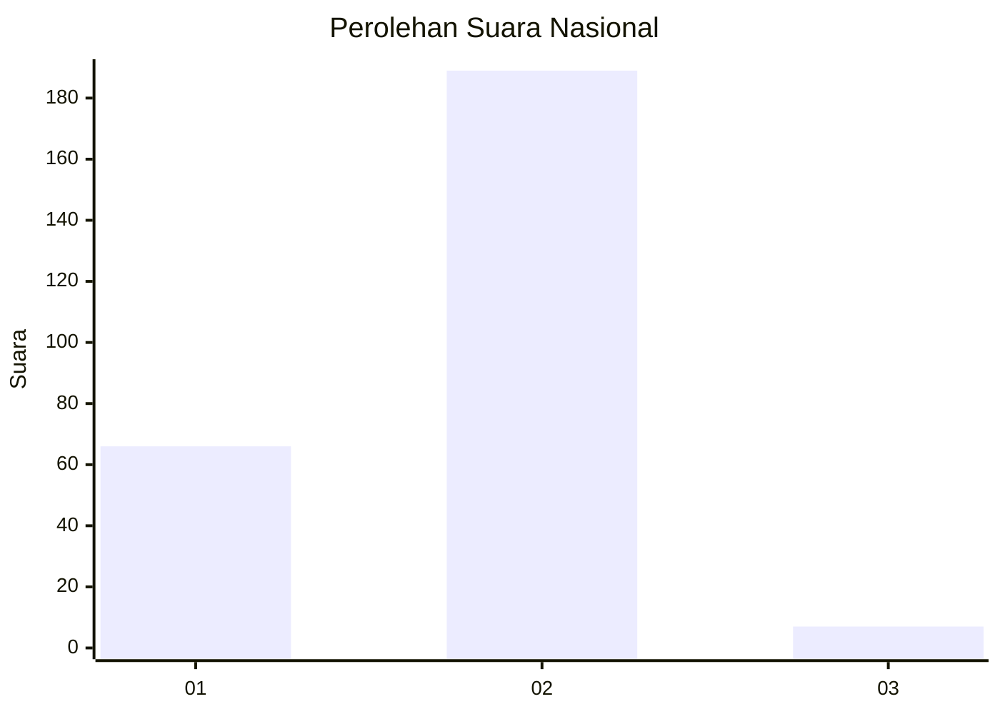
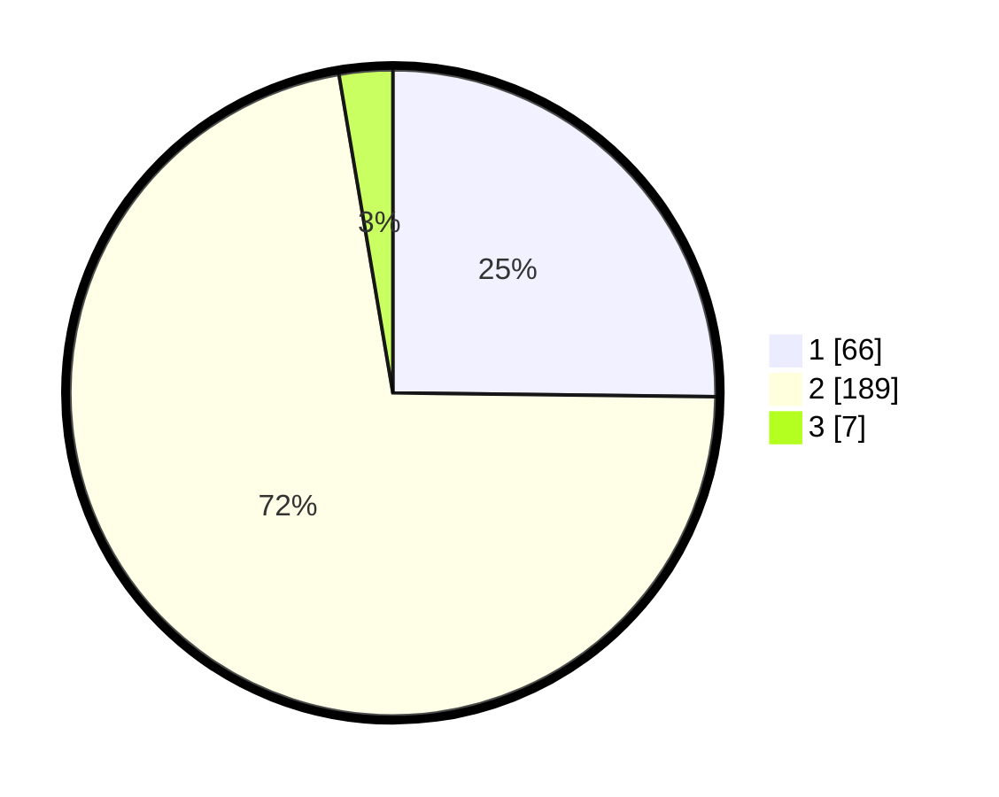

# Hasil

## Grafik

## Tabel

| No. | Nama Paslon    | Suara | Suara (raw) | Persentase |
|:--- |:-------------- | -----:| -----------:| ----------:|
| 1   | ANIES MUHAIMIN | 66    | [66][p-1]   | 25,19      |
| 2   | PRABOWO GIBRAN | 189   | [189][p-2]  | 72,14      |
| 3   | GANJAR MAHFUD  | 7     | [7][p-3]    | 2,67       |

[p-1]: https://github.com/gigit-pemilu/pemilu-2024/blob/main/pilpres/hitung-suara/sub/74-sulawesi-tenggara/sub/06-bombana/sub/11-poleang-selatan/sub/2005-la-ea/sub/004-tps/sub/paslon-1.txt
[p-2]: https://github.com/gigit-pemilu/pemilu-2024/blob/main/pilpres/hitung-suara/sub/74-sulawesi-tenggara/sub/06-bombana/sub/11-poleang-selatan/sub/2005-la-ea/sub/004-tps/sub/paslon-2.txt
[p-3]: https://github.com/gigit-pemilu/pemilu-2024/blob/main/pilpres/hitung-suara/sub/74-sulawesi-tenggara/sub/06-bombana/sub/11-poleang-selatan/sub/2005-la-ea/sub/004-tps/sub/paslon-3.txt

## Foto C Plano

https://sirekap-obj-formc.kpu.go.id/8f41/pemilu/ppwp/74/06/11/20/05/7406112005004-20240215-150038--815788f7-01dc-47af-856b-9f81acf99772.jpg

https://sirekap-obj-formc.kpu.go.id/8f41/pemilu/ppwp/74/06/11/20/05/7406112005004-20240215-150210--ea6e2fbe-dd8f-4bdb-b682-d5910c9347e4.jpg

https://sirekap-obj-formc.kpu.go.id/8f41/pemilu/ppwp/74/06/11/20/05/7406112005004-20240215-150337--9ca9187d-5902-47f0-9bc0-4c65f75ed8f6.jpg

## Metadata

| Key        | Value               |
| ---------- | ------------------- |
| Time Stamp | 2024-02-24 22:31:28 |

