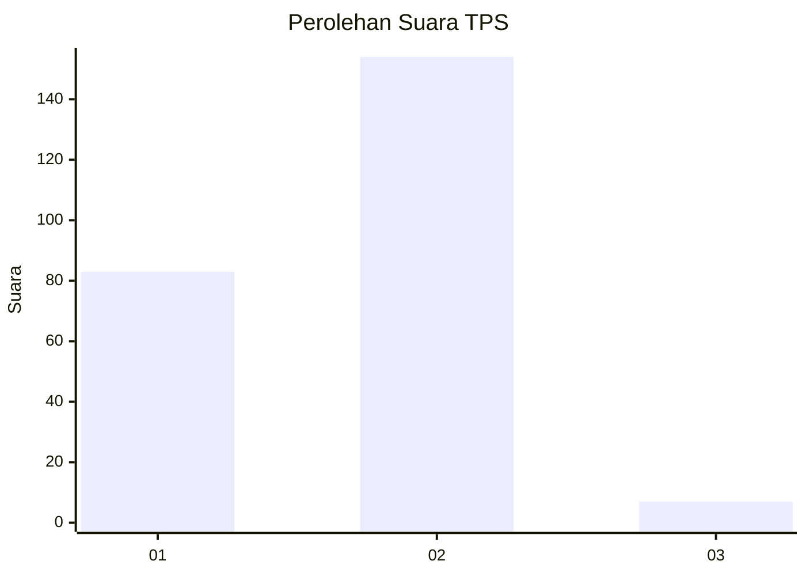
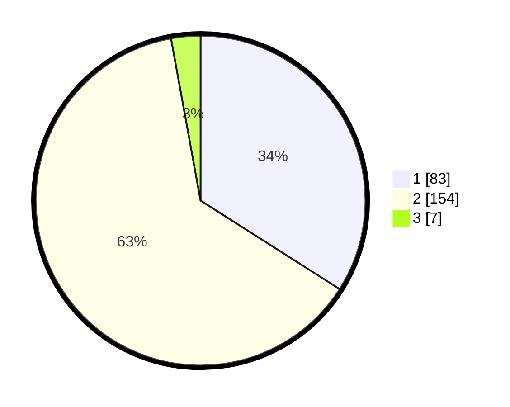

# Hasil

## Grafik

## Tabel

| No. | Nama Paslon    | Suara | Suara (raw) | Persentase |
|:--- |:-------------- | -----:| -----------:| ----------:|
| 1   | ANIES MUHAIMIN | 83    | [83][p-1]   | 34,02      |
| 2   | PRABOWO GIBRAN | 154   | [154][p-2]  | 63,11      |
| 3   | GANJAR MAHFUD  | 7     | [7][p-3]    | 2,87       |

[p-1]: https://github.com/gigit-pemilu/pemilu-2024-74-sulawesi-tenggara/blob/main/pilpres/hitung-suara/sub/74-sulawesi-tenggara/sub/06-bombana/sub/12-poleang-tenggara/sub/2002-lemo/sub/002-tps/sub/paslon-1.txt
[p-2]: https://github.com/gigit-pemilu/pemilu-2024-74-sulawesi-tenggara/blob/main/pilpres/hitung-suara/sub/74-sulawesi-tenggara/sub/06-bombana/sub/12-poleang-tenggara/sub/2002-lemo/sub/002-tps/sub/paslon-2.txt
[p-3]: https://github.com/gigit-pemilu/pemilu-2024-74-sulawesi-tenggara/blob/main/pilpres/hitung-suara/sub/74-sulawesi-tenggara/sub/06-bombana/sub/12-poleang-tenggara/sub/2002-lemo/sub/002-tps/sub/paslon-3.txt

## Foto C Plano

https://sirekap-obj-formc.kpu.go.id/8dc2/pemilu/ppwp/74/06/12/20/02/7406122002002-20240215-114619--5095e7a4-7375-47ae-b954-0078fe788926.jpg

https://sirekap-obj-formc.kpu.go.id/8dc2/pemilu/ppwp/74/06/12/20/02/7406122002002-20240215-113831--ad6ee6e7-30b5-450d-a883-37e6c0245489.jpg

https://sirekap-obj-formc.kpu.go.id/8dc2/pemilu/ppwp/74/06/12/20/02/7406122002002-20240215-115641--209aa278-ac1c-43a7-9219-b2a7067554e8.jpg

## Metadata

| Key        | Value               |
| ---------- | ------------------- |
| Time Stamp | 2024-02-25 17:00:00 |

