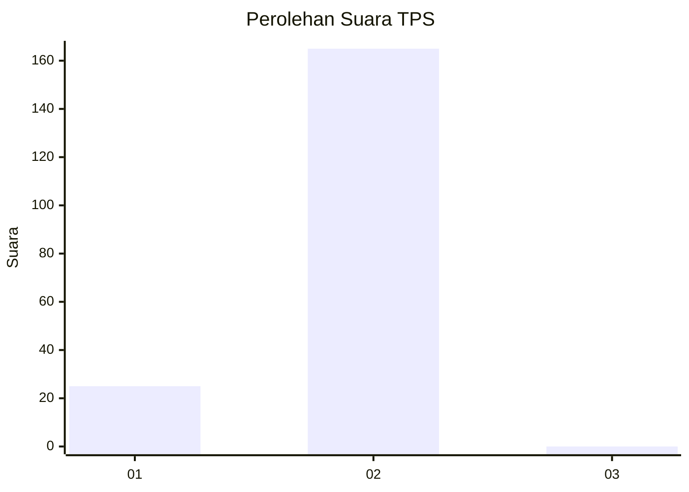
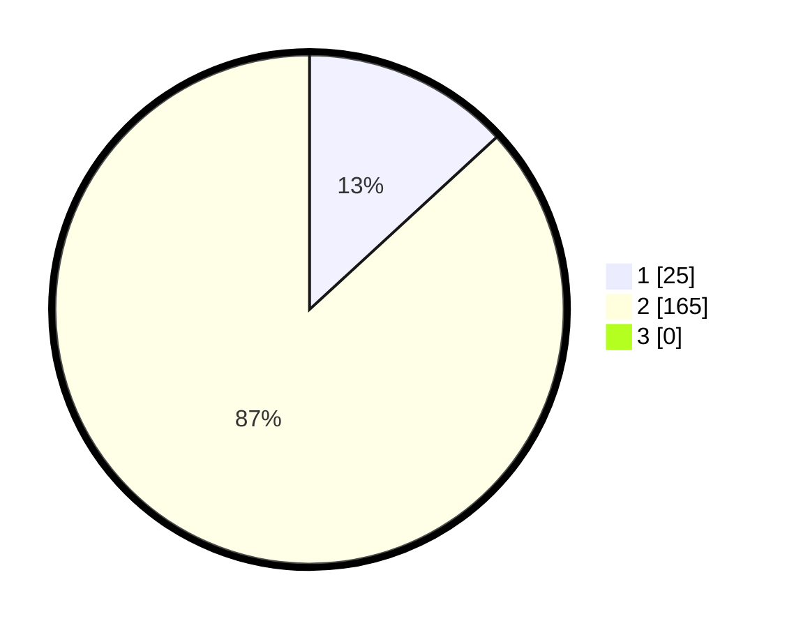

# Hasil

## Grafik

## Tabel

| No. | Nama Paslon    | Suara | Suara (raw) | Persentase |
|:--- |:-------------- | -----:| -----------:| ----------:|
| 1   | ANIES MUHAIMIN | 25    | [25][p-1]   | 13,16      |
| 2   | PRABOWO GIBRAN | 165   | [165][p-2]  | 86,84      |
| 3   | GANJAR MAHFUD  | 0     | [0][p-3]    | 0,00       |

[p-1]: https://github.com/gigit-pemilu/pemilu-2024-74-sulawesi-tenggara/blob/main/pilpres/hitung-suara/sub/74-sulawesi-tenggara/sub/06-bombana/sub/12-poleang-tenggara/sub/2003-terapung/sub/002-tps/sub/paslon-1.txt
[p-2]: https://github.com/gigit-pemilu/pemilu-2024-74-sulawesi-tenggara/blob/main/pilpres/hitung-suara/sub/74-sulawesi-tenggara/sub/06-bombana/sub/12-poleang-tenggara/sub/2003-terapung/sub/002-tps/sub/paslon-2.txt
[p-3]: https://github.com/gigit-pemilu/pemilu-2024-74-sulawesi-tenggara/blob/main/pilpres/hitung-suara/sub/74-sulawesi-tenggara/sub/06-bombana/sub/12-poleang-tenggara/sub/2003-terapung/sub/002-tps/sub/paslon-3.txt

## Foto C Plano

https://sirekap-obj-formc.kpu.go.id/79e7/pemilu/ppwp/74/06/12/20/03/7406122003002-20240215-190034--708835e5-ab98-4ae2-8908-96dbc8a7c99a.jpg

https://sirekap-obj-formc.kpu.go.id/79e7/pemilu/ppwp/74/06/12/20/03/7406122003002-20240215-190118--cdf2c49b-c0cb-41a8-be6e-e3654e548b32.jpg

https://sirekap-obj-formc.kpu.go.id/79e7/pemilu/ppwp/74/06/12/20/03/7406122003002-20240215-190147--97dbcd55-1124-4e10-b7fa-74a9784e1445.jpg

## Metadata

| Key        | Value               |
| ---------- | ------------------- |
| Time Stamp | 2024-02-24 22:31:28 |

