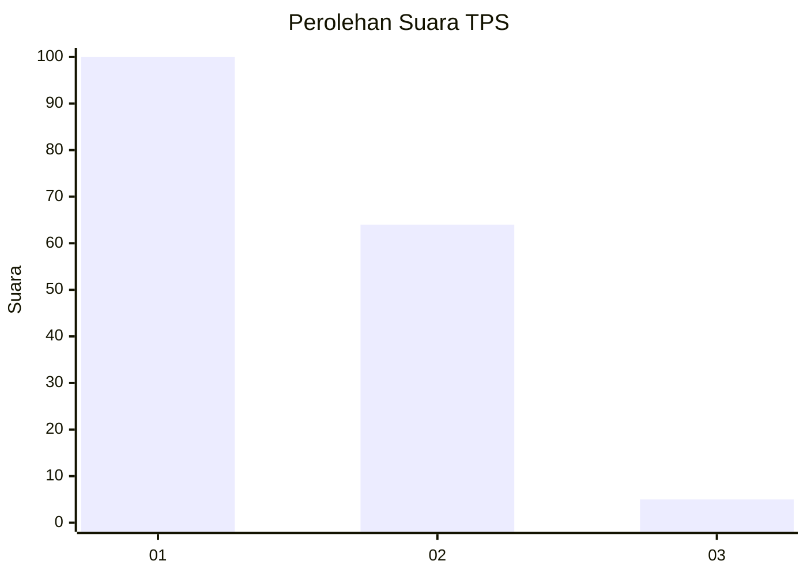
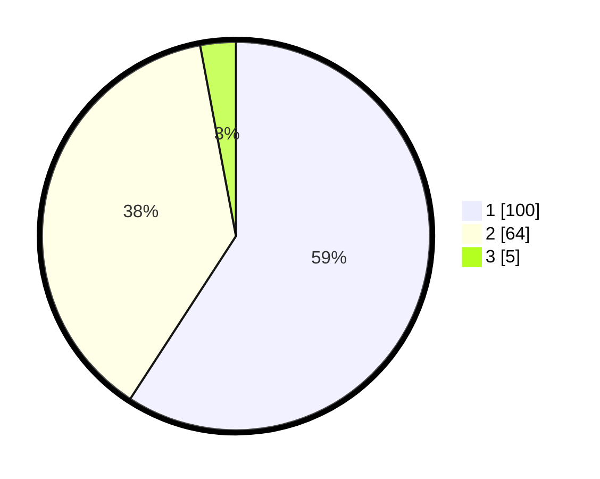

# Hasil

## Grafik

## Tabel

| No. | Nama Paslon    | Suara | Suara (raw) | Persentase |
|:--- |:-------------- | -----:| -----------:| ----------:|
| 1   | ANIES MUHAIMIN | 100   | [100][p-1]  | 59,17      |
| 2   | PRABOWO GIBRAN | 64    | [64][p-2]   | 37,87      |
| 3   | GANJAR MAHFUD  | 5     | [5][p-3]    | 2,96       |

[p-1]: https://github.com/gigit-pemilu/pemilu-2024-74-sulawesi-tenggara/blob/main/pilpres/hitung-suara/sub/74-sulawesi-tenggara/sub/06-bombana/sub/19-poleang-tengah/sub/2001-mulaeno/sub/002-tps/sub/paslon-1.txt
[p-2]: https://github.com/gigit-pemilu/pemilu-2024-74-sulawesi-tenggara/blob/main/pilpres/hitung-suara/sub/74-sulawesi-tenggara/sub/06-bombana/sub/19-poleang-tengah/sub/2001-mulaeno/sub/002-tps/sub/paslon-2.txt
[p-3]: https://github.com/gigit-pemilu/pemilu-2024-74-sulawesi-tenggara/blob/main/pilpres/hitung-suara/sub/74-sulawesi-tenggara/sub/06-bombana/sub/19-poleang-tengah/sub/2001-mulaeno/sub/002-tps/sub/paslon-3.txt

## Foto C Plano

https://sirekap-obj-formc.kpu.go.id/3301/pemilu/ppwp/74/06/19/20/01/7406192001002-20240215-205326--1f7acfac-2e16-4f8e-bc85-9af255dd53e4.jpg

https://sirekap-obj-formc.kpu.go.id/3301/pemilu/ppwp/74/06/19/20/01/7406192001002-20240215-205011--2b60df01-e932-43ba-ac0a-31e802fc70ae.jpg

https://sirekap-obj-formc.kpu.go.id/3301/pemilu/ppwp/74/06/19/20/01/7406192001002-20240215-205625--9a234cc5-81e2-4654-a752-e628880e911d.jpg

## Metadata

| Key        | Value               |
| ---------- | ------------------- |
| Time Stamp | 2024-02-17 14:45:18 |

