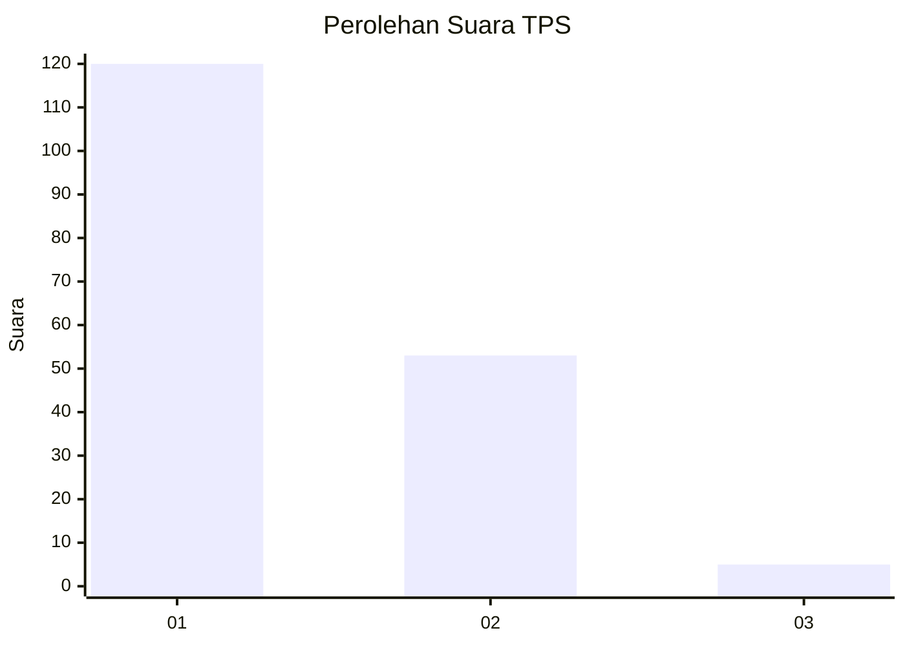
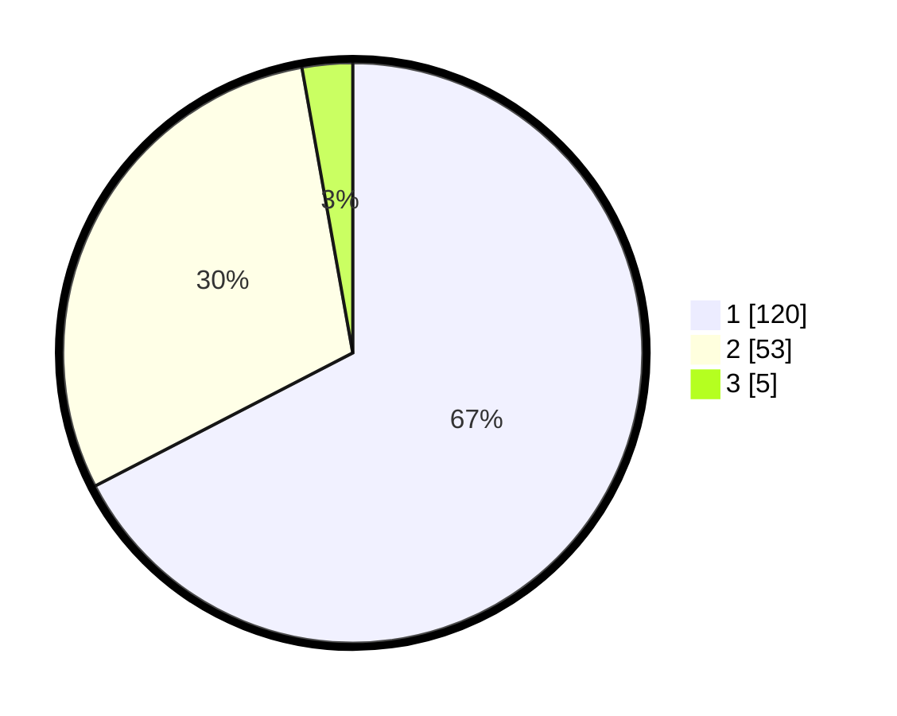

# Hasil

## Grafik

## Tabel

| No. | Nama Paslon    | Suara | Suara (raw) | Persentase |
|:--- |:-------------- | -----:| -----------:| ----------:|
| 1   | ANIES MUHAIMIN | 120   | [120][p-1]  | 67,42      |
| 2   | PRABOWO GIBRAN | 53    | [53][p-2]   | 29,78      |
| 3   | GANJAR MAHFUD  | 5     | [5][p-3]    | 2,81       |

[p-1]: https://github.com/gigit-pemilu/pemilu-2024-74-sulawesi-tenggara/blob/main/pilpres/hitung-suara/sub/74-sulawesi-tenggara/sub/06-bombana/sub/19-poleang-tengah/sub/2002-lebo-ea/sub/002-tps/sub/paslon-1.txt
[p-2]: https://github.com/gigit-pemilu/pemilu-2024-74-sulawesi-tenggara/blob/main/pilpres/hitung-suara/sub/74-sulawesi-tenggara/sub/06-bombana/sub/19-poleang-tengah/sub/2002-lebo-ea/sub/002-tps/sub/paslon-2.txt
[p-3]: https://github.com/gigit-pemilu/pemilu-2024-74-sulawesi-tenggara/blob/main/pilpres/hitung-suara/sub/74-sulawesi-tenggara/sub/06-bombana/sub/19-poleang-tengah/sub/2002-lebo-ea/sub/002-tps/sub/paslon-3.txt

## Foto C Plano

https://sirekap-obj-formc.kpu.go.id/7af7/pemilu/ppwp/74/06/19/20/02/7406192002002-20240214-215414--375af95e-ade6-41e7-a015-f00a049ea0ff.jpg

https://sirekap-obj-formc.kpu.go.id/7af7/pemilu/ppwp/74/06/19/20/02/7406192002002-20240214-215650--b0f1a78e-3604-42e0-84c2-283aabb37fd9.jpg

https://sirekap-obj-formc.kpu.go.id/7af7/pemilu/ppwp/74/06/19/20/02/7406192002002-20240214-220132--f1b2a292-086e-4986-992b-a6d6fa7222c5.jpg

## Metadata

| Key        | Value               |
| ---------- | ------------------- |
| Time Stamp | 2024-02-17 14:45:18 |

