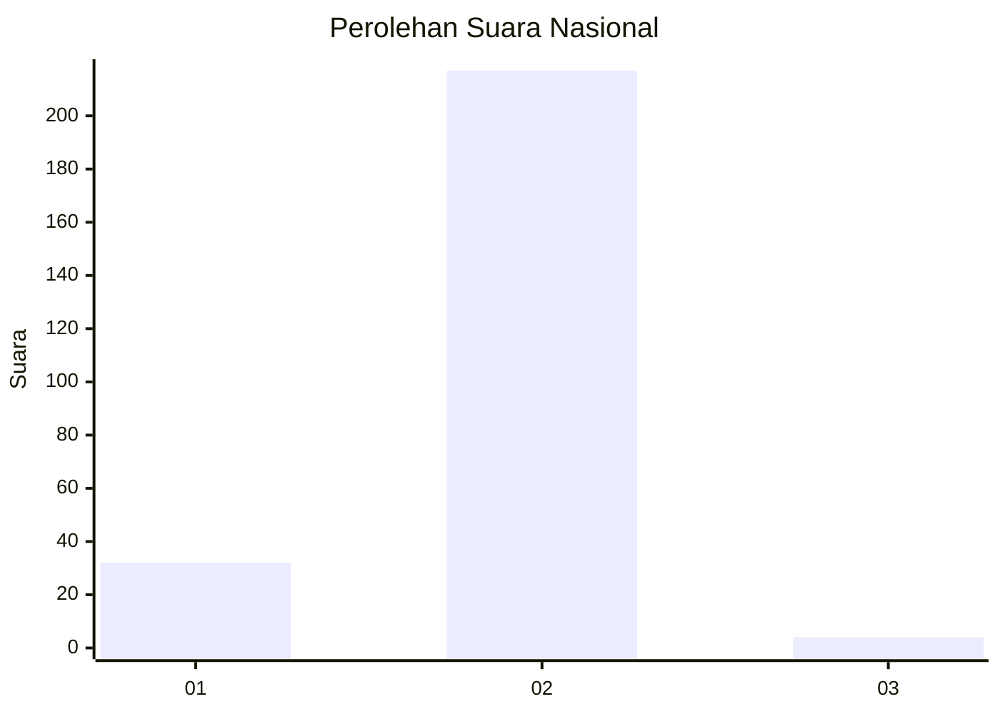
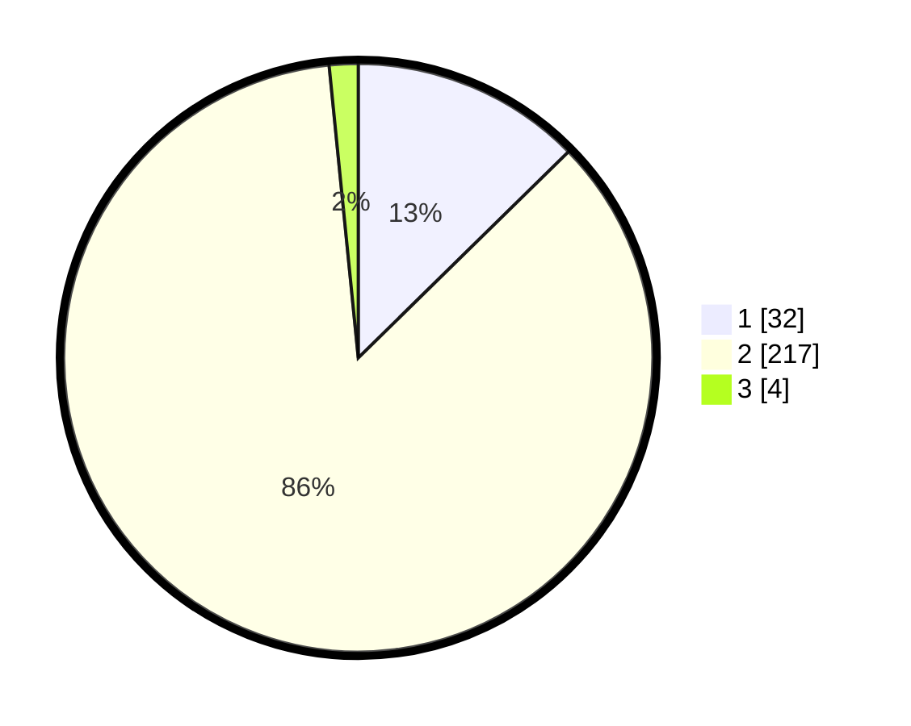

# Hasil

## Grafik

## Tabel

| No. | Nama Paslon    | Suara | Suara (raw) | Persentase |
|:--- |:-------------- | -----:| -----------:| ----------:|
| 1   | ANIES MUHAIMIN | 32    | [32][p-1]   | 12,65      |
| 2   | PRABOWO GIBRAN | 217   | [217][p-2]  | 85,77      |
| 3   | GANJAR MAHFUD  | 4     | [4][p-3]    | 1,58       |

[p-1]: https://github.com/gigit-pemilu/pemilu-2024/blob/main/pilpres/hitung-suara/sub/74-sulawesi-tenggara/sub/06-bombana/sub/20-tontonunu/sub/2002-tongkoseng/sub/001-tps/sub/paslon-1.txt
[p-2]: https://github.com/gigit-pemilu/pemilu-2024/blob/main/pilpres/hitung-suara/sub/74-sulawesi-tenggara/sub/06-bombana/sub/20-tontonunu/sub/2002-tongkoseng/sub/001-tps/sub/paslon-2.txt
[p-3]: https://github.com/gigit-pemilu/pemilu-2024/blob/main/pilpres/hitung-suara/sub/74-sulawesi-tenggara/sub/06-bombana/sub/20-tontonunu/sub/2002-tongkoseng/sub/001-tps/sub/paslon-3.txt

## Foto C Plano

https://sirekap-obj-formc.kpu.go.id/636d/pemilu/ppwp/74/06/20/20/02/7406202002001-20240219-084445--d52244fc-78ca-4e06-9059-13a277ac5fd1.jpg

https://sirekap-obj-formc.kpu.go.id/636d/pemilu/ppwp/74/06/20/20/02/7406202002001-20240219-084534--fcad8167-2a76-49fb-9584-469d2e1626d7.jpg

https://sirekap-obj-formc.kpu.go.id/636d/pemilu/ppwp/74/06/20/20/02/7406202002001-20240219-084412--272ec97f-c722-4f09-92e4-740a65cf6056.jpg

## Metadata

| Key        | Value               |
| ---------- | ------------------- |
| Time Stamp | 2024-02-25 12:00:00 |

