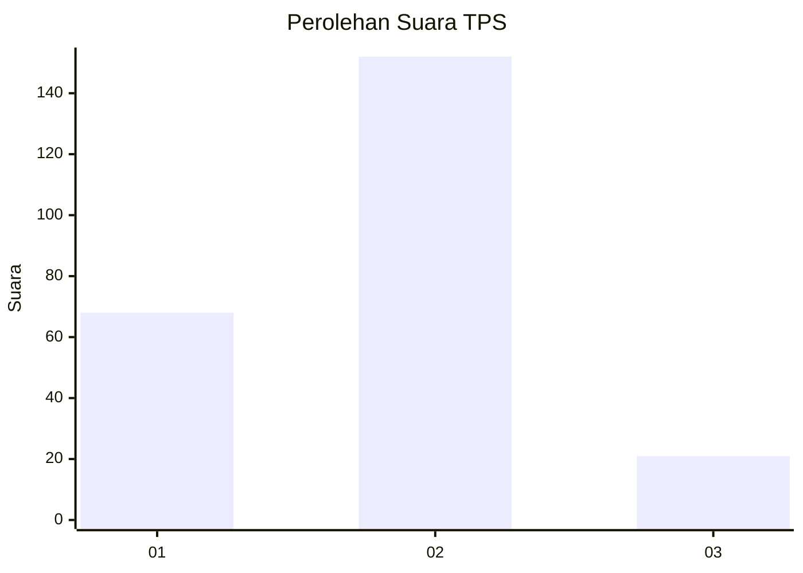
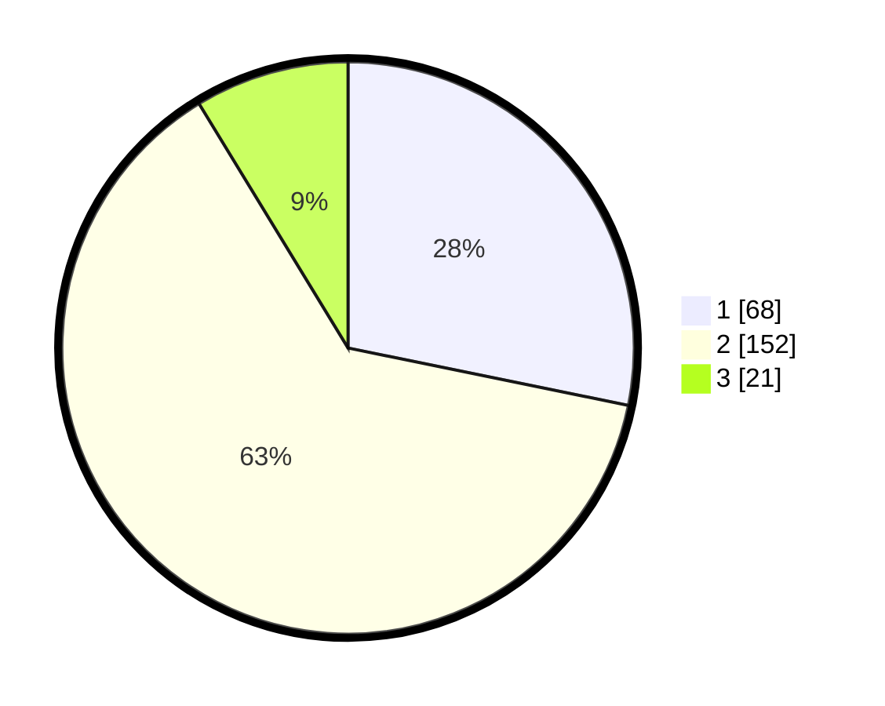

# Hasil

## Grafik

## Tabel

| No. | Nama Paslon    | Suara | Suara (raw) | Persentase |
|:--- |:-------------- | -----:| -----------:| ----------:|
| 1   | ANIES MUHAIMIN | 68    | [68][p-1]   | 28,22      |
| 2   | PRABOWO GIBRAN | 152   | [152][p-2]  | 63,07      |
| 3   | GANJAR MAHFUD  | 21    | [21][p-3]   | 8,71       |

[p-1]: https://github.com/gigit-pemilu/pemilu-2024-74-sulawesi-tenggara/blob/main/pilpres/hitung-suara/sub/74-sulawesi-tenggara/sub/06-bombana/sub/21-lantari-jaya/sub/2002-lantari/sub/001-tps/sub/paslon-1.txt
[p-2]: https://github.com/gigit-pemilu/pemilu-2024-74-sulawesi-tenggara/blob/main/pilpres/hitung-suara/sub/74-sulawesi-tenggara/sub/06-bombana/sub/21-lantari-jaya/sub/2002-lantari/sub/001-tps/sub/paslon-2.txt
[p-3]: https://github.com/gigit-pemilu/pemilu-2024-74-sulawesi-tenggara/blob/main/pilpres/hitung-suara/sub/74-sulawesi-tenggara/sub/06-bombana/sub/21-lantari-jaya/sub/2002-lantari/sub/001-tps/sub/paslon-3.txt

## Foto C Plano

https://sirekap-obj-formc.kpu.go.id/f6b9/pemilu/ppwp/74/06/21/20/02/7406212002001-20240215-075409--c2f8daf0-0817-4015-8f33-54e347658c3e.jpg

https://sirekap-obj-formc.kpu.go.id/f6b9/pemilu/ppwp/74/06/21/20/02/7406212002001-20240215-075639--3f5d9dd4-4c0b-41bc-93f9-324e74ae6384.jpg

https://sirekap-obj-formc.kpu.go.id/f6b9/pemilu/ppwp/74/06/21/20/02/7406212002001-20240215-083937--5603ab0a-4d2f-4df7-abf2-229d8225af88.jpg

## Metadata

| Key        | Value               |
| ---------- | ------------------- |
| Time Stamp | 2024-02-17 11:30:03 |

