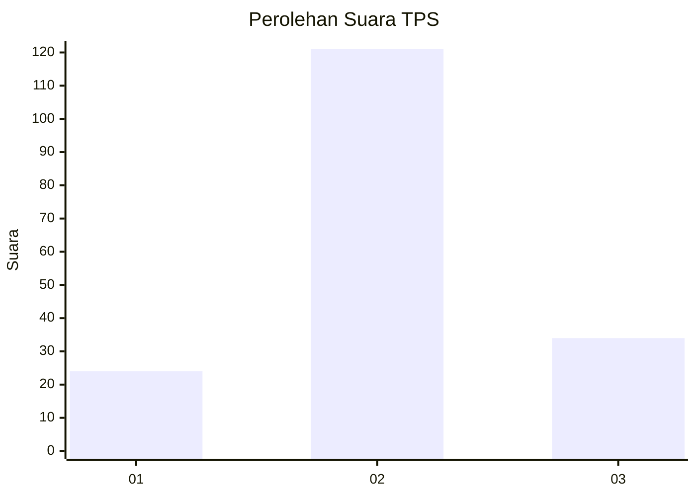
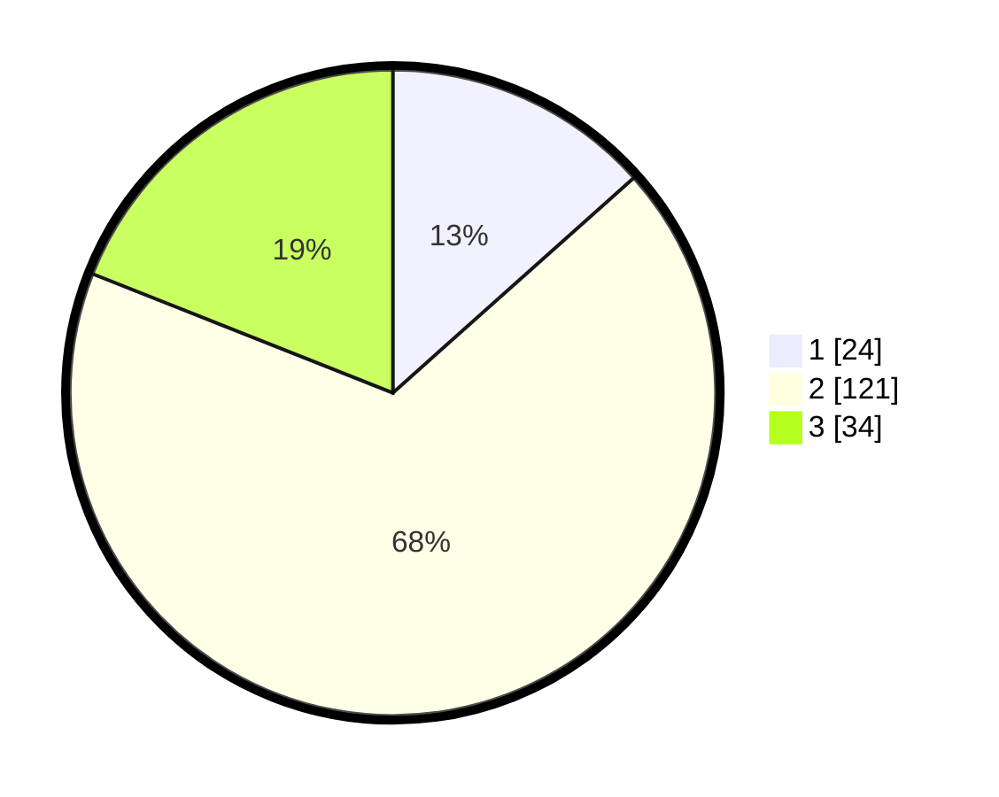

# Hasil

## Grafik

## Tabel

| No. | Nama Paslon    | Suara | Suara (raw) | Persentase |
|:--- |:-------------- | -----:| -----------:| ----------:|
| 1   | ANIES MUHAIMIN | 24    | [24][p-1]   | 13,41      |
| 2   | PRABOWO GIBRAN | 121   | [121][p-2]  | 67,60      |
| 3   | GANJAR MAHFUD  | 34    | [34][p-3]   | 18,99      |

[p-1]: https://github.com/gigit-pemilu/pemilu-2024-74-sulawesi-tenggara/blob/main/pilpres/hitung-suara/sub/74-sulawesi-tenggara/sub/07-wakatobi/sub/05-wangi-wangi-selatan/sub/1016-mandati-ii/sub/008-tps/sub/paslon-1.txt
[p-2]: https://github.com/gigit-pemilu/pemilu-2024-74-sulawesi-tenggara/blob/main/pilpres/hitung-suara/sub/74-sulawesi-tenggara/sub/07-wakatobi/sub/05-wangi-wangi-selatan/sub/1016-mandati-ii/sub/008-tps/sub/paslon-2.txt
[p-3]: https://github.com/gigit-pemilu/pemilu-2024-74-sulawesi-tenggara/blob/main/pilpres/hitung-suara/sub/74-sulawesi-tenggara/sub/07-wakatobi/sub/05-wangi-wangi-selatan/sub/1016-mandati-ii/sub/008-tps/sub/paslon-3.txt

## Foto C Plano

https://sirekap-obj-formc.kpu.go.id/53fc/pemilu/ppwp/74/07/05/10/16/7407051016008-20240215-055647--ba5425ae-635d-4940-b73c-656e10faec5d.jpg

https://sirekap-obj-formc.kpu.go.id/53fc/pemilu/ppwp/74/07/05/10/16/7407051016008-20240215-055654--b6d09f34-b85e-4f28-9f2a-e647c15a07a9.jpg

https://sirekap-obj-formc.kpu.go.id/53fc/pemilu/ppwp/74/07/05/10/16/7407051016008-20240215-055659--e85563fc-cb7a-4ad7-9db3-cc5f2d255903.jpg

## Metadata

| Key        | Value               |
| ---------- | ------------------- |
| Time Stamp | 2024-02-15 19:00:26 |

