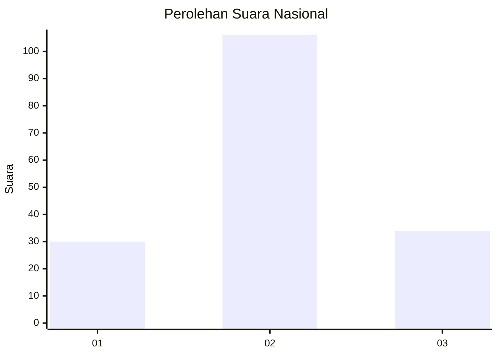
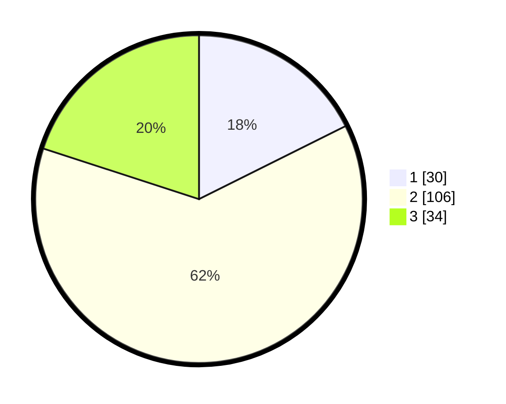

# Hasil

## Grafik

## Tabel

| No. | Nama Paslon    | Suara | Suara (raw) | Persentase |
|:--- |:-------------- | -----:| -----------:| ----------:|
| 1   | ANIES MUHAIMIN | 30    | [30][p-1]   | 17,65      |
| 2   | PRABOWO GIBRAN | 106   | [106][p-2]  | 62,35      |
| 3   | GANJAR MAHFUD  | 34    | [34][p-3]   | 20,00      |

[p-1]: https://github.com/gigit-pemilu/pemilu-2024/blob/main/pilpres/hitung-suara/sub/74-sulawesi-tenggara/sub/07-wakatobi/sub/05-wangi-wangi-selatan/sub/1016-mandati-ii/sub/009-tps/sub/paslon-1.txt
[p-2]: https://github.com/gigit-pemilu/pemilu-2024/blob/main/pilpres/hitung-suara/sub/74-sulawesi-tenggara/sub/07-wakatobi/sub/05-wangi-wangi-selatan/sub/1016-mandati-ii/sub/009-tps/sub/paslon-2.txt
[p-3]: https://github.com/gigit-pemilu/pemilu-2024/blob/main/pilpres/hitung-suara/sub/74-sulawesi-tenggara/sub/07-wakatobi/sub/05-wangi-wangi-selatan/sub/1016-mandati-ii/sub/009-tps/sub/paslon-3.txt

## Foto C Plano

https://sirekap-obj-formc.kpu.go.id/361b/pemilu/ppwp/74/07/05/10/16/7407051016009-20240215-091648--47209fec-e92e-4fc7-85b9-ca4226015074.jpg

https://sirekap-obj-formc.kpu.go.id/361b/pemilu/ppwp/74/07/05/10/16/7407051016009-20240215-091757--f5776bc9-cb50-436e-9504-185f0a331ecd.jpg

https://sirekap-obj-formc.kpu.go.id/361b/pemilu/ppwp/74/07/05/10/16/7407051016009-20240215-091922--b8e2c2eb-2c6c-46fa-abde-e4cb5cf49d00.jpg

## Metadata

| Key        | Value               |
| ---------- | ------------------- |
| Time Stamp | 2024-02-15 15:30:25 |

