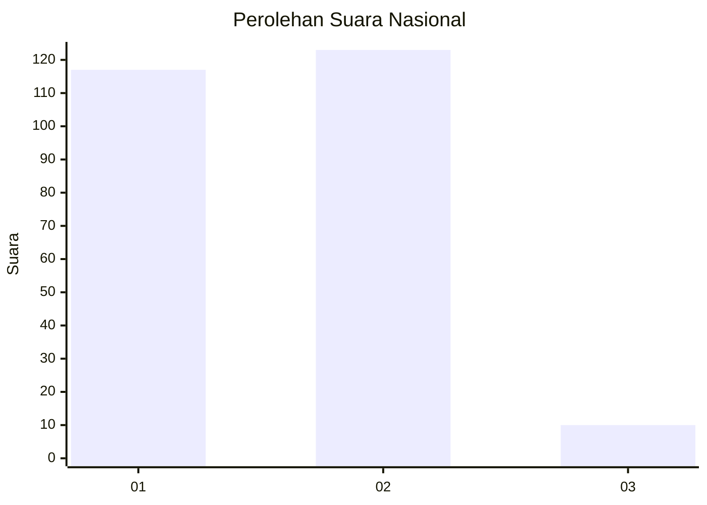
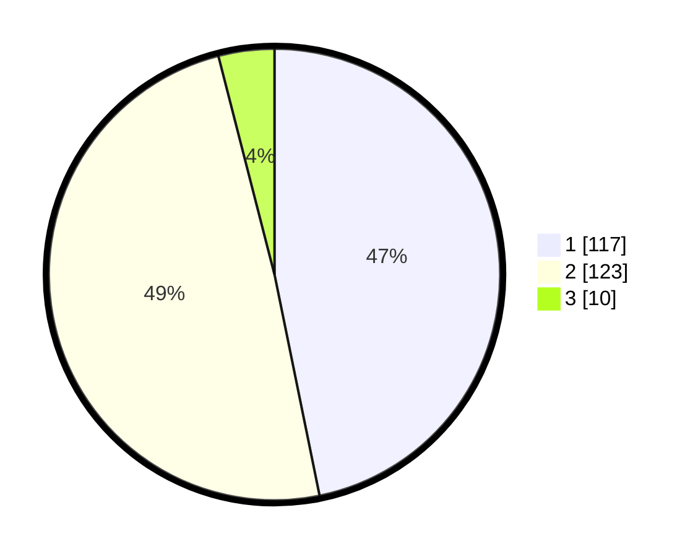

# Hasil

## Grafik

## Tabel

| No. | Nama Paslon    | Suara | Suara (raw) | Persentase |
|:--- |:-------------- | -----:| -----------:| ----------:|
| 1   | ANIES MUHAIMIN | 117   | [117][p-1]  | 46,80      |
| 2   | PRABOWO GIBRAN | 123   | [123][p-2]  | 49,20      |
| 3   | GANJAR MAHFUD  | 10    | [10][p-3]   | 4,00       |

[p-1]: https://github.com/gigit-pemilu/pemilu-2024/blob/main/pilpres/hitung-suara/sub/74-sulawesi-tenggara/sub/08-kolaka-utara/sub/01-lasusua/sub/2007-tojabi/sub/006-tps/sub/paslon-1.txt
[p-2]: https://github.com/gigit-pemilu/pemilu-2024/blob/main/pilpres/hitung-suara/sub/74-sulawesi-tenggara/sub/08-kolaka-utara/sub/01-lasusua/sub/2007-tojabi/sub/006-tps/sub/paslon-2.txt
[p-3]: https://github.com/gigit-pemilu/pemilu-2024/blob/main/pilpres/hitung-suara/sub/74-sulawesi-tenggara/sub/08-kolaka-utara/sub/01-lasusua/sub/2007-tojabi/sub/006-tps/sub/paslon-3.txt

## Foto C Plano

https://sirekap-obj-formc.kpu.go.id/d80b/pemilu/ppwp/74/08/01/20/07/7408012007006-20240215-104053--74df8553-397f-41df-9cde-f7a159d17dfd.jpg

https://sirekap-obj-formc.kpu.go.id/d80b/pemilu/ppwp/74/08/01/20/07/7408012007006-20240215-104338--807c8fa4-e665-4028-8916-4191a52d15d0.jpg

https://sirekap-obj-formc.kpu.go.id/d80b/pemilu/ppwp/74/08/01/20/07/7408012007006-20240215-104456--ae9620ed-4478-4aa8-9eaa-22291fc87bad.jpg

## Metadata

| Key        | Value               |
| ---------- | ------------------- |
| Time Stamp | 2024-02-16 16:25:10 |

