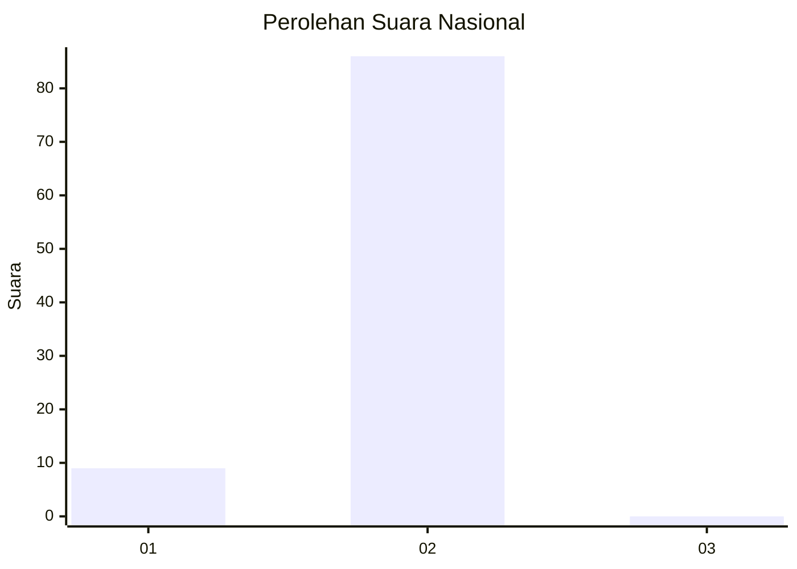
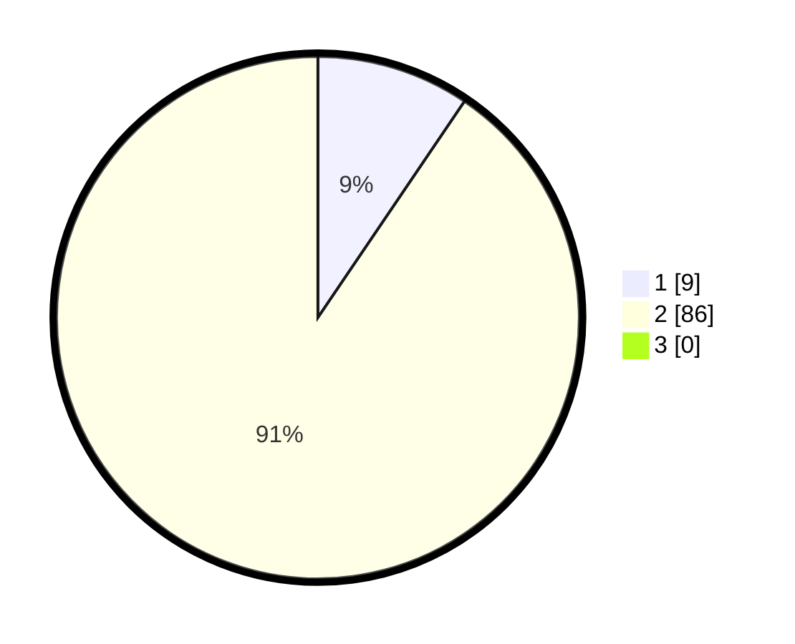

# Hasil

## Grafik

## Tabel

| No. | Nama Paslon    | Suara | Suara (raw) | Persentase |
|:--- |:-------------- | -----:| -----------:| ----------:|
| 1   | ANIES MUHAIMIN | 9     | [9][p-1]    | 9,47       |
| 2   | PRABOWO GIBRAN | 86    | [86][p-2]   | 90,53      |
| 3   | GANJAR MAHFUD  | 0     | [0][p-3]    | 0,00       |

[p-1]: https://github.com/gigit-pemilu/pemilu-2024/blob/main/pilpres/hitung-suara/sub/74-sulawesi-tenggara/sub/08-kolaka-utara/sub/12-porehu/sub/2002-tobela/sub/002-tps/sub/paslon-1.txt
[p-2]: https://github.com/gigit-pemilu/pemilu-2024/blob/main/pilpres/hitung-suara/sub/74-sulawesi-tenggara/sub/08-kolaka-utara/sub/12-porehu/sub/2002-tobela/sub/002-tps/sub/paslon-2.txt
[p-3]: https://github.com/gigit-pemilu/pemilu-2024/blob/main/pilpres/hitung-suara/sub/74-sulawesi-tenggara/sub/08-kolaka-utara/sub/12-porehu/sub/2002-tobela/sub/002-tps/sub/paslon-3.txt

## Foto C Plano

https://sirekap-obj-formc.kpu.go.id/1d0a/pemilu/ppwp/74/08/12/20/02/7408122002002-20240214-140944--42203e85-ab7c-4a2c-abdf-03312fa5e4d1.jpg

https://sirekap-obj-formc.kpu.go.id/1d0a/pemilu/ppwp/74/08/12/20/02/7408122002002-20240214-141716--128d0632-f4ce-4d76-9ca4-5338f26a9272.jpg

https://sirekap-obj-formc.kpu.go.id/1d0a/pemilu/ppwp/74/08/12/20/02/7408122002002-20240214-184838--be7efabf-0838-4a00-ae8f-c4c7e5d9635c.jpg

## Metadata

| Key        | Value               |
| ---------- | ------------------- |
| Time Stamp | 2024-02-14 21:46:01 |

## DATA PEMILIH TETAP

Jumlah pemilih dalam DPT: **109**.
 * L: **53**.
 * P: **56**.

## DATA PENGGUNA HAK PILIH

Jumlah pengguna hak pilih dalam DPT: **83**.
 * L: **40**.
 * P: **43**.

Jumlah pengguna hak pilih dalam DPTb: **0**.
 * L: **0**.
 * P: **0**.

Jumlah pengguna hak pilih dalam DPK: **13**.
 * L: **13**.
 * P: **0**.

Jumlah pengguna hak pilih: **96**.
 * L: **53**.
 * P: **43**.

## JUMLAH SUARA SAH DAN TIDAK SAH

JUMLAH SELURUH SUARA SAH: **95**.

JUMLAH SUARA TIDAK SAH: **1**.

JUMLAH SELURUH SUARA SAH DAN SUARA TIDAK SAH: **96**.

