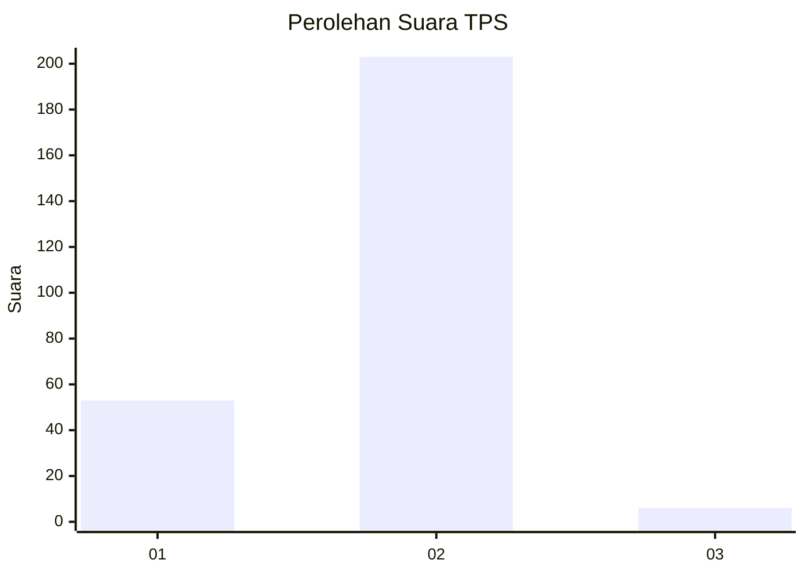
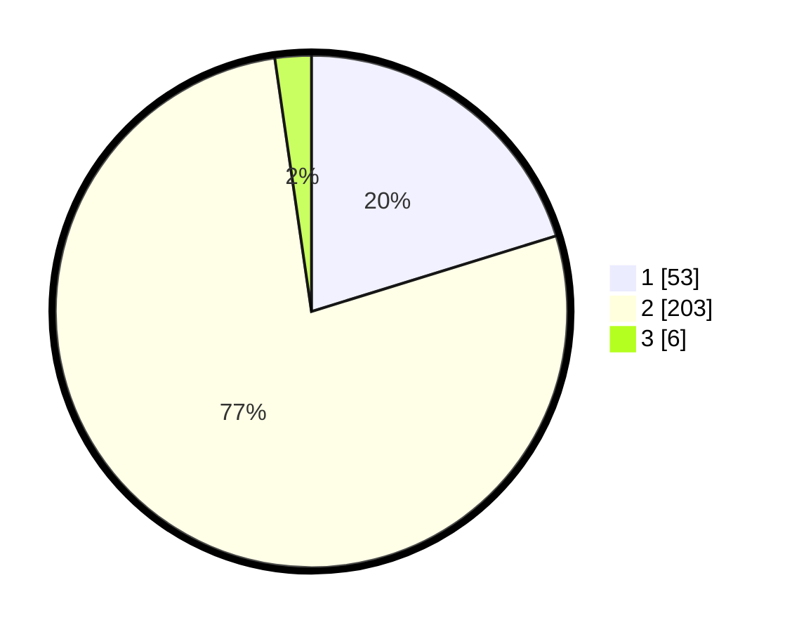

# Hasil

## Grafik

## Tabel

| No. | Nama Paslon    | Suara | Suara (raw) | Persentase |
|:--- |:-------------- | -----:| -----------:| ----------:|
| 1   | ANIES MUHAIMIN | 53    | [53][p-1]   | 20,23      |
| 2   | PRABOWO GIBRAN | 203   | [203][p-2]  | 77,48      |
| 3   | GANJAR MAHFUD  | 6     | [6][p-3]    | 2,29       |

[p-1]: https://github.com/gigit-pemilu/pemilu-2024-74-sulawesi-tenggara/blob/main/pilpres/hitung-suara/sub/74-sulawesi-tenggara/sub/09-konawe-utara/sub/01-asera/sub/1005-wanggudu/sub/002-tps/sub/paslon-1.txt
[p-2]: https://github.com/gigit-pemilu/pemilu-2024-74-sulawesi-tenggara/blob/main/pilpres/hitung-suara/sub/74-sulawesi-tenggara/sub/09-konawe-utara/sub/01-asera/sub/1005-wanggudu/sub/002-tps/sub/paslon-2.txt
[p-3]: https://github.com/gigit-pemilu/pemilu-2024-74-sulawesi-tenggara/blob/main/pilpres/hitung-suara/sub/74-sulawesi-tenggara/sub/09-konawe-utara/sub/01-asera/sub/1005-wanggudu/sub/002-tps/sub/paslon-3.txt

## Foto C Plano

https://sirekap-obj-formc.kpu.go.id/dfdc/pemilu/ppwp/74/09/01/10/05/7409011005002-20240215-022256--2556589d-3c49-443e-bd67-52eb85dac8f9.jpg

https://sirekap-obj-formc.kpu.go.id/dfdc/pemilu/ppwp/74/09/01/10/05/7409011005002-20240215-022617--24d0e41e-a74f-480f-8907-fdffe728f402.jpg

https://sirekap-obj-formc.kpu.go.id/dfdc/pemilu/ppwp/74/09/01/10/05/7409011005002-20240215-022858--809c76d3-f9ae-4c8a-8577-864b2ccc3bf0.jpg

## Metadata

| Key        | Value               |
| ---------- | ------------------- |
| Time Stamp | 2024-02-15 17:00:25 |

