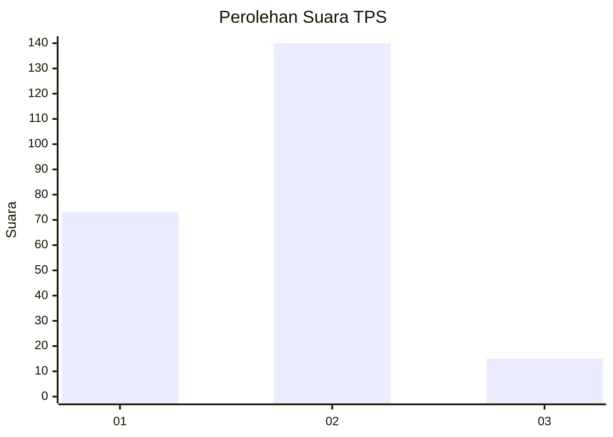
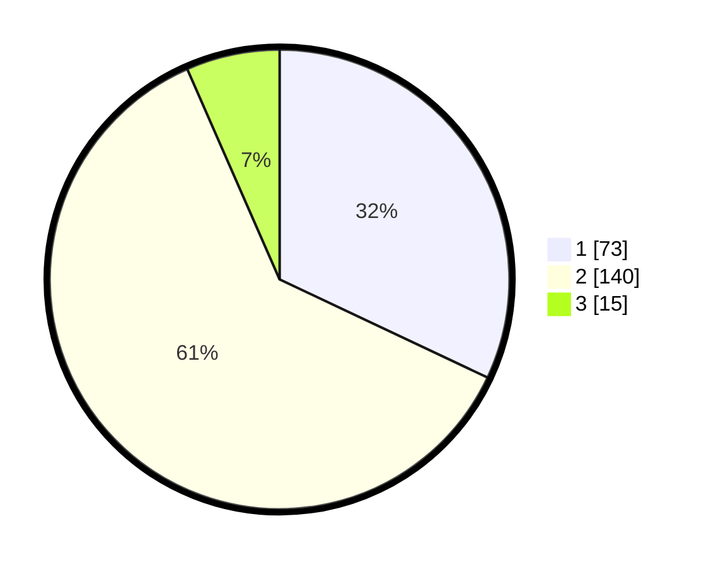

# Hasil

## Grafik

## Tabel

| No. | Nama Paslon    | Suara | Suara (raw) | Persentase |
|:--- |:-------------- | -----:| -----------:| ----------:|
| 1   | ANIES MUHAIMIN | 73    | [73][p-1]   | 32,02      |
| 2   | PRABOWO GIBRAN | 140   | [140][p-2]  | 61,40      |
| 3   | GANJAR MAHFUD  | 15    | [15][p-3]   | 6,58       |

[p-1]: https://github.com/gigit-pemilu/pemilu-2024-74-sulawesi-tenggara/blob/main/pilpres/hitung-suara/sub/74-sulawesi-tenggara/sub/09-konawe-utara/sub/01-asera/sub/1005-wanggudu/sub/004-tps/sub/paslon-1.txt
[p-2]: https://github.com/gigit-pemilu/pemilu-2024-74-sulawesi-tenggara/blob/main/pilpres/hitung-suara/sub/74-sulawesi-tenggara/sub/09-konawe-utara/sub/01-asera/sub/1005-wanggudu/sub/004-tps/sub/paslon-2.txt
[p-3]: https://github.com/gigit-pemilu/pemilu-2024-74-sulawesi-tenggara/blob/main/pilpres/hitung-suara/sub/74-sulawesi-tenggara/sub/09-konawe-utara/sub/01-asera/sub/1005-wanggudu/sub/004-tps/sub/paslon-3.txt

## Foto C Plano

https://sirekap-obj-formc.kpu.go.id/2eed/pemilu/ppwp/74/09/01/10/05/7409011005004-20240215-055709--601fa7e5-91f3-40a3-9e4b-18899c5526e8.jpg

https://sirekap-obj-formc.kpu.go.id/2eed/pemilu/ppwp/74/09/01/10/05/7409011005004-20240215-053643--5223963a-e04f-47a3-9255-0354d022ae3e.jpg

https://sirekap-obj-formc.kpu.go.id/2eed/pemilu/ppwp/74/09/01/10/05/7409011005004-20240215-053853--d9d4ca42-ad2b-4b57-99f4-3b451673b5b5.jpg

## Metadata

| Key        | Value               |
| ---------- | ------------------- |
| Time Stamp | 2024-02-25 21:00:00 |

