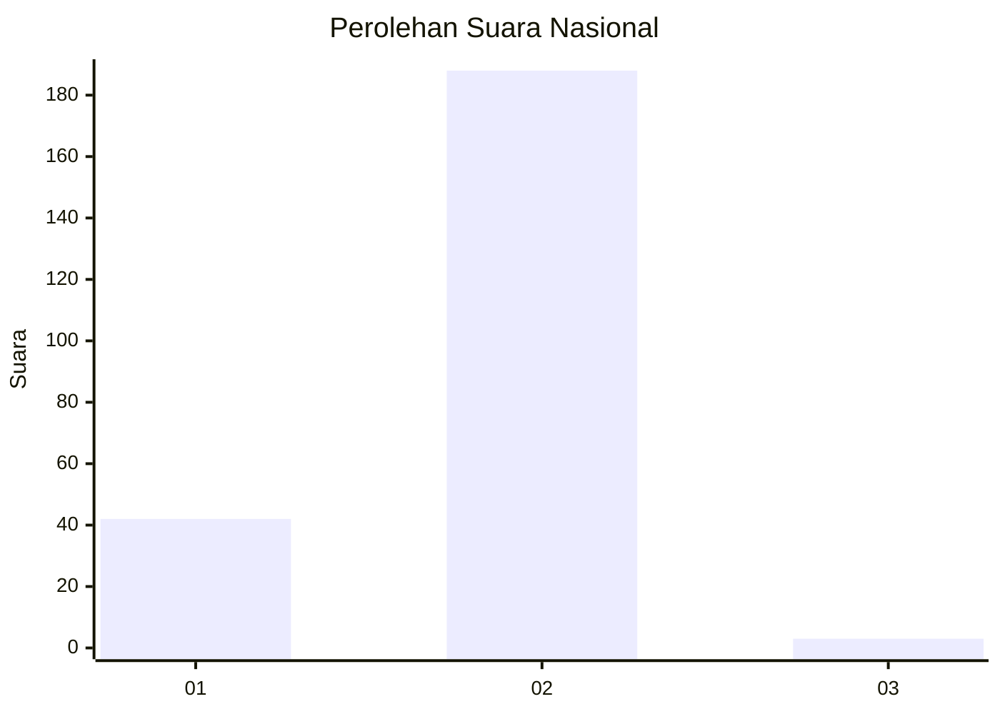
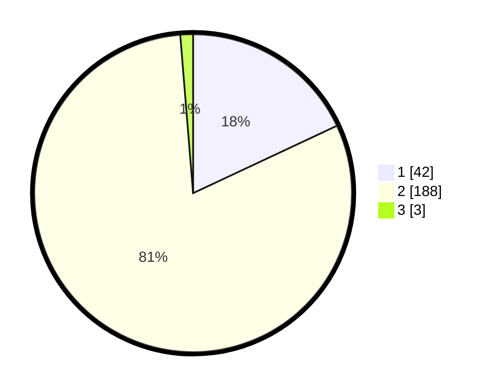

# Hasil

## Grafik

## Tabel

| No. | Nama Paslon    | Suara | Suara (raw) | Persentase |
|:--- |:-------------- | -----:| -----------:| ----------:|
| 1   | ANIES MUHAIMIN | 42    | [42][p-1]   | 18,03      |
| 2   | PRABOWO GIBRAN | 188   | [188][p-2]  | 80,69      |
| 3   | GANJAR MAHFUD  | 3     | [3][p-3]    | 1,29       |

[p-1]: https://github.com/gigit-pemilu/pemilu-2024/blob/main/pilpres/hitung-suara/sub/74-sulawesi-tenggara/sub/09-konawe-utara/sub/02-wiwirano/sub/1001-lamonae/sub/001-tps/sub/paslon-1.txt
[p-2]: https://github.com/gigit-pemilu/pemilu-2024/blob/main/pilpres/hitung-suara/sub/74-sulawesi-tenggara/sub/09-konawe-utara/sub/02-wiwirano/sub/1001-lamonae/sub/001-tps/sub/paslon-2.txt
[p-3]: https://github.com/gigit-pemilu/pemilu-2024/blob/main/pilpres/hitung-suara/sub/74-sulawesi-tenggara/sub/09-konawe-utara/sub/02-wiwirano/sub/1001-lamonae/sub/001-tps/sub/paslon-3.txt

## Foto C Plano

https://sirekap-obj-formc.kpu.go.id/65ef/pemilu/ppwp/74/09/02/10/01/7409021001001-20240214-203514--75cf137e-e269-47cc-9f25-d6cda0e3afa6.jpg

https://sirekap-obj-formc.kpu.go.id/65ef/pemilu/ppwp/74/09/02/10/01/7409021001001-20240214-203517--79b75d64-cf33-494b-b566-3b6411e59d76.jpg

https://sirekap-obj-formc.kpu.go.id/65ef/pemilu/ppwp/74/09/02/10/01/7409021001001-20240214-203520--6ec183cd-3347-4ac1-be3c-36013a18d941.jpg

## Metadata

| Key        | Value               |
| ---------- | ------------------- |
| Time Stamp | 2024-02-15 21:01:18 |

