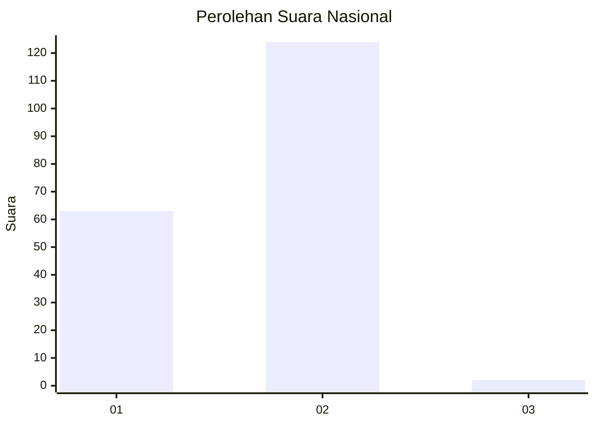
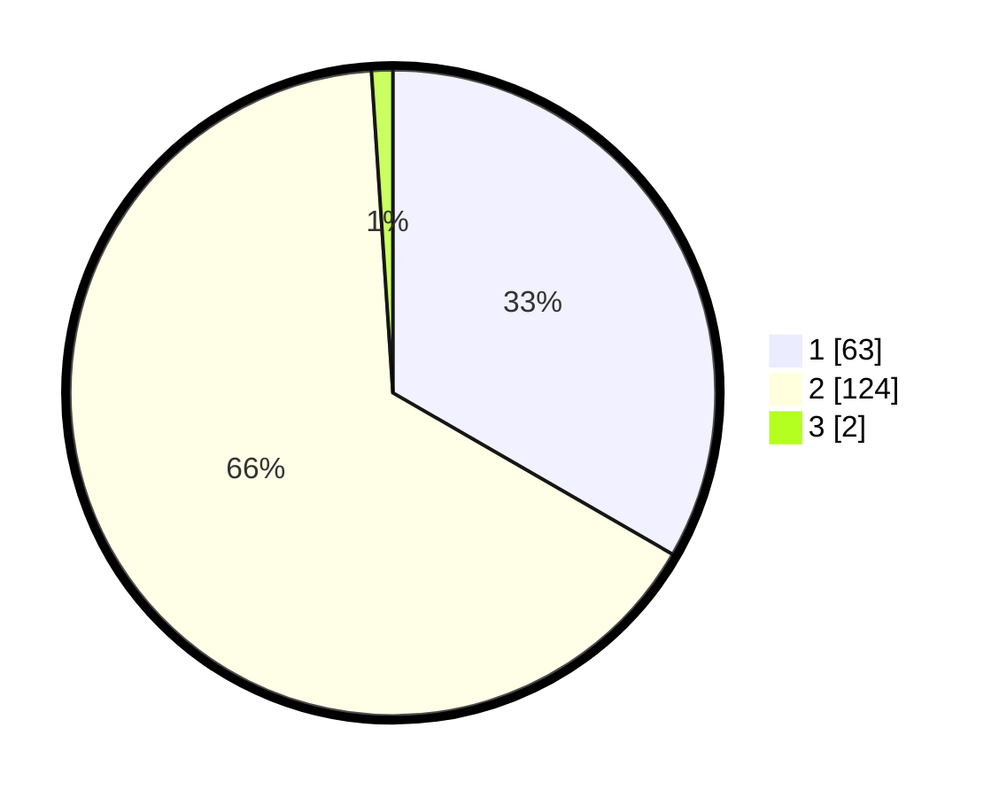

# Hasil

## Grafik

## Tabel

| No. | Nama Paslon    | Suara | Suara (raw) | Persentase |
|:--- |:-------------- | -----:| -----------:| ----------:|
| 1   | ANIES MUHAIMIN | 63    | [63][p-1]   | 33,33      |
| 2   | PRABOWO GIBRAN | 124   | [124][p-2]  | 65,61      |
| 3   | GANJAR MAHFUD  | 2     | [2][p-3]    | 1,06       |

[p-1]: https://github.com/gigit-pemilu/pemilu-2024/blob/main/pilpres/hitung-suara/sub/74-sulawesi-tenggara/sub/09-konawe-utara/sub/02-wiwirano/sub/1001-lamonae/sub/002-tps/sub/paslon-1.txt
[p-2]: https://github.com/gigit-pemilu/pemilu-2024/blob/main/pilpres/hitung-suara/sub/74-sulawesi-tenggara/sub/09-konawe-utara/sub/02-wiwirano/sub/1001-lamonae/sub/002-tps/sub/paslon-2.txt
[p-3]: https://github.com/gigit-pemilu/pemilu-2024/blob/main/pilpres/hitung-suara/sub/74-sulawesi-tenggara/sub/09-konawe-utara/sub/02-wiwirano/sub/1001-lamonae/sub/002-tps/sub/paslon-3.txt

## Foto C Plano

https://sirekap-obj-formc.kpu.go.id/5f6c/pemilu/ppwp/74/09/02/10/01/7409021001002-20240222-153406--65619036-e5fa-45f2-9b66-c8d37685daba.jpg

https://sirekap-obj-formc.kpu.go.id/5f6c/pemilu/ppwp/74/09/02/10/01/7409021001002-20240215-011748--510cd924-3ce1-4659-ab19-e5e69be6753e.jpg

https://sirekap-obj-formc.kpu.go.id/5f6c/pemilu/ppwp/74/09/02/10/01/7409021001002-20240215-011912--26b9e425-72f4-407c-8eb0-d639e79f6bb4.jpg

## Metadata

| Key        | Value               |
| ---------- | ------------------- |
| Time Stamp | 2024-02-24 22:31:28 |

