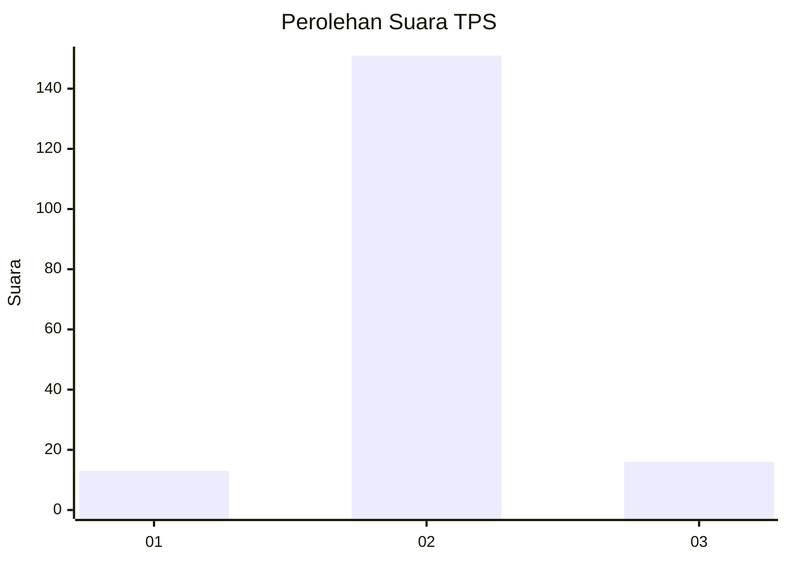
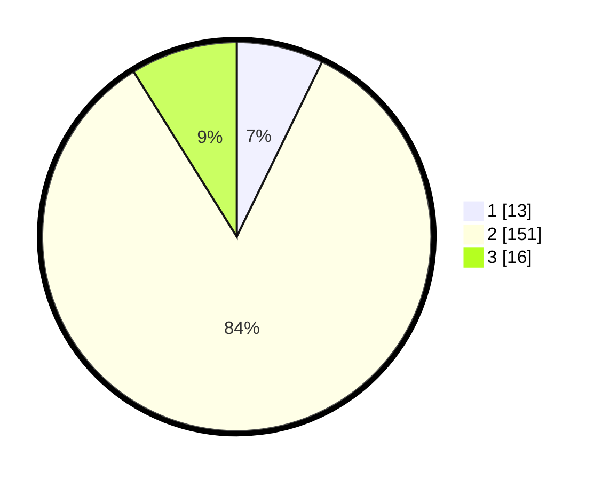

# Hasil

## Grafik

## Tabel

| No. | Nama Paslon    | Suara | Suara (raw) | Persentase |
|:--- |:-------------- | -----:| -----------:| ----------:|
| 1   | ANIES MUHAIMIN | 13    | [13][p-1]   | 7,22       |
| 2   | PRABOWO GIBRAN | 151   | [151][p-2]  | 83,89      |
| 3   | GANJAR MAHFUD  | 16    | [16][p-3]   | 8,89       |

[p-1]: https://github.com/gigit-pemilu/pemilu-2024-74-sulawesi-tenggara/blob/main/pilpres/hitung-suara/sub/74-sulawesi-tenggara/sub/09-konawe-utara/sub/02-wiwirano/sub/2007-wawoheo/sub/001-tps/sub/paslon-1.txt
[p-2]: https://github.com/gigit-pemilu/pemilu-2024-74-sulawesi-tenggara/blob/main/pilpres/hitung-suara/sub/74-sulawesi-tenggara/sub/09-konawe-utara/sub/02-wiwirano/sub/2007-wawoheo/sub/001-tps/sub/paslon-2.txt
[p-3]: https://github.com/gigit-pemilu/pemilu-2024-74-sulawesi-tenggara/blob/main/pilpres/hitung-suara/sub/74-sulawesi-tenggara/sub/09-konawe-utara/sub/02-wiwirano/sub/2007-wawoheo/sub/001-tps/sub/paslon-3.txt

## Foto C Plano

https://sirekap-obj-formc.kpu.go.id/a6d3/pemilu/ppwp/74/09/02/20/07/7409022007001-20240214-232227--14e81b72-f885-408a-a36a-e6aa8f17cba9.jpg

https://sirekap-obj-formc.kpu.go.id/a6d3/pemilu/ppwp/74/09/02/20/07/7409022007001-20240214-232443--fa9c678d-cc44-4236-9756-5dd62c98e195.jpg

https://sirekap-obj-formc.kpu.go.id/a6d3/pemilu/ppwp/74/09/02/20/07/7409022007001-20240214-232702--0eb08e4a-ec29-4ea1-9a29-ea99eba95101.jpg

## Metadata

| Key        | Value               |
| ---------- | ------------------- |
| Time Stamp | 2024-02-24 23:00:00 |

